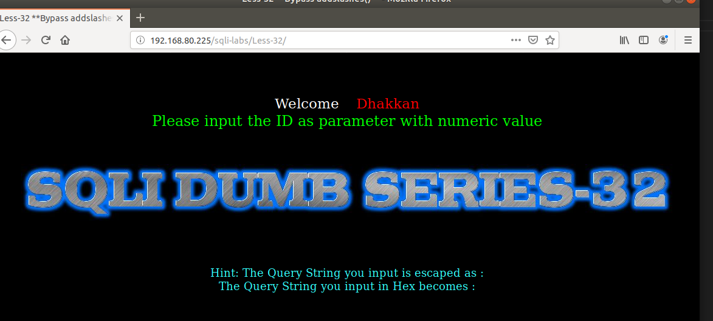
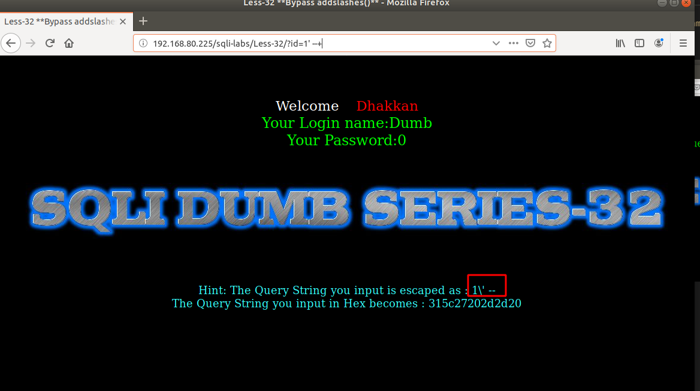
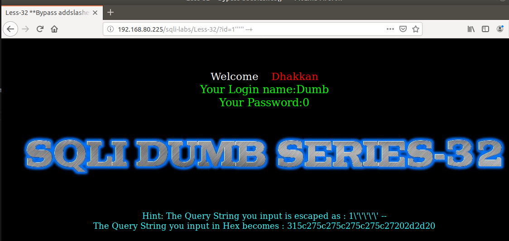
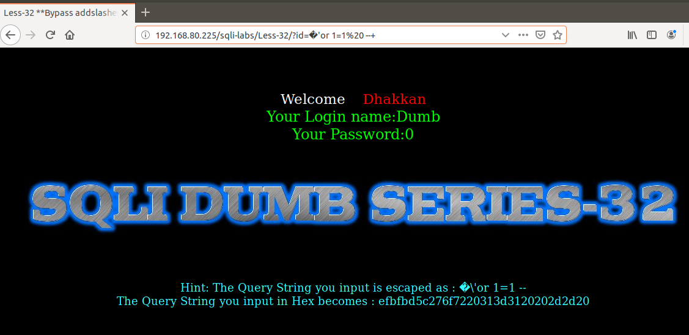
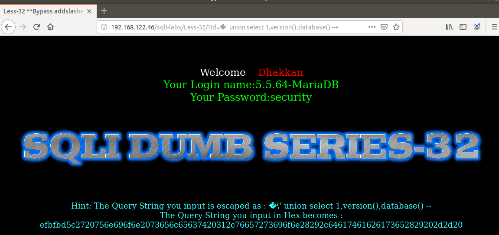

# Những việc làm được với lesson-32
Việc check xem nó là dạng DB gì thì làm giống như những lesson trước. Ta sẽ sử dụng command `nmap`

Sau khi đăng nhập vào lesson-32

Ta để ý đến dòng cuối cùng.

ta đã bị bỏ qua mất ký tự comment trong DB mất rồi. Dù ta thêm bao nhiêu ký tự đi nữa thì nó vẫ sẽ mất 

Như ta thấy rằng ký tự này đã bị bỏ qua ở trong bài này 

thế nên ta sẽ thêm ký tự `%bf` hay là `%af` hay `%df`  `�` và đằng trước nó là một dạng ký tự dùng để thay thế giá trị. 

và chúng ta đã pass được qua nó. Những dữ liệu được lấy ra như các bài trước đây 

ví dụ như lấy phần version và tên của DB 