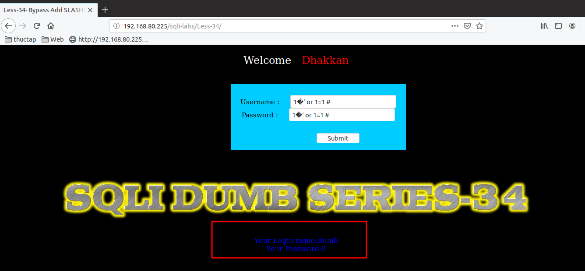

# Những việc làm được với lesson-34
Việc check xem nó là dạng DB gì thì làm giống như những lesson trước. Ta sẽ sử dụng command `nmap`

Sau khi đăng nhập vào lesson-34


 
Ở bài này ta để ý ở cuối trang web nó có gợi ý giống như 2 bài trước là nó sẽ bỏ qua các ký tự comment bằng cách thêm dấu gạch chéo `\` vào câu truy vấn. Bởi vì đã được sử dụng hàm `addslashes`

Thì ta sẽ pass qua bằng cách tương tự là thêm ký tự thay thế vào bên trong username vàm password 



Sau khi pass qua được thì ta nên sử dụng union để có thể xuất được ra dữ liệu 

```
username : 1�' union select version(),database() #
password : 1�' or 1=1 #
```


Tương tự như vậy ta sẽ thay vào bằng các câu truy vấn  để có thể tạo ra được các dữ liệu trong DB 
