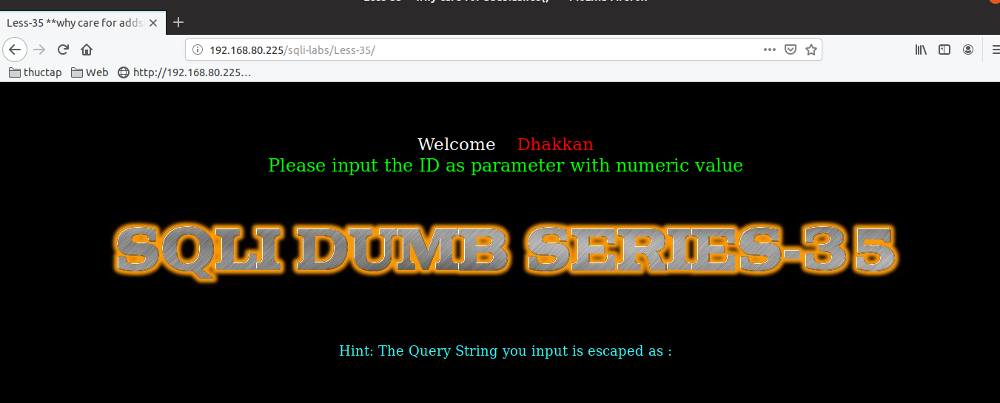
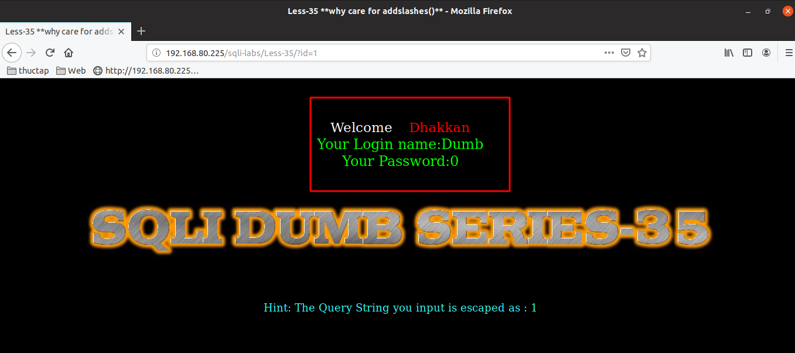
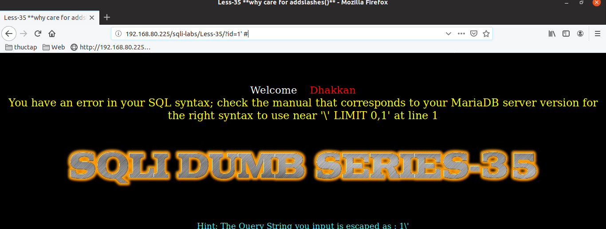
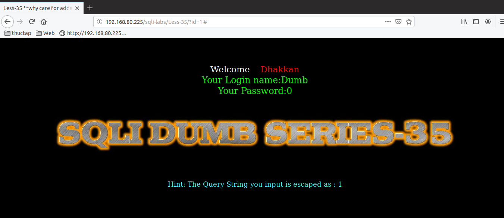
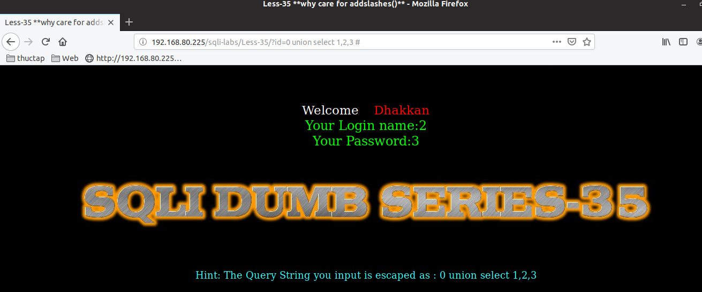
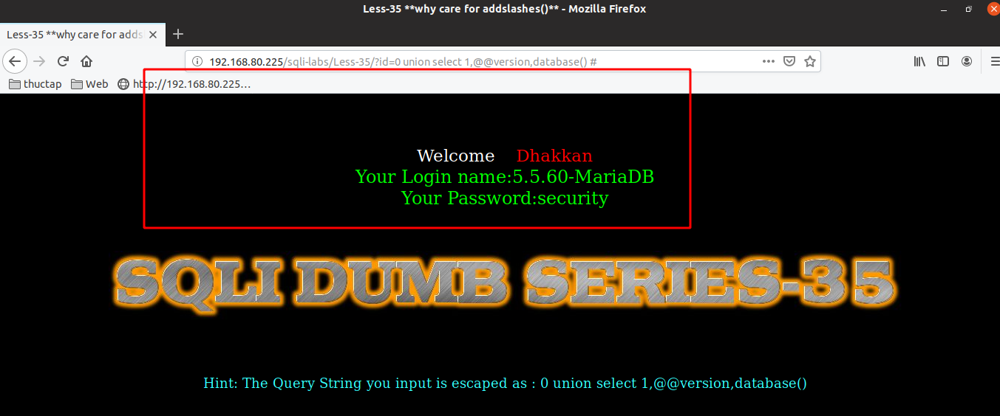

# Những việc làm được với lesson-35
Việc check xem nó là dạng DB gì thì làm giống như những lesson trước. Ta sẽ sử dụng command `nmap`

Sau khi đăng nhập vào lesson-35 Giống như lesson-2

Bài này yêu cầu nhập id vào. Và sau khi nhập id thì ta thấy user và pass được hiển thị ra. Điều này có nghĩa là ta có thể sử dụng được union và select nếu ta tìm được cấu trúc của nó 

1. Tìm cấu trúc của câu truy vấn 
- Trong lúc tìm truy vấn thì có xuất ra dữ liệu khi cấu trúc lỗi ta cũng có thể sử dụng được error-base cho bài này nếu muốn 

- Cấu trúc của bài này đơn giải giá trị id được nhập mà không có ký tự đặc biệt nào `id = $id`  

2. Sử dụng union và select 

Sau khi biết được cấu trúc ta dùng union để có thể lấy được dữ liệu 

Cấu trúc của union là như thế này. Ví dụ như là tìm version và tên của DB  

