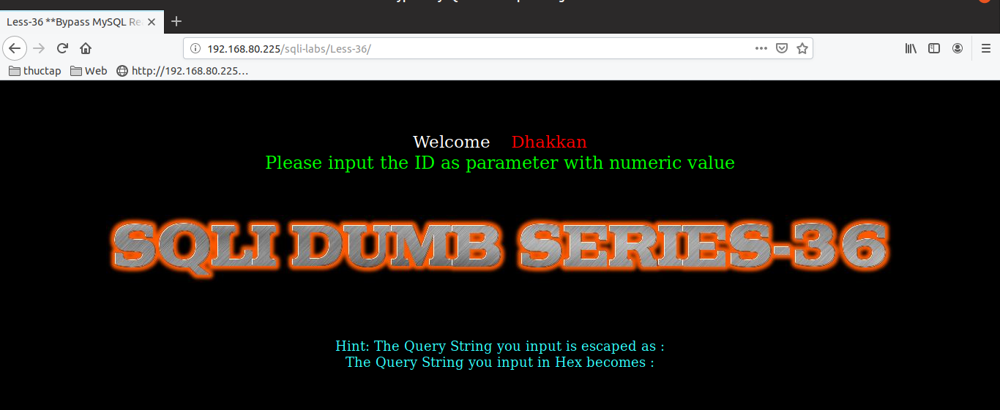

# Những việc làm được với lesson-36
Việc check xem nó là dạng DB gì thì làm giống như những lesson trước. Ta sẽ sử dụng command `nmap`

Sau khi đăng nhập vào lesson-36 

bài này làm tương tự như bài [32](https://github.com/duckmak14/thuctapsinh/blob/master/DucNA/SQL_Injection/docs/lesson-32.md)