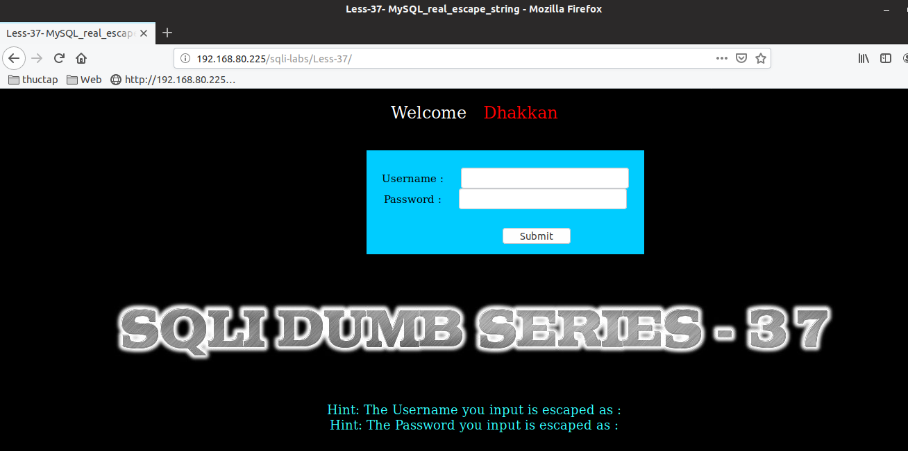

# Những việc làm được với lesson-37
Việc check xem nó là dạng DB gì thì làm giống như những lesson trước. Ta sẽ sử dụng command `nmap`

Sau khi đăng nhập vào lesson-37

Giống như bài [34](https://github.com/duckmak14/thuctapsinh/blob/master/DucNA/SQL_Injection/docs/lesson-34.md)

