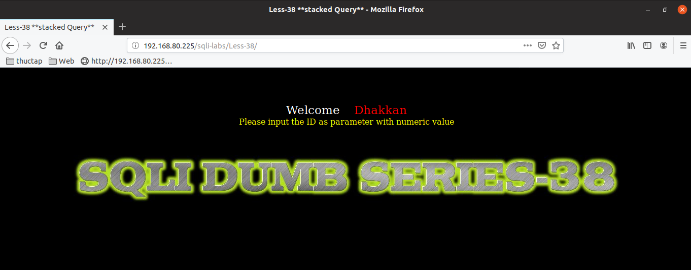

# Những việc làm được với lesson-38
Việc check xem nó là dạng DB gì thì làm giống như những lesson trước. Ta sẽ sử dụng command `nmap`

Sau khi đăng nhập vào lesson-38

Giống như [lesson 1](https://github.com/duckmak14/thuctapsinh/blob/master/DucNA/SQL_Injection/docs/lesson-1.md)

