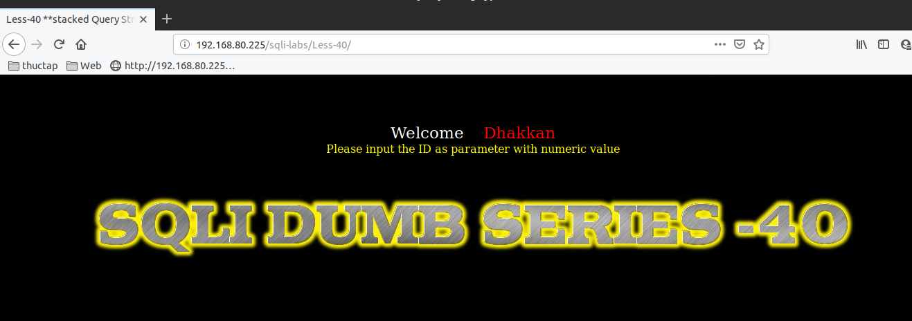

# Những việc làm được với lesson-40
Việc check xem nó là dạng DB gì thì làm giống như những lesson trước. Ta sẽ sử dụng command `nmap`

Sau khi đăng nhập vào lesson-40

Giống như [lesson 3](https://github.com/duckmak14/thuctapsinh/blob/master/DucNA/SQL_Injection/docs/lesson-3.md)

Nhưng lesson 3 dùng được error-base còn ở bài này thì không 