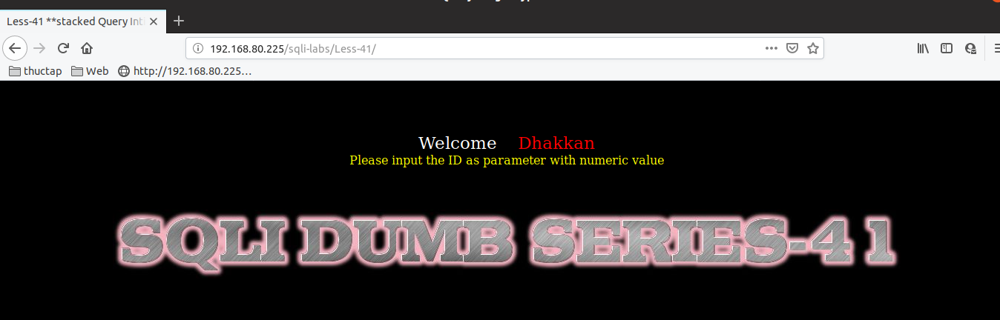

# Những việc làm được với lesson-41
Việc check xem nó là dạng DB gì thì làm giống như những lesson trước. Ta sẽ sử dụng command `nmap`

Sau khi đăng nhập vào lesson-41

Giống như [lesson 2](https://github.com/duckmak14/thuctapsinh/blob/master/DucNA/SQL_Injection/docs/lesson-2.md)

Có 1 điểm khác giữa 2 bài này đó là bài 2 sử dụng được error base còn bài này thì không vì nó không hề xuất ra lỗi 

