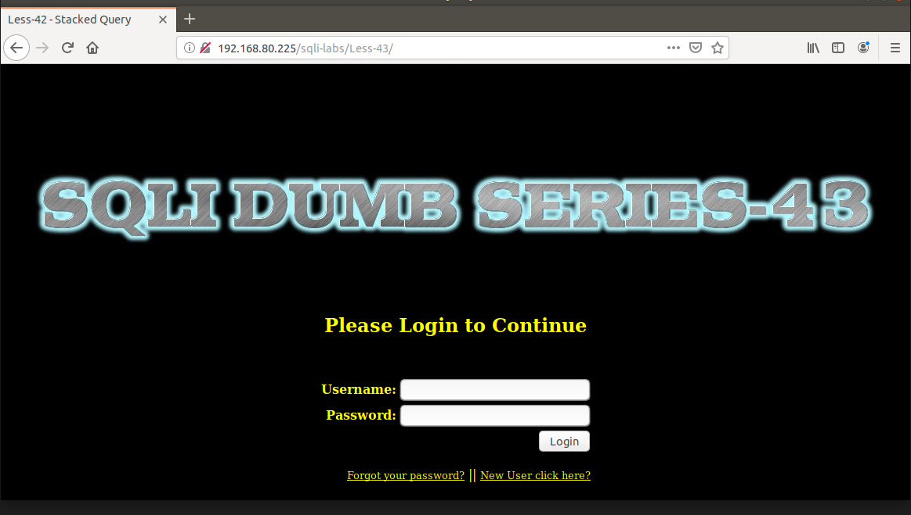
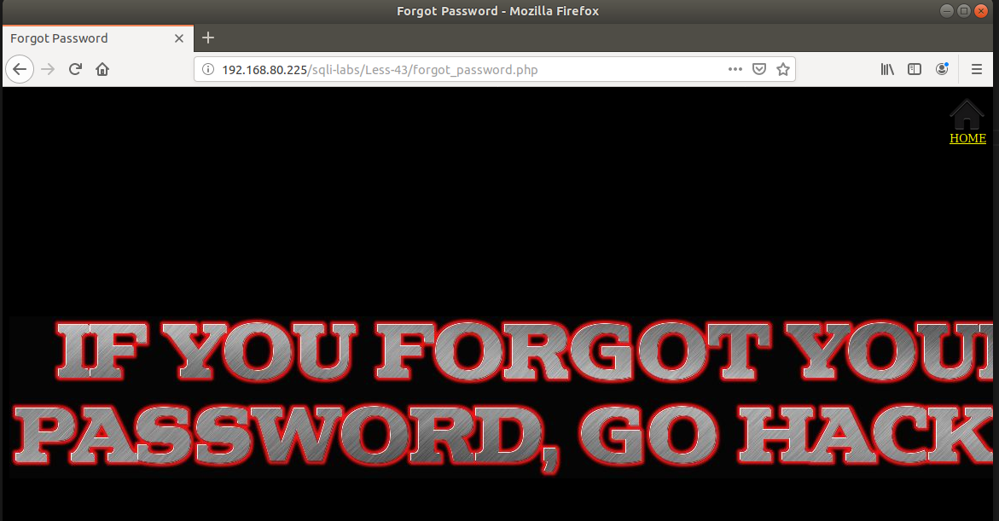
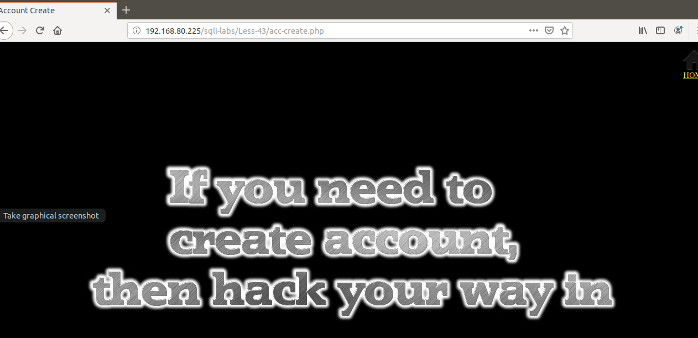
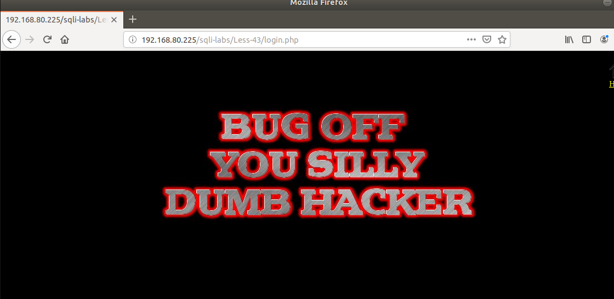
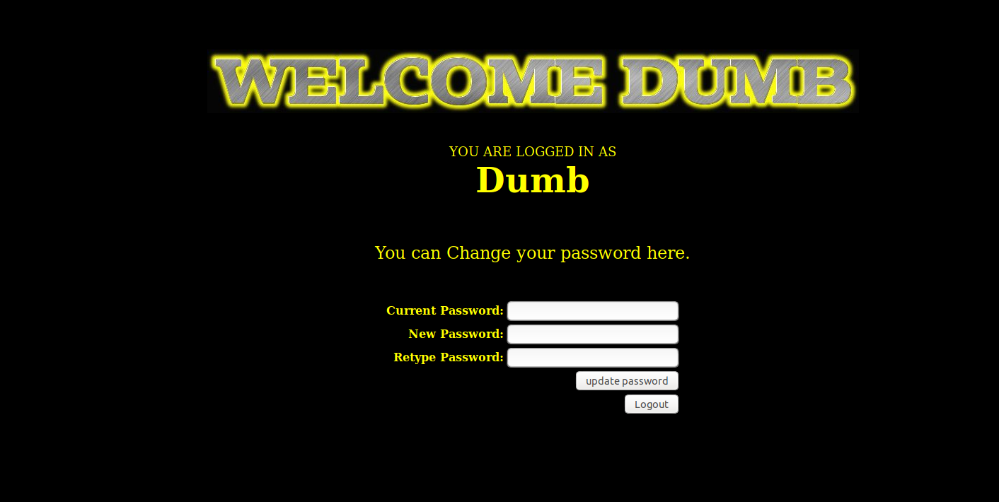
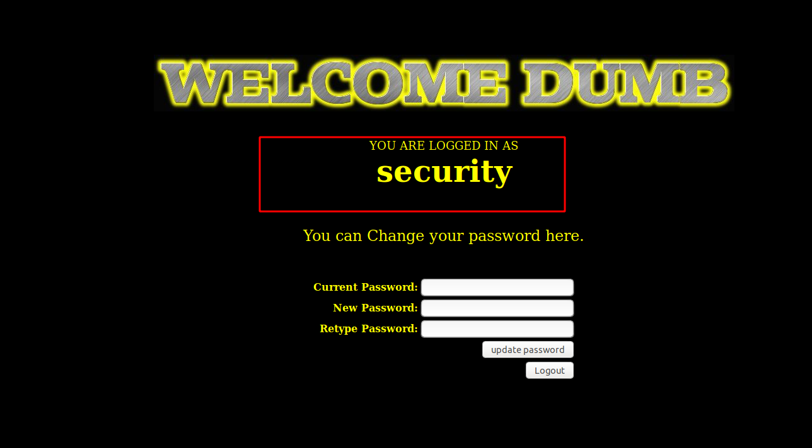

# Những việc làm được với lesson-43
Việc check xem nó là dạng DB gì thì làm giống như những lesson trước. Ta sẽ sử dụng command `nmap`

Sau khi đăng nhập vào lesson-43  



Ở đây tôi thấy khung đăng nhập và tôi thử vào `forgot` và `new user` nhưng không có gì cả và không thể injection ở đây





Tôi thử nhập vào một giá trị user pass bất kỳ không được 



Ta sẽ cho giá trị luôn đúng để có thể pass được qua login của nó. Mỗi một cấu trúc truy vấn khác nhau thì ta lại phải cho kiểu giá trị luôn đúng của nó khác nhau. Vì thế ta phải đi tìm được cấu trúc truy vấn của bài này để cho nó được luôn đúng. Ta sẽ phải thử cách nhập giá trị thôi 

1. Cấu trúc của bài này 
```
user : a') or ('1') = ('1
pass : a') or ('1') = ('1
```



Sau khi login được vào ta thấy rằng có hiển thị user của ta dùng giá trị luôn đúng để pass qua. Chứng tỏ rằng ta có thể dùng union và select để truy xuất dữ liệu 

2. Dùng union 
```
user : a') or ('1') = ('1
pass : a')  union select 1,database(),3 or ('1')=('1
```



Ta sẽ thấy được database bằng câu lệnh này cứ lần lượt thay câu lệnh truy vấn ta sẽ biết được tất cả DB của nó 