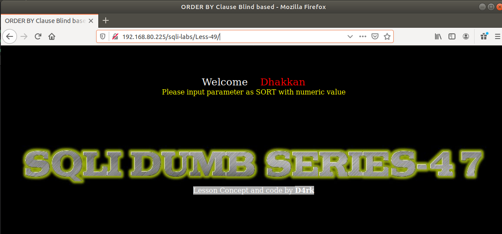
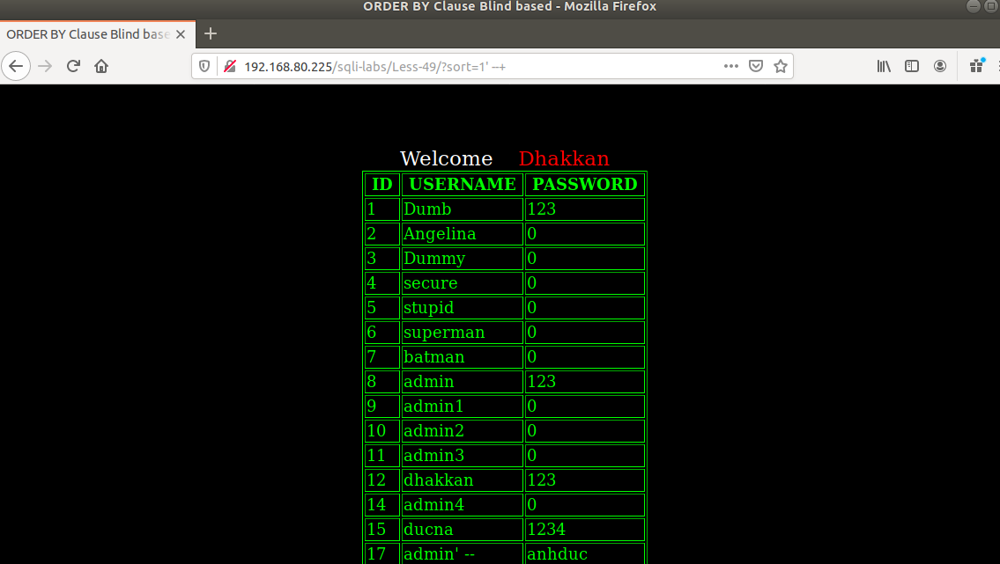
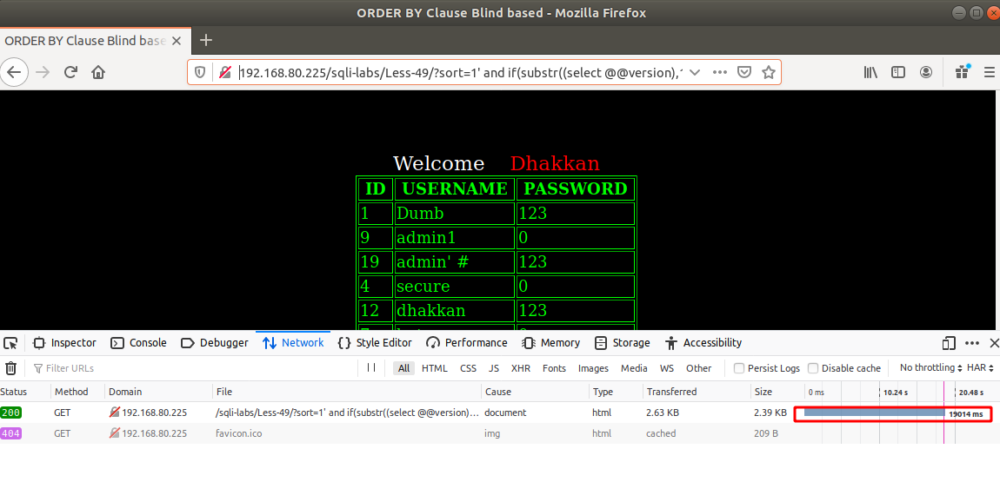

# Những việc làm được với lesson-49
Việc check xem nó là dạng DB gì thì làm giống như những lesson trước. Ta sẽ sử dụng command `nmap`

Sau khi đăng nhập vào lesson-49



Ta nhập giá trị có hiển thị và ta thêm giá trị vào nhưng mà không có thông báo lỗi. Suy ra ta không thể thực hiện được error base và ta hãy sử dụng time base 

1. Như bài trước ta sử dụng time base thì ta phải tìm cấu trúc của nó. 
```
sort = '$sort' 
```



2. Sử dụng time base 
- Như bài trước ta sử dụng time-base với cấu trúc như sau 
```
192.168.80.225/sqli-labs/Less-49/?sort=1%27%20and%20if(substr((select%20@@version),1,3)=%275.5%27,sleep(1),false)%20--+
```



Tương tự như thế ta áp dụng với vài câu truy vấn ta có thể tìm được DB của nó nhưng mất khá nhiều thời gian 

