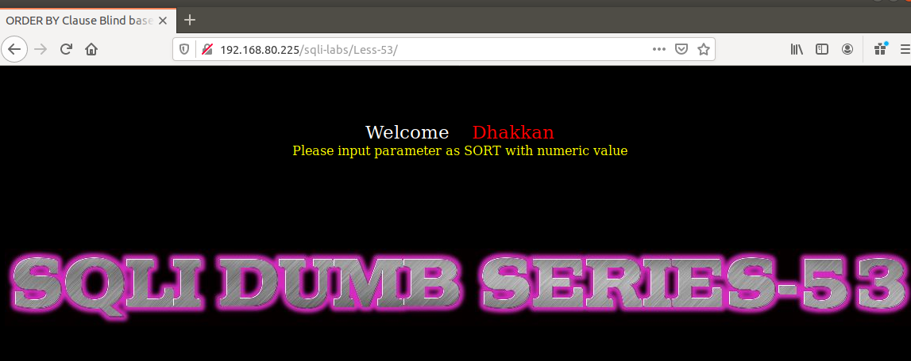

# Những việc làm được với lesson-53
Việc check xem nó là dạng DB gì thì làm giống như những lesson trước. Ta sẽ sử dụng command `nmap`

Sau khi đăng nhập vào lesson-53



Nó không hiển thị ra lỗi chứng tỏ rằng ta không thể sử dụng được error-base như bài trước nữa mà ta phải sử dụng time-base 

1. Tìm cấu trúc của bài 
```
192.168.80.225/sqli-labs/Less-49/?sort=1' --+
```

Sau khi tìm được cấu trúc của bài này thì ta sẽ sử dụng time giống như bài 52 với cấu trúc của bài này 


