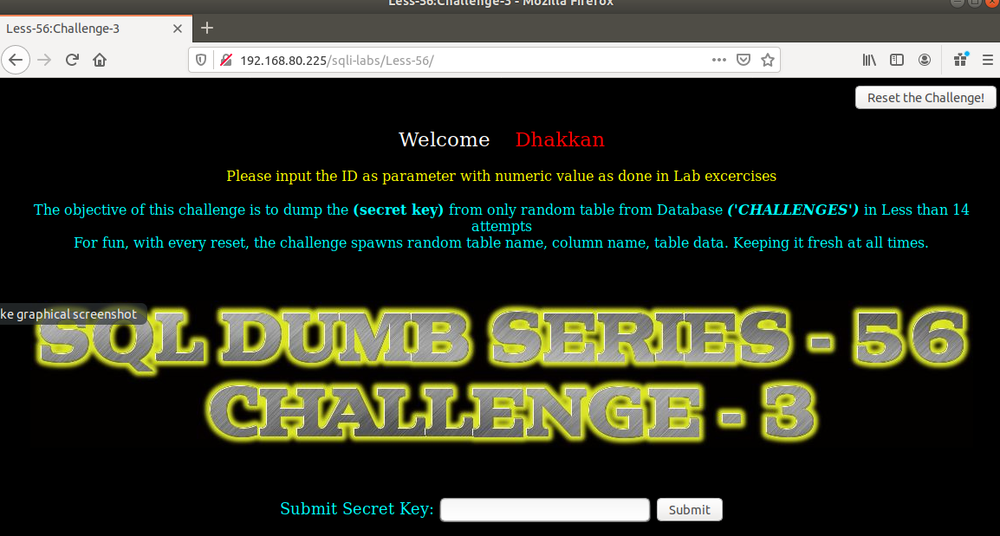
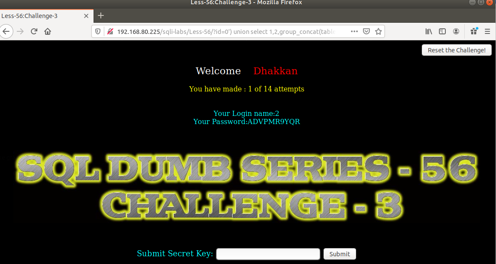

# Những việc làm được với lesson-56
Việc check xem nó là dạng DB gì thì làm giống như những lesson trước. Ta sẽ sử dụng command `nmap`

Sau khi đăng nhập vào lesson-56



Bài này yêu cầu giống bài 54 ta chỉ việc đi tìm cấu trúc của nó Và kết hợp cùng với union luôn. Và ta có được 14 lần thử  

- Lần 1: 
```
192.168.80.225/sqli-labs/Less-56/?id=0') union select 1,2,group_concat(table_name) from information_schema.tables where table_schema='challenges' --+
```



`LUCKY` lần đầu và thành công với tên của bảng này ta sẽ làm tưng tự bài 54 cùng với cấu trúc của bài này để có được key 
