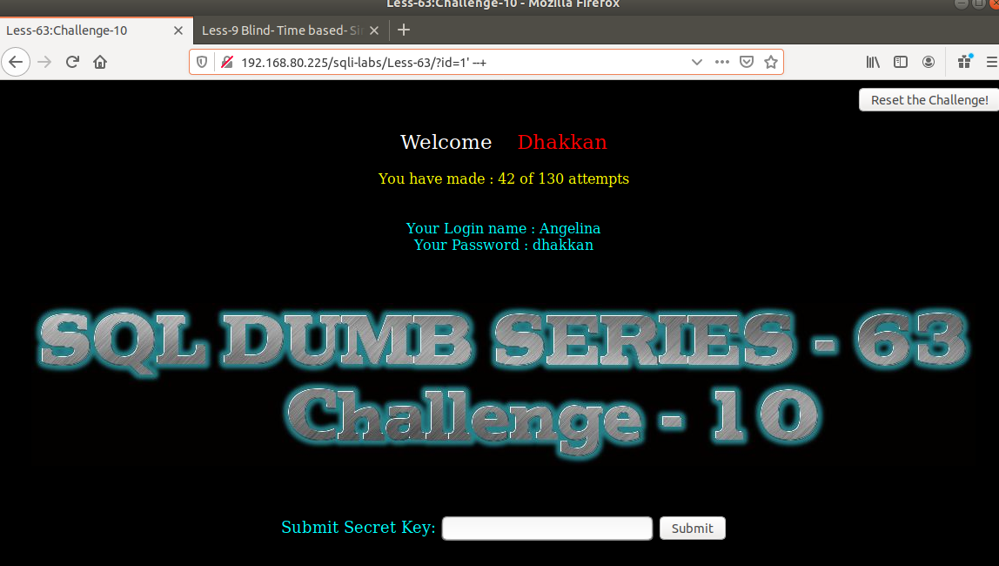

# Những việc làm được với lesson-63
Việc check xem nó là dạng DB gì thì làm giống như những lesson trước. Ta sẽ sử dụng command `nmap`

Sau khi đăng nhập vào lesson-63

Sau nhiều lần thử thì kết quả bài này sẽ có cấu trúc khác với bài 62 nhưng chúng ta chỉ có thể sử dụng time-base như thế. Thế nên để tìm được `key` bài này rất lâu với cấu trúc này và cách sử dụng time-base và cả bài  64 và 65 cũng tương tự như vậy chỉ có cấu trúc truy vấn là khác nhau còn cách làm chỉ có thể sử dụng time-base 