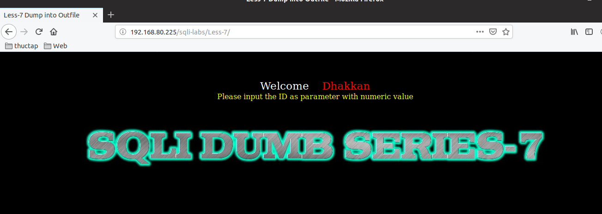
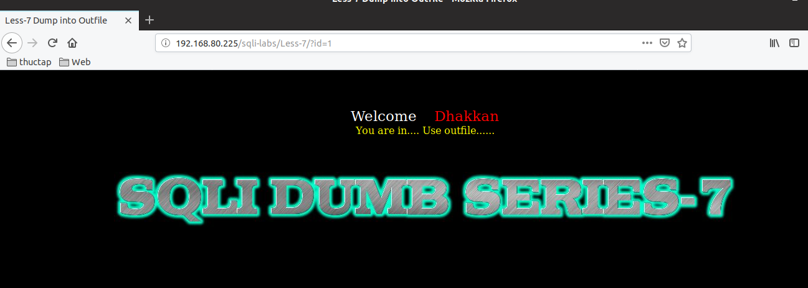
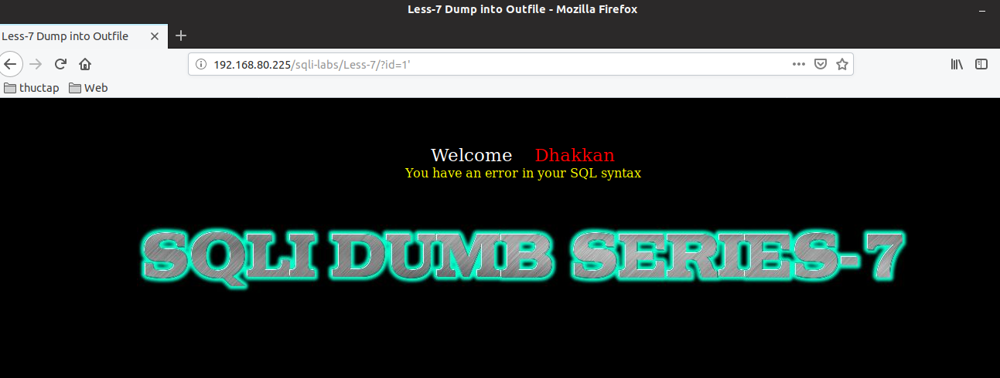
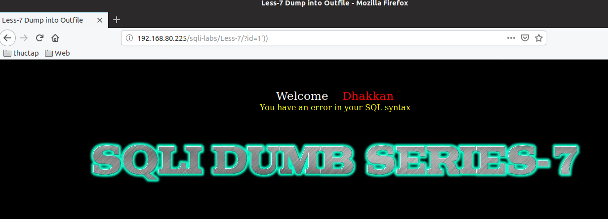
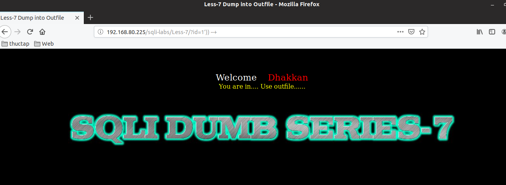

# Những việc làm được với lesson-7
Việc check xem nó là dạng DB gì thì làm giống như những lesson trước. 

Sau khi đăng nhập vào lesson-7 



1. Yêu cầu của nó là nhập ID và ta thử nhập nó vào. và dự đoán cấu trúc của câu truy vấn.



Khi ta nhập id thì như vậy sẽ pass được qua. Nhưng khi ta thêm ký tự đặc biệt vào thì nó không báo lỗi cụ thể ra ngoài màn hình mà nó chỉ thông báo là có lỗi 



Có nghĩa là ta không thể dùng `error-base` cho bài này. Vậy nên ta phải dùng một loại khác. Trước tiên ta tìm cấu trúc câu lệnh truy vấn 

Sau những lesson trước thì thấy rằng khi ký tự đặc biệt có lỗi mà thêm `--+` cuối cùng đúng thì nó là cấu trúc của URL. Ví dụ 





Vậy cấu trúc của nó là
```
?id=1')) --+
```

2. 