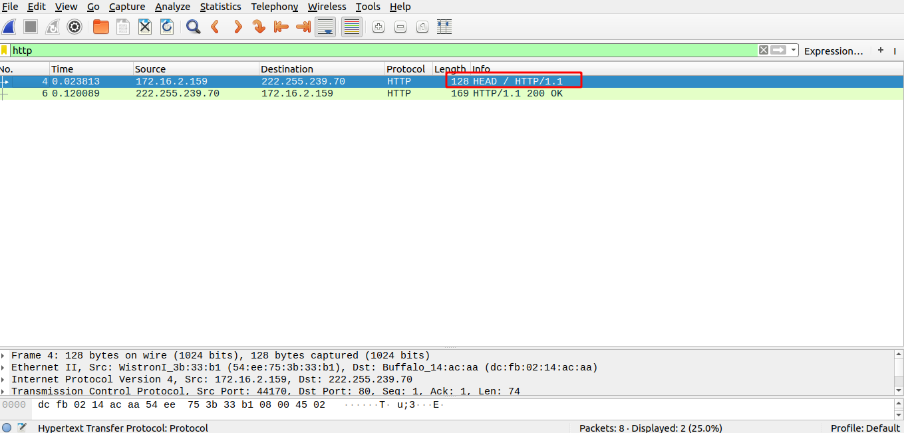
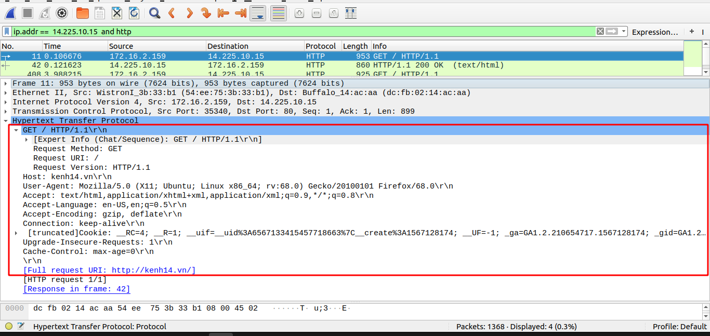
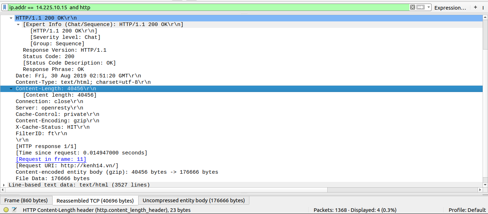

# Yêu cầu kịch bản 
- Sử dụng lệnh curl để truyền dữ liệu đến server
- Sử dụng lệnh tcpdump để bắt gói tin HTTP requests và HTTP response của nó 
- So sánh giữa 2 method GET và HEAD 
- Cách thực hiện: Thực hiện bắt gói tin 2 lần. Lần 1 dùng với command curl lần 2 dùng với web browser 

# Thực hiện 
- Lần 1: Mở cùng lúc 2 terminal và thực hiện lệnh như sau

1. Terminal 1 
```
sudo tcpdump -i enp0s25 -w http.pcap port 80 
```
2. Terminal 2
```
anhduc@anhduc:~$ curl -I kenh14.vn
HTTP/1.1 200 OK
Content-Length: 176532
ServerName: 41
Date: Fri, 30 Aug 2019 02:46:21 GMT
Connection: close
```
Kết quả :



Gói tin HTTP Request 


- Method: HEAD 
- Phiên bản HTTP 
- Host: kenh14.vn
- User-agent : Thông tin của agent được sử dụng để lấy thông tin  
- Accept: Client nói với server những định dạng mà nó đồng ý cho qua 

Gói tin HTTP Response 


Trong gói tin nói về 
- phiên bản HTTP 
- Status code : Trạng thái gói tin
- Servername : tên của server 
- Date : Ngày tháng trên server 
- Severity level : Mức độ bảo mật của nội dung này 
- Connection : Loại kết nối 

- Lần 2 : Bắt gọi tin dùng trình duyệt 



HTTP Requests 
- Method : GET 
- HTTP version : HTTP/1.1
- host : kenh14.vn
- User agent : Cho biết thông tin về ứng dụng được dùng để truy vấn 
- Accept : Các định dạng mà client cho phép nhận
- Accept-Language : Ngôn ngữ client cho phép 
- Accept- Encoding : Các chuẩn encode client cho phép 
- Connection : Loại kết nối 
- Upgrade-Insecure-Requests: Cho phép sử dụng https 


HTTP Response 



- Phiên bản HTTP : HTTP/1.1
- Severity level: Mức độ bảo mật của thông tin 
- Date : thời gian trên server 
- Status code : Trạng thái của gói tin 
- Content-TYPE : kiểu dữ liệu được hiển thị 
- Content-Length : Độ dài của nội dung 
- Connection : Trạng thái kết nối 

Method HEAD và GET 
là ở phần response sẽ chỉ thấy phần header mà không thấy phần body đâu 

HTTP Resquest (POST và GET) 


Trong POST sẽ có thêm một số mục 
- Content-type : Được sử dụng dùng để chỉ kiểu dữ liệu của nó gửi đi được hiển thị ở dạng nào 
- content-lenght : Chỉ mức giới hạn ký tự của nó 

Lý dó khiến cho 2 method này khác nhau là vì method post thường được sử dụng để gửi thông tin về user pass để đăng nhập cho server 
