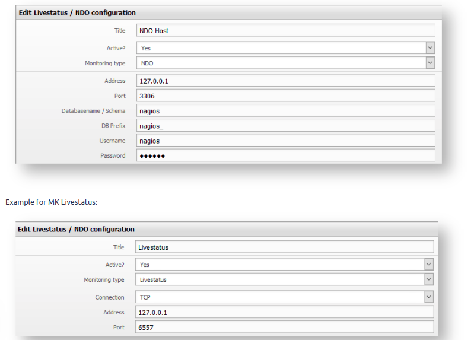
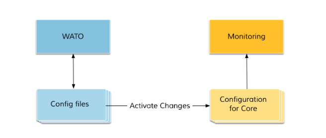
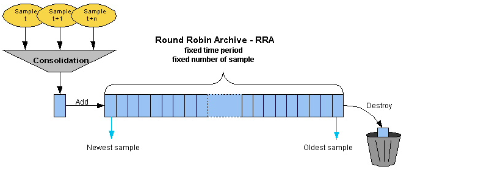
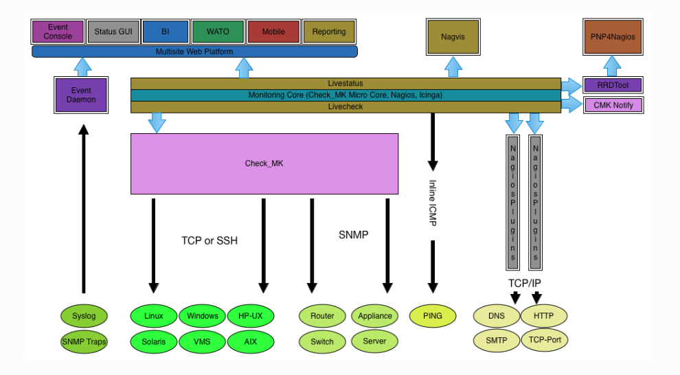

# I. Tổng quan về Check_mk 
1. Lịch sử 
- Năm 2008 check_mk được phát hành như là một plugins của nagios 
- Năm 2010 dự án OMD (Open Monitoring Distribution) được khởi động bởi Mathias Kettner. Đã kết hợp nhiều sản phẩm tạo ra sự linh hoạt trong giám sát. OMD có 2 distro là OMD-LABS và CHECK_MK RAW (OMD thường)
- OMD - Open Monitoring Distribution là một project được phát triển từ năm 2010 bới Mathias Kettner. OMD sử dụng nhân là Nagios Core, kết hợp với các phần mềm mã nguồn mở khác để đóng gói thành một sản phẩm phục vụ cho nhu cầu giám sát, cảnh báo và hiển thị. 
- Năm 2015 phiên bản đơn giản của OMD được ra đời và gọi là Check_mk 

2.  Phân biệt OMD-LABS và  CHECK_MK (OMD thường)
- OMB-LABS là một tool chứa OMD và thêm một số  dịch vụ nữa như Grafana, InfluxDB, Naemon, Icinga 
- OMD tập trung chủ yếu vào CHECK_MK và là phiên bản nhỏ hơn của OMB-LABS
- Phiên bản state của OMD-LABS là 3.0. Bình thường sẽ cứ 6 tháng sẽ có một phiên bản state mới được ra mắt

Một số đặc điểm khác nhau giữa OMD-LABS và CHECK_MK
- Trước phiên bản 3.0 
    - Ngoài nagios 3.0 thì omd-labs còn có cả 2 core Naemon và Icinga2. 
    - Có thêm biểu đồ grafana dựa trên influxdb 
    - Có hệ thống prometheus giúp hỗ trợ vấn đề cảnh báo 
- Sau phiên bản 3.0 thì OMD-LABS remove một số thành phần 
    - Nagios 3 
    - Icinga 1
    - CheckMK
    - Nagvis

3. Khái niệm về check_mk 
- Là một giải pháp giám sát dựa trên mã nguồn mở. Có lõi là nagios core.
- Check_mk được tạo ra với mục đích giải bài toán hiệu năng cho nagios 
- Check_mk bổ sung một số chức năng cho nagios core 
    - Bảng điều khiển 
    - Có thể quản lý bằng giao diện web như là add thêm host bằng giao diện web
    - Giám sát phân tán 
    - Giảm thời gian check tiêu chuẩn từ 5 xuống 1 phút 

4. Các phiên bản của Check_mk 
- Hiện nay check_mk có 3 phiên bản chính đó là : `Check_MK Raw Edition` và `Check_MK Enterprise Edition` và  `Checkmk Managed Services Edition (CME) ` 
- Check_MK Enterprise Edition phát triển hơn một số chức năng
    - Giao diện đồ họa được cải thiện 
    - Tạo báo cáo PDF
    - Cấu hình agent cho từng thiết bị 
    - Khoảng thời gian đo ngắn nhất cho số liệu xuống còn 1s 
    - Giao diện người dùng bằng tiếng Đức 
    - Quản lý hệ điều hành thông qua GUI 
    - Hiệu suất cao và độ trễ thấp 
- Phiên bản state Checkmk Raw Edition (CRE) 1.5.0p20
- Phiên bản Checkmk Managed Services Edition là một phiên bản dựa trên phiên bản CEE và  bổ sung thêm một số dịch vụ quản lý. 

# II. Các Khái niệm trong check_mk 
1. Livestatus 
- Là một phần quan trọng của check_mk. Nó giúp check_mk truy xuất dữ liệu một cách nhanh nhất. 
- Không truy xuất dữ liệu được đọc theo tốc độ I/O của disk bởi vì nó sẽ không lưu trữ thông tin trạng thái ở file. 
- Khi truy xuất nó phân biệt chữ hoa và trữ thường. Cú pháp của livestatus dựa trên giao thức HTTP 
- Livestatus sẽ sử dụng một socket để lấy dữ liệu từ phía host và service 

2. Livecheck 
- Trước khi có livecheck thì mỗi khi kiểm tra dịch vụ sẽ chỉ thực hiện trên một core của CPU. 
- Sau khi có livecheck thì mỗi khi kiểm tra dịch vụ sẽ không chỉ một CPU làm việc mà được phân tán trên tất cả các core của CPU.

3. Multisite - Giao diện web 
- Multisite là một giao diện web được check_mk áp dụng để thay thế cho nagios web.
- Nó được sử dụng để xem thông tin và kiểm soát hệ thống giám sát.

4. Wato
- Trong web của check_mk thì sẽ có hai chức năng
    - Chức năng 1: Hiển thị trạng thái của các host và service 
    - Chức năng 2: Được sử dụng để cấu hình check_mk (Wato)

- Wato bao gồm nhiều modules. Mỗi modules có một chức năng khác nhau. Một số module phổ biến 
    - Main menu : chứa danh sách tất cả các loại modules cùng với một miêu tả ngắn cách dùng
    - Monitoring Agents	: Tại đây sẽ tìm thấy các agent cho linux windowns và cách hệ điều hành khác
    - Host : Quản lý các host được theo dõi 
    - Global Settings : Những cài đặt không áp dụng cho host; service và users
    - Host & Service Parameters	: danh sách tất cả các cài đặt giám sát về host và service 
- Khi thay đổi bằng WATO thì giám sát sẽ chưa thực hiện vai trò của mình ngay lập tức. Mà sau khi nhấn nút `Activate changes` mới thực hiện thay đổi và mới bắt đầu thực hiện giám sát. 

5. Mobile 
- Là phiên bản tối ưu hóa cho điện thoại. Nó cho phép truy cập vào tất cả trạng thái dữ liệu. Nó có thể sử dụng được multisite 

6. Event console 
- Ngoài việc check trạng thái theo lịch trình thì cũng có một kiểu check trạng thái theo sự việc xảy ra ( ví dụ như là việc có một host bị down)
- Đối với event console thì check_mk có một hệ thống tích hợp để theo dõi sự kiện từ các nguồn như là syslog, SNMP traps, log file. 
- Những event xảy ra không được xử lý bởi lõi giám sát mà sẽ được sử dụng bởi dịch vụ riêng 

7. RRD (Round Robin Database)
- Đây là dạng DB mặc định mà khi check_mk lưu dữ liệu vào. 
- Dung lượng của DB này đã được định sẵn từ trước Khi mà nó đầy dữ liệu thì nó sẽ ghi đè lên dữ liệu được ghi đầu tiên
- Có thể tích hợp dung lượng trong một khoảng thời gian nào đó vào làm một. 
- Có thể truy vấn được dữ liệu trong RRD bằng live status language. 
- Dữ liệu trong Round Robin được lưu thành các bảng và các cột
- Dữ liệu có thể hợp nhất lại thành một để có thể giải quyết được vấn đề là muốn quan sát dữ liệu trong một khoảng thời gian dài như là một năm 

8. Live status language 
- Là ngôn ngữ để truy vấn trong RRD. 
- Ngôn ngữ truy vấn này được chia ra thành các tables và trong các tables có các columns để lưu trữ các thông tin và dữ liệu của hệ thống check_mk 
- Có thể sử dụng ngôn ngữ này để truy vấn dữ liệu. Lưu ý ngôn ngữ truy vấn này phân biệt chữ hoa và chữ thường.
- Có thể sử dụng các `headers` để lọc thông tin hiển thị từ các truy vấn được sử dụng 
- Khi muốn truy vấn thống kê thì có các giá trị và các toán tử được định nghĩa sẵn để sử dụng 

9. Site
- Trên một server có thể tạo ra nhiều site để có thể phân chia các khu vực giám sát dành cho một hệ thống lớn. 
- Muốn có một WATO để có thể quan sát thì ta phải tạo ra một site để có thể sử dụng WATO 
- Với mỗi user có quyền khác nhau đối với 1 Site giám sát. Quyền cao nhất là user omdadmin có quyền quản lý 
- Có 3 cấu của các user được chia như sau 
    - adminstrator 
    - Guest user 
    - Normal monitoring user 

**Cấu trúc của CHECK_MK**

- PNP4nagios: được sử dụng để xử lý dữ liệu để chuyển sang dạng biểu đồ
- Nagvis : được sử dụng để vẽ lại mô hình giám sát giúp người dùng có thể nhìn một cách dễ dàng hiểu hơn

# Link tham khảo 
https://check-mk-documentation.readthedocs.io/en/latest/cmkarchitecture.html

https://checkmk.com/editions.html

https://buildmedia.readthedocs.org/media/pdf/check-mk-documentation/latest/check-mk-documentation.pdf

http://www.idz.vn/2015/11/best-monitoring-solution-2015-omd-open.html

