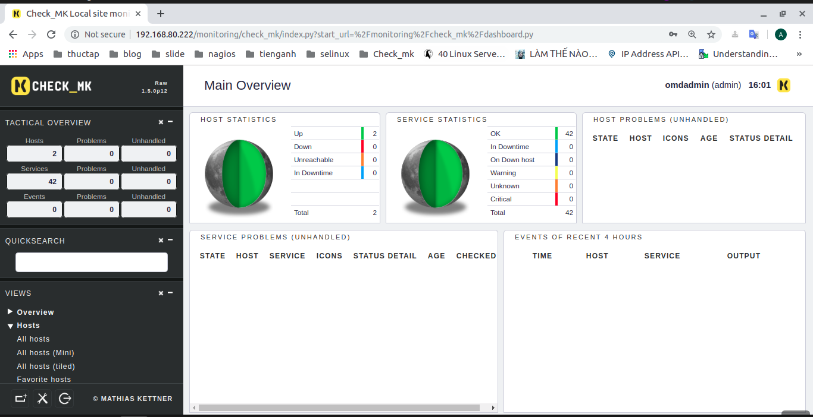

# Hướng dẫn cài đặt OMD-Check_mk trên hệ điều hành centos 7

## I. Thông số của máy 

| Host name | IP | RAM | CPU | DISK |
|---|---|---|---|---|
| Check_mk | 192.168.80.222 | 1G | 1 | 20G |

## II. Các bước cài đặt 
1. Cài đặt gói wget 
```
yum install wget -y
```
2. Khai báo repo của check_mk 
```
yum install epel-release -y
```
3. Sử dụng wget để cài download check_mk về trên [web check_mk](https://checkmk.com/download.php?)
```
wget https://mathias-kettner.de/support/1.5.0p12/check-mk-raw-1.5.0p12-el7-38.x86_64.rpm
```
4. Cài đặt check_mk 
```
yum install check-mk-raw-1.5.0p12-el7-38.x86_64.rpm -y 
```
5. Mở port 80 để có thể sử dụng dịch vụ httpd 
```
firewall-cmd --permanent --add-port=80/tcp
firewall-cmd --reload
```
6. Tắt selinux
```
setenforce 0 
```
7. Tạo và khởi động một site 
```
omd create monitoring
omd start monitoring
```
8. Đặt mật khẩu cho user omdadmin 
```
su - monitoring
htpasswd -m ~/etc/htpasswd omdadmin
```
9. Kiểm tra trang web 
```
http://192.168.80.222/monitoring/check_mk
```
Đăng nhập web với user `omdadmin` và pass đặt cho nó 


