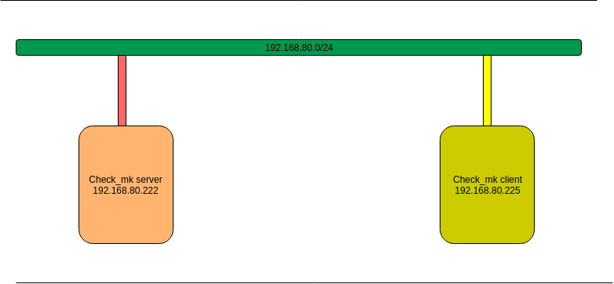
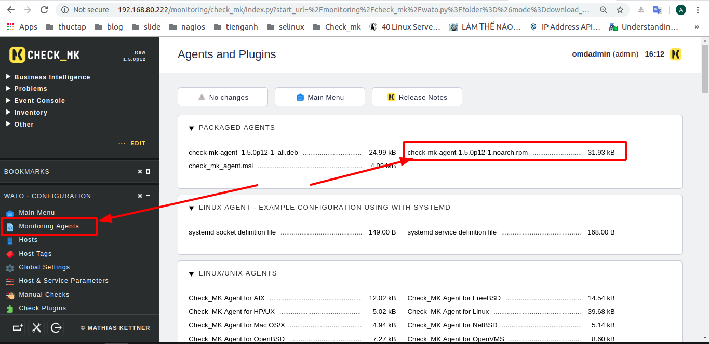
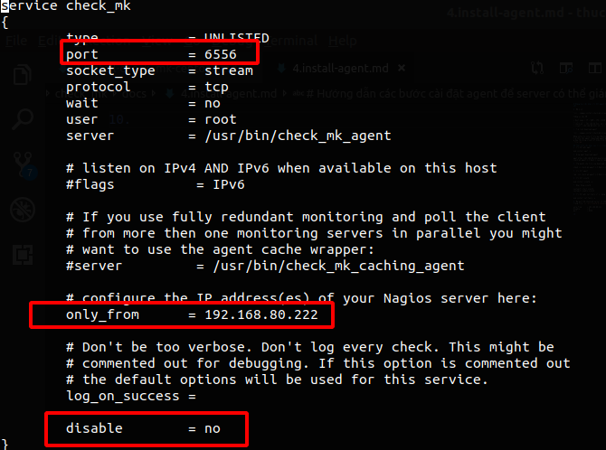

# Hướng dẫn các bước cài đặt agent để server có thể giám sát 

0. Mô hình 



Thông số các VM

| Host name | IP | RAM | CPU | DISK |
|---|----|----|----|-----|
| check_mk  | 192.168.80.222| 1G | 1 | 20G |
| client | 192.168.80.225| 1G | 1 | 20G |

1. Tìm link download agent 



Đăng nhập vào site và vào mục Monitoring agent để có thể tìm thấy các agent. Download agent phù hợp với hệ điều hành ở đây tôi dùng client hệ điều hành centos 7 nên download `file.rpm`

## Thực hiện các bước sau trên client 
2. Cài đặt gói wget 
```
yum install wget -y 
```
3. Dùng wget download agent
```
wget http://192.168.80.222/monitoring/check_mk/agents/check-mk-agent-1.5.0p12-1.noarch.rpm
```
4. Cấp quyền cho file vừa download về 
```
chmod +x check-mk-agent-1.5.0p12-1.noarch.rpm
```
5. Cài đặt agent 
```
rpm -ivh check-mk-agent-1.5.0p12-1.noarch.rpm
```
6. Cài đặt xinetd 
```
yum install xinetd -y
```
7. Khởi động xinetd
```
systemctl start xinetd
systemctl enable xinetd
```
8. Cài đặt gói net-tools và sử dụng để kiểm tra port
```
yum install net-tools -y
```
9. Mở port để check_mk server có thể giám sát client. Sửa trong file `vi /etc/xinetd.d/check_mk`. Sửa các giá trị sau
```
only_from      = 192.168.80.222
disable        = 0
port           = 6556
```



10. Kiểm tra port mặc định của check_mk sử dụng để giám sát được chưa
```
[root@client ~]# netstat -npl | grep 6556
tcp6       0      0 :::6556                 :::*                    LISTEN      1/systemd 
```
11. Mở port nếu sử dụng firewall
```
 firewall-cmd --add-port=6556/tcp --permanent
 firewall-cmd --reload
```
12. Tắt selinux 
```
setenforce 0
```

**Đã cài đặt xong agent trên client bây giờ hãy add vào server để có thể giám sát**