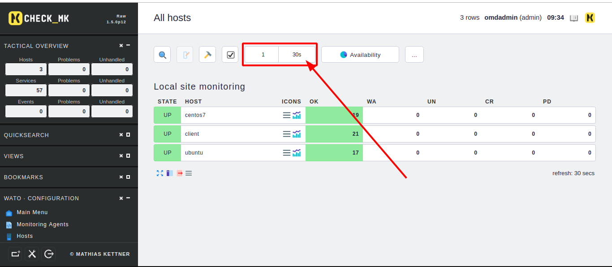
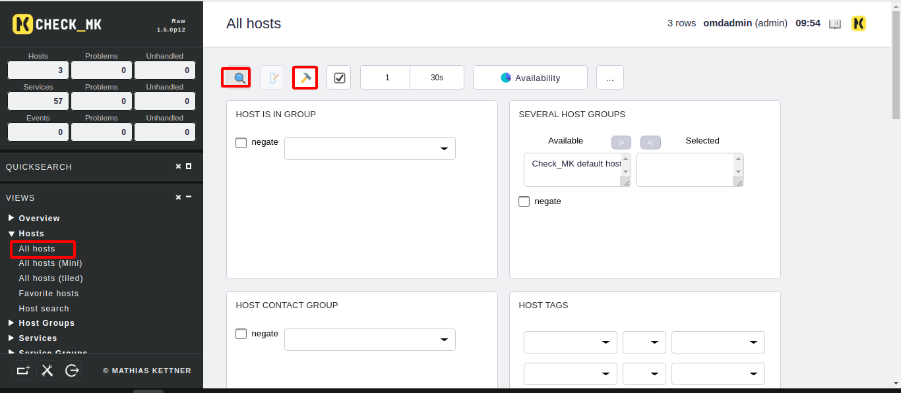
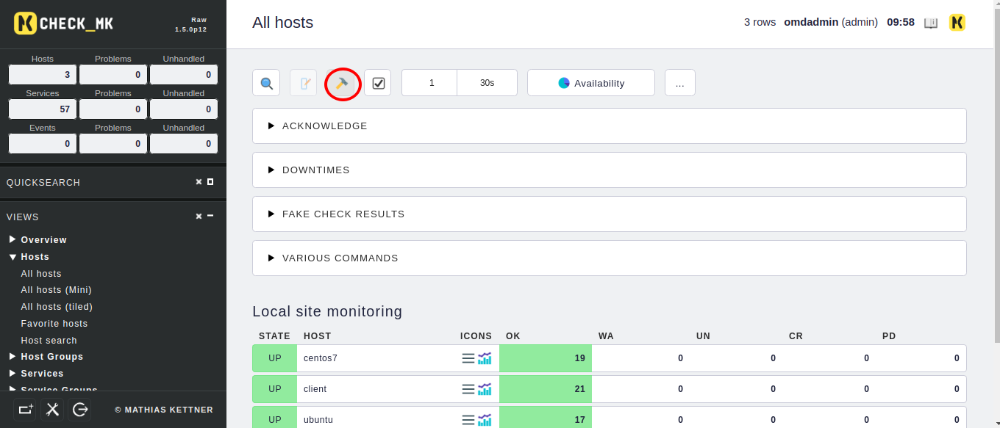
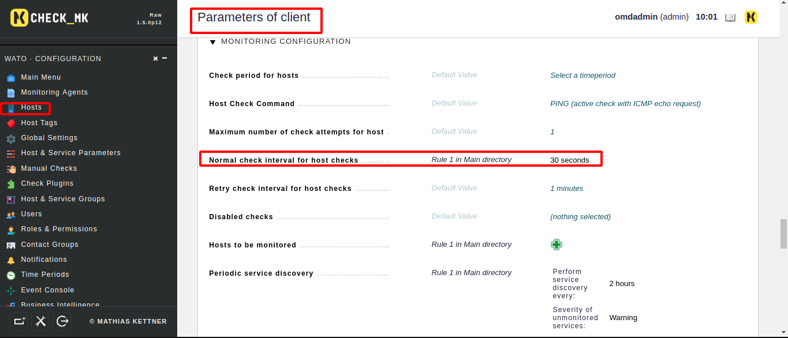
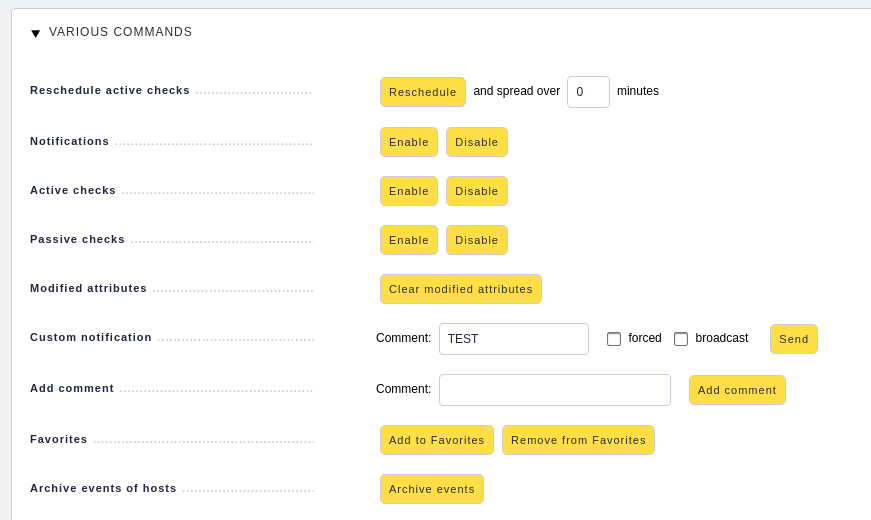
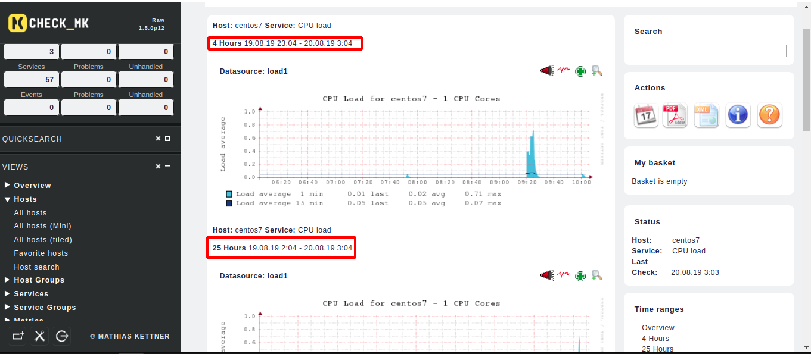

Sau khi add thêm host vào thì kết quả sẽ hiển thị ra sao và được hiển thị như thế nào trên website của check_mk server? 

Sau khi vào mục views rồi views all host thì sẽ hiển thị ra các host được giám sát. Ô được khoanh đỏ có ý nghĩa là website sẽ được làm mới hiển thị sau 30s. Và mỗi một hàng sẽ được hiển thị 1 host trên một hàng. 

Trong mục views có một số lưu ý tiếp theo về các cách dùng của nó. 
- Hình kính núp kia là nơi để cài đặt cho phần hiển thị. Có thể chỉnh sửa được cách hiển thị của check_mk theo ý muốn của mình. Cho phép hiển thị các loại trạng thái nào... 

- Hình chiếc búa màu vàng là biểu hiện cho việc cài đặt của việc check host. có sử dụng active check và passive check có bật gửi thông báo hay không. Thời gian check theo lịch trình là bao nhiêu có thể sửa tại đây nếu ko sửa giá trị này thì nó sẽ lấy giá trị mặc định là 1 phút check 1 lần 

Hay chúng ta có thể sửa đổi giá trị check tại parameters trong từng host riêng biệt ta có thể không để giá trị mặc định mà ta thay thế thành một giá trị khác mà ta muốn. Như ở đây tôi đã thay thế thành 30s 

Trên là một số giá trị ví dụ mà mục cây búa vàng có thể chỉnh sửa được =)) 

Về các service thì tương tự các giá trị hiển thị giống như host. Còn service có thể chuyển thông tin về dạng biểu đồ giống như vậy. Thì thông tin dạng biểu đồ của service sẽ hiển thị theo các mục. 
- 1 năm 
- 1 tháng 
- 1 tuần 
- 25 giờ 
- 4 giờ 

