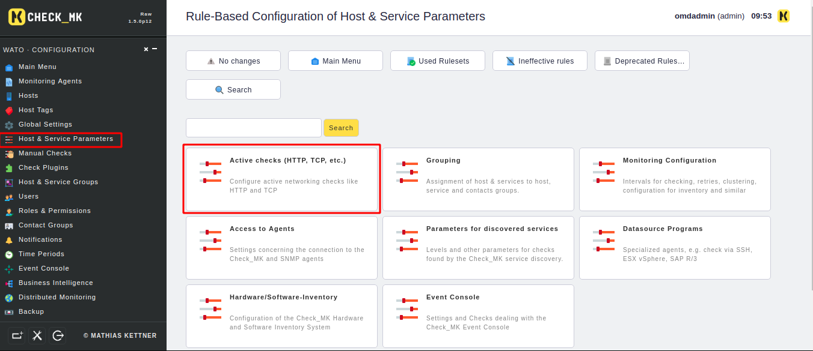
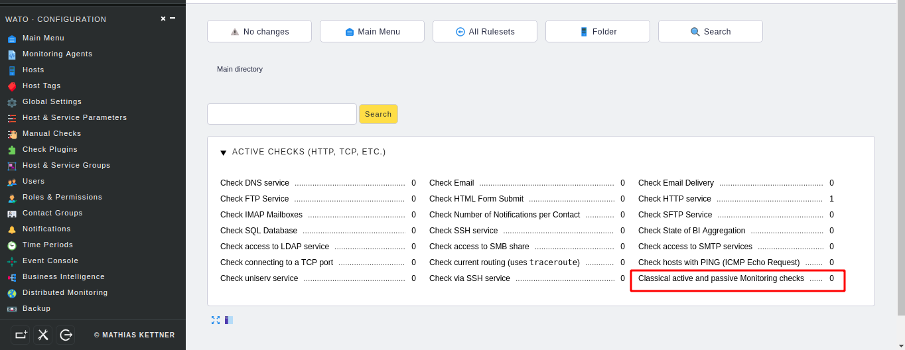
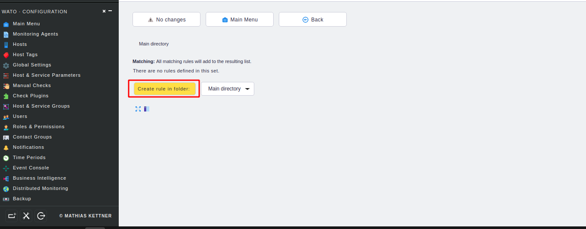
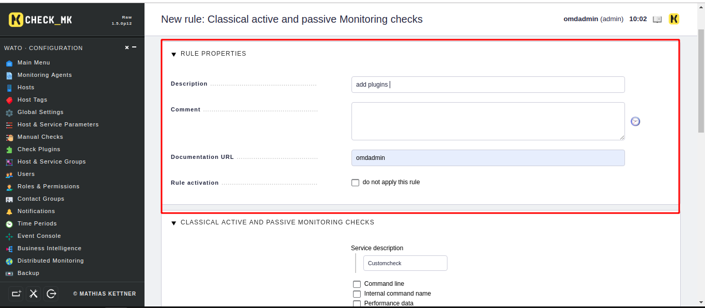
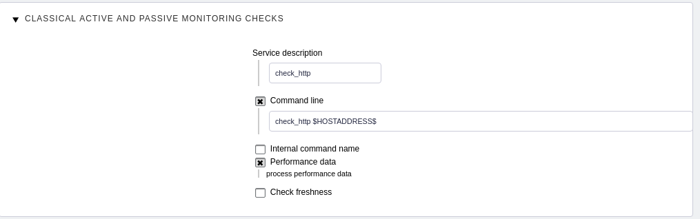
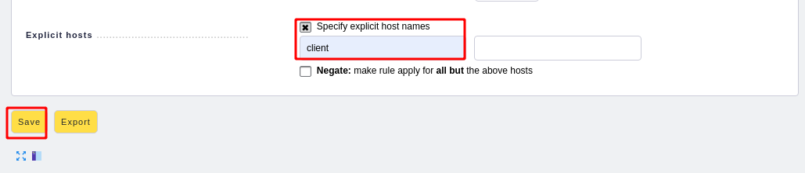
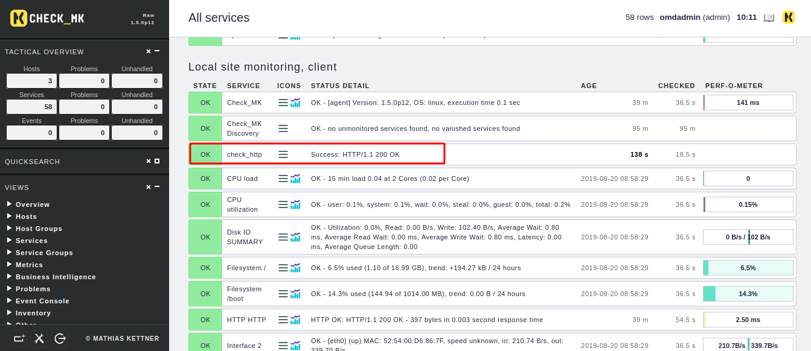

# Hướng dẫn thêm plugin vào OMD-Check_mk 

1. Chuẩn bị và download plugin
plugin có thể tự viết ra hoặc là ta có thể download từ trên mạng về . Các lệnh thực hiện trong site 

```
cd ~/local/lib/nagios/plugins
wget https://raw.githubusercontent.com/hoangdh/meditech-ghichep-nagios/master/scripts/Plugin-nagios/check%20http/check_http
```

2. Phân quyền cho plugins 
```
chmod 755 check_http
```

3. Chạy thử plugins 
```
OMD[monitoring]:~/local/lib/nagios/plugins$ ./check_http 192.168.80.225
  % Total    % Received % Xferd  Average Speed   Time    Time     Time  Current
                                 Dload  Upload   Total   Spent    Left  Speed
  0   136    0     0    0     0      0      0 --:--:-- --:--:-- --:--:--     0
Success: HTTP/1.1 200 OK
```
Đầu tiên ta sẽ vào để config lại cấu hình để add thêm 





Sau đó ta tạo thêm rule 



Rồi điền thông tin của plugins 







Sau đó ta cập nhật thay đổi và kiểm tra services 


