# Hướng dẫn sử dụng WATO add thêm host để check_mk server để giám sát
1. Đăng nhập vào GUI với tài khoản admin và vào mục host trong `WATO configuaration`

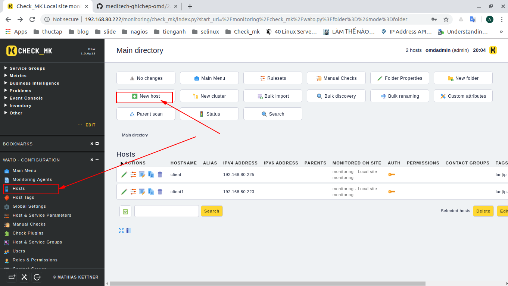

2. Điền thông tin của host giám sát. Những mục bắt buộc là tên và địa chỉ IP 

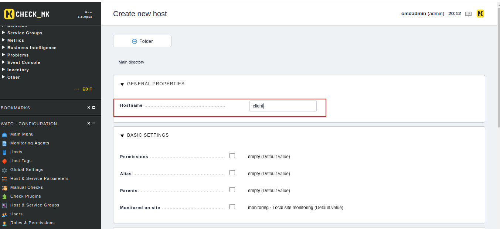

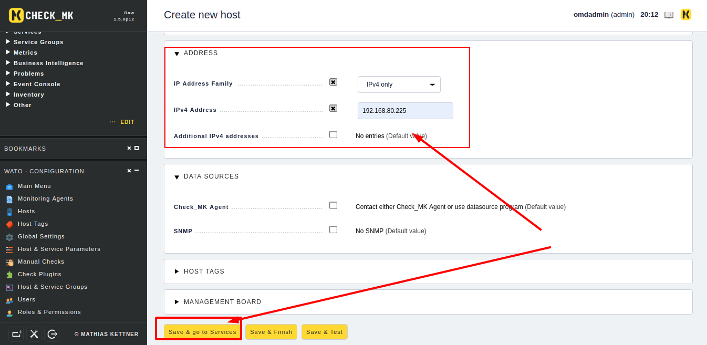

3. Sau khi điều xong thông tin nhấn `save & go to service`

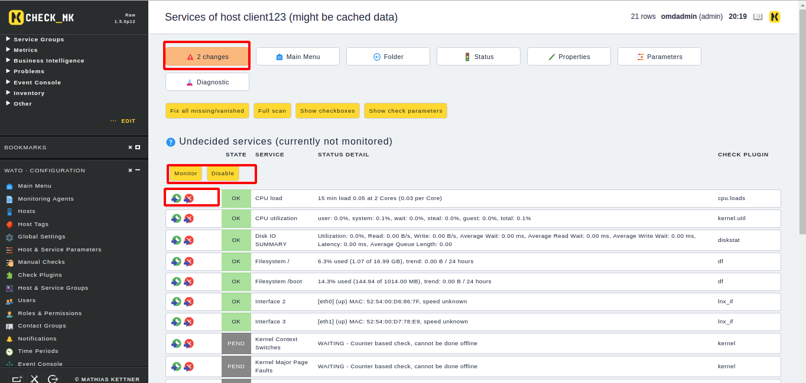

- Tại đây là nơi các service mặc định sẽ được tìm thấy. Service nào bạn muốn giám sát hãy để nguyên và ấn `monitoring`
- Những thông số nào bạn không muốn giám sát thì hãy ấn nút x màu đủ ở đầu các service. 
- Rồi sau đó ấn monitoring 
- Thay đổi sẽ chưa được cập nhật. Chúng ta thây chữ `2 changes` chúng ta phải vào đó và cập nhật thay đổi thì check_mk server mới nhận host và làm nhiệm vụ của mk 
4. Cập nhật thay đổi 

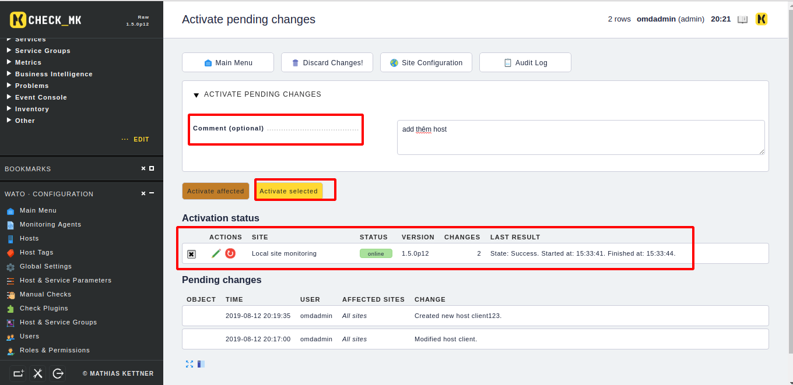

- Ô đầu tiên là miêu tả về sự thay đổi 
- Ô thứ 2 là nút cập nhật thay đổi
- Ô cuối cùng Chọn site để cập nhật thay đổi này chúng ta cần chọn site trước khi ấn nút cập nhật 

5. Đây chỉ là các service mặc định được phát hiện ra bởi check_mk server. Ta có thể add thêm được các service khác với `Acitve checks`

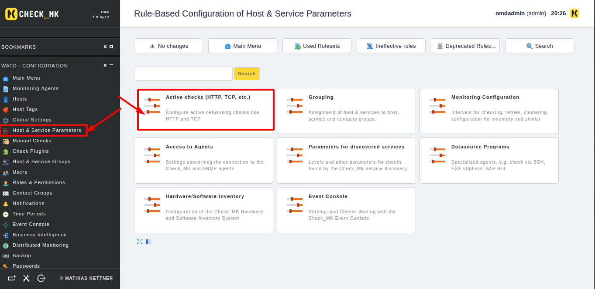

6. chọn các service để có thể giám sát thêm ví dụ tôi chọn thêm dịch vụ ssh vì nó có sẵn và không phải cài đặt thêm gì trên agent 

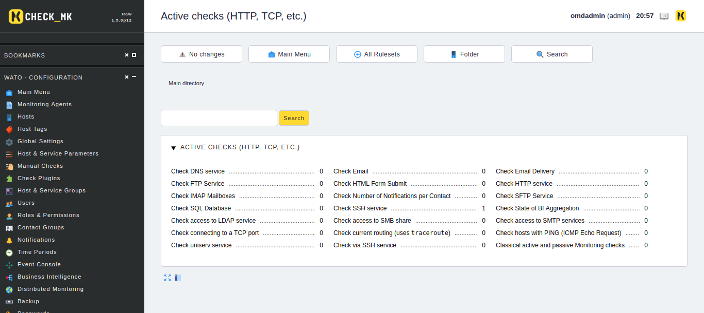

7. Sau đó nhập thông tin của host mk muốn giám sát 

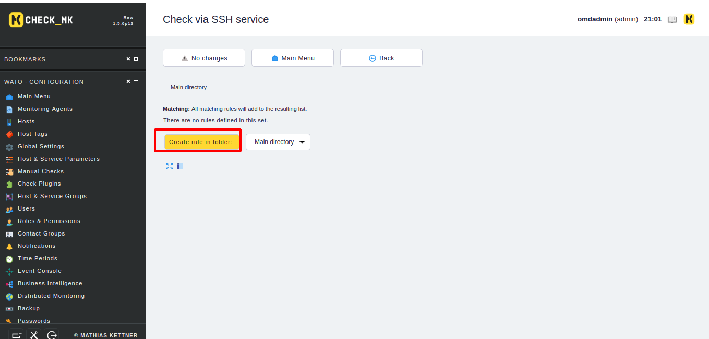

8. Sau đó điền thông tin của host cần giám sát 

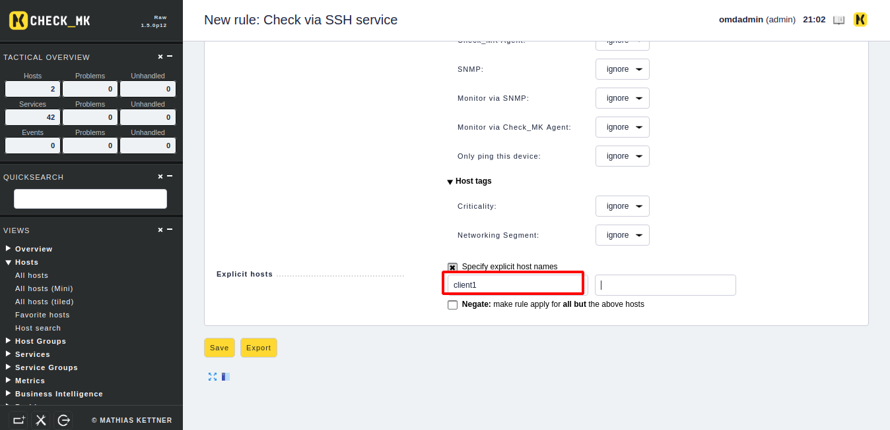

9. Sau đó lưu lại và cập nhật thay đổi như lúc add host 

## II.The discovery check 
1. Đây là một loại dịch vụ được giám sát bởi check_mk mỗi khi giám sát một máy 
2. Service này có khả năng tự động phát hiện ra 
3. Nó sẽ cảnh báo nếu có dịch vụ nào mà nó mặc định phát hiện không được giám sát 
4. Có thể tự động thêm bớt được dịch vụ mới được phát hiện thêm để giám sát hoặc mới phát hiện là nó mất đi sẽ remove nó đi 

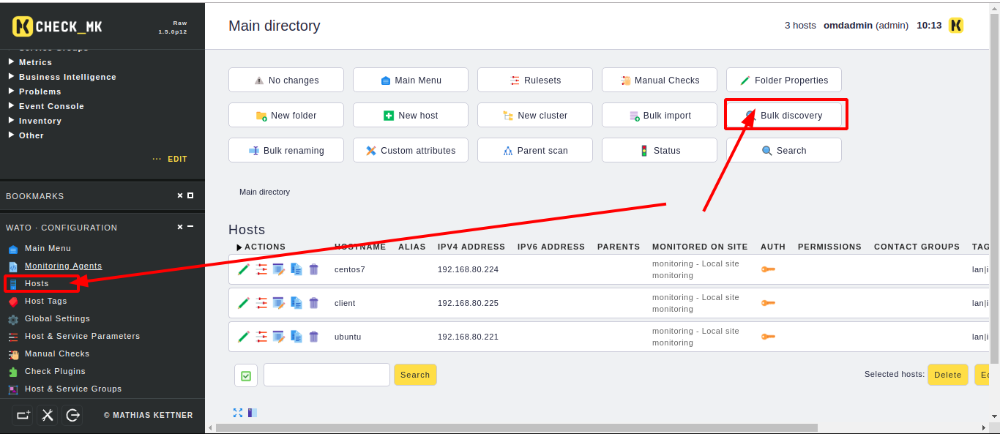

Để có thể làm được như thế thì vào mục host và và mục `Bulk discovery` 

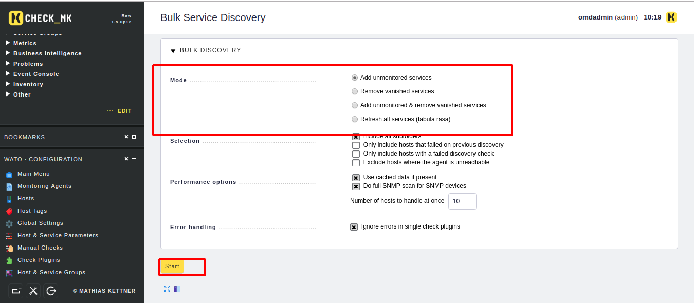

Sau khi chọn mode phù hợp xong thì hãy chọn start để bắt đầu quá trình đó 

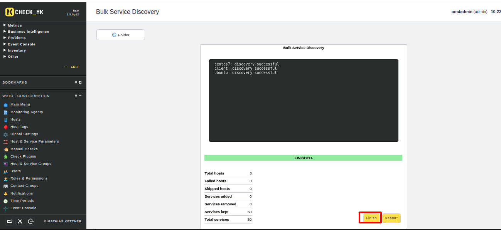

Cuối cùng là finish để kết thúc quá trình 

Các bước trên là các bước thực hiện quá trình add và remove các dịnh vụ theo thủ công. Ta có thể cài đặt được chúng có thể một cách tự động 

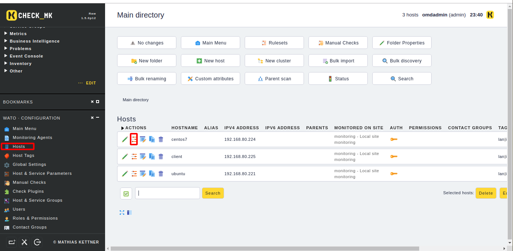

Vào mục host và chọn cài đặt host để chỉnh sửa 

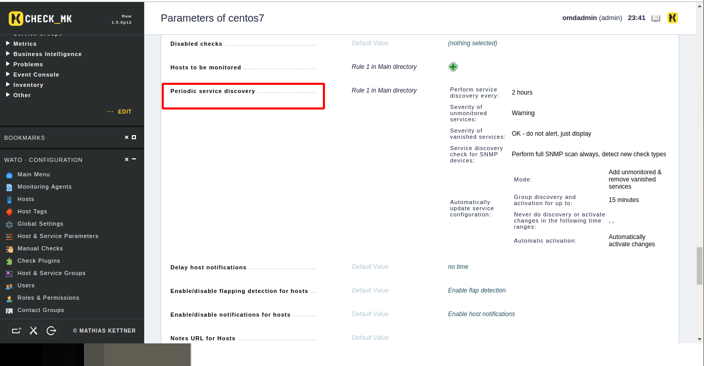

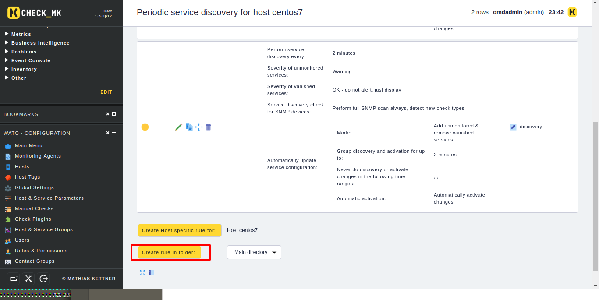

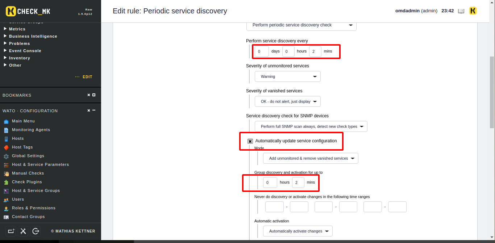

Sau đó lưu lại và cập nhật thay đổi

Kiểm tra bằng cách add thêm card mạng ảo 
# Tài liệu tham khảo 

https://checkmk.com/cms_wato_services.html#discovery_check

