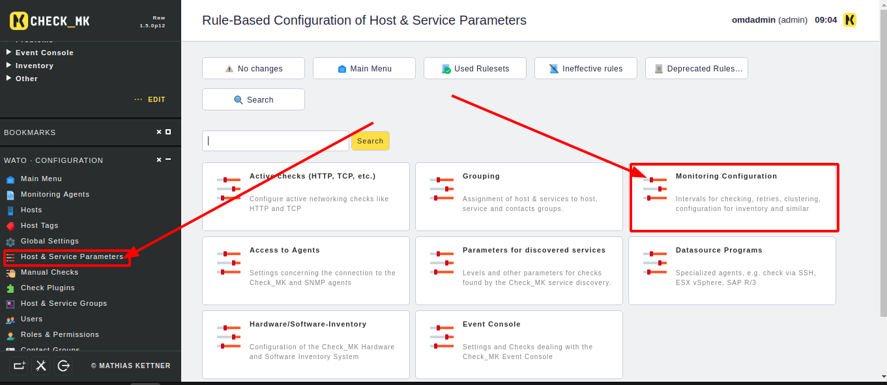
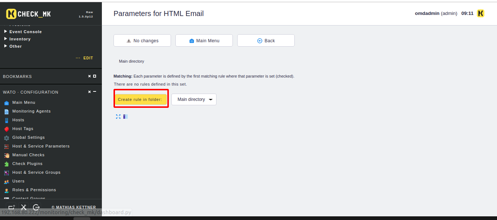
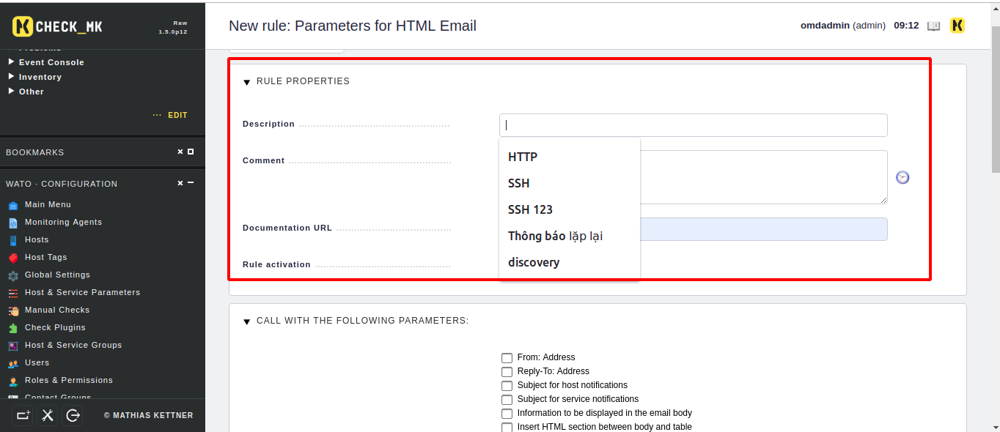
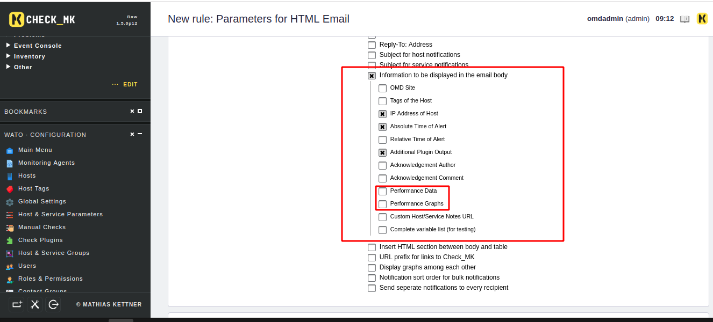
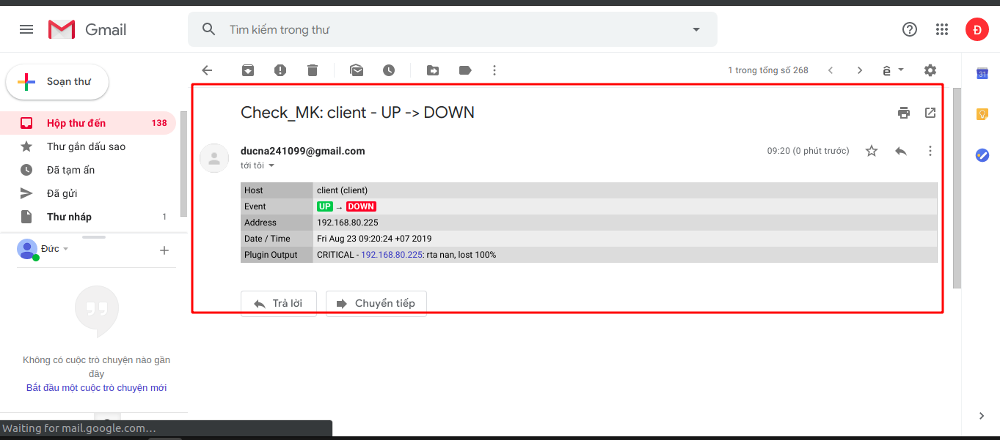

# Chỉnh sửa mail cảnh báo 

Đôi khi muốn chỉnh sửa mail bởi vì nó có những thông tin cảnh báo không cần thiết hoặc thêm mail cảnh báo.

Để chỉnh sửa mail cảnh báo thì chúng ta thực hiện các bước như sau. Đầu tiên là vào khung cấu hình để chọn mục 

Sau đó ta tạo thêm các rule 

Rồi ta bắt đầu thiết lập cho mail cảnh báo của mình 

Đầu tiên là miêu tả về chỉnh sửa này 

Tiếp theo là việc sửa nội dung trong mail và bên dưới tôi bớt đi 2 mục này 

Sau đó ta lưu lại và chỉnh sửa thay đổi 

Tiếp theo là kiểm tra mail đã được sửa  

