# Tài liệu các bước cảnh báo qua telegram 

1. Tìm ID chat

Bước 1: Tạo bot 
```
https://telegram.me/botfather
```
vào link để chat với `BotFather`

Chọn newbot 

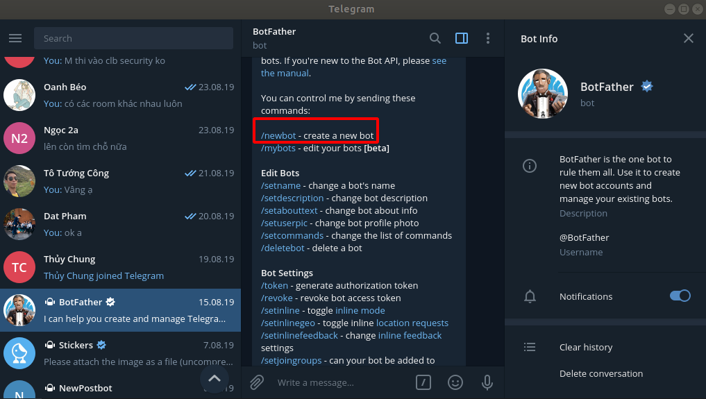

Bước 2: Sau khi chọn newbot thì ta chọn tên cho con bot đó và tên người dùng cho bot. Tên phải được kết thúc bằng `bot`


Bước 3: Tiếp theo ta tìm kiến bot bằng `@name-bot` để có thể bắt đầu chat với bot 

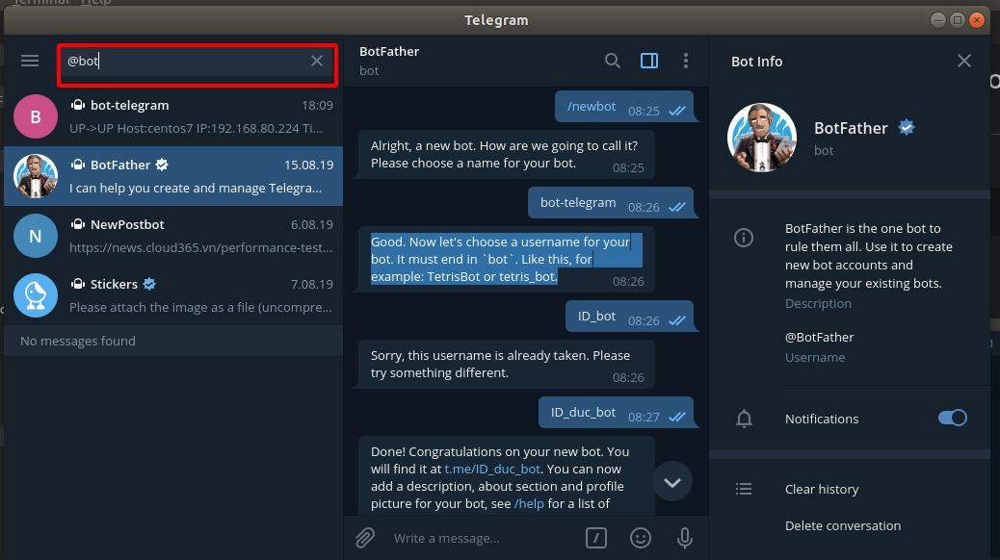

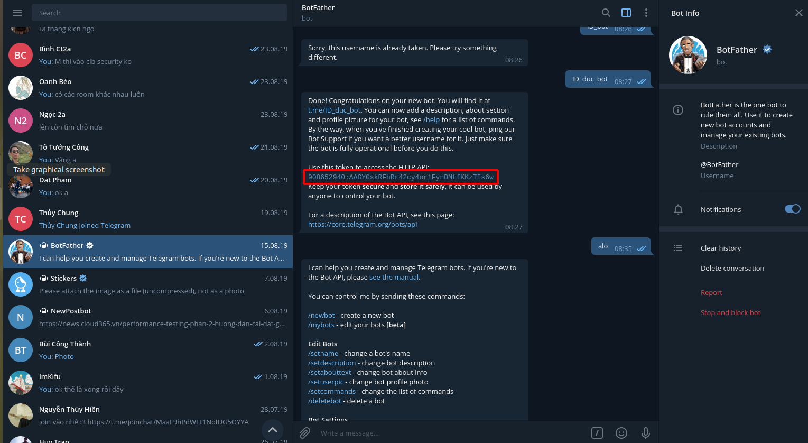

Lưu ý token của bot này ta sẽ phải sử dụng để lấy ID 

Bước 4: Bắt đầu start rồi chat với bot đó 

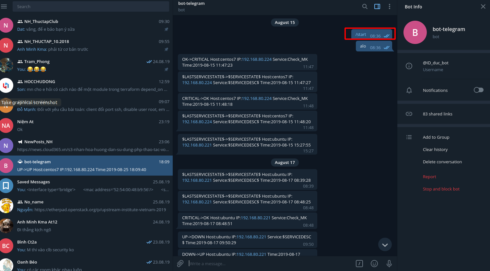

Bước 5: lấy ID của telegram


vào HTTP API của tele để lấy ID chat 
- Cú pháp
```
https://api.telegram.org/botToken/getUpdates
```
- ví dụ 
```
https://api.telegram.org/bot908652940:AAGYGskRFhRr42cy4or1FynDMtfKKzTIs6w/getUpdates
```

2. Cấu hình check_mk 

Tạo file `telegram.py`
```
vi /omd/sites/monitoring/share/check_mk/notifications/telegram.py
```

Nội dung file `telegram.py` như sau:
```
#!/usr/bin/env python
# Gui Canh Bao Telegram
import json
import requests
import os

TOKEN = "your_token"
URL = "https://api.telegram.org/bot{}/".format(TOKEN)


def get_url(url):
    response = requests.get(url)
    content = response.content.decode("utf8")
    return content


def get_json_from_url(url):
    content = get_url(url)
    js = json.loads(content)
    return js


def get_updates():
    url = URL + "getUpdates"
    js = get_json_from_url(url)
    return js


def get_last_chat_id_and_text(updates):
    num_updates = len(updates["result"])
    last_update = num_updates - 1
    text = updates["result"][last_update]["message"]["text"]
    chat_id = updates["result"][last_update]["message"]["chat"]["id"]
    return (text, chat_id)


def send_message(text, chat_id):
    url = URL + "sendMessage?text={}&chat_id={}".format(text, chat_id)
    get_url(url)


#text, chat = get_last_chat_id_and_text(get_updates())
#send_message(text, chat)
mess = os.environ['NOTIFY_LASTSERVICESTATE']+ '->' + os.environ['NOTIFY_SERVICESTATE'] + ' Host:' + os.environ['NOTIFY_HOSTNAME'] + ' IP:' + os.environ['NOTIFY_HOSTADDRESS'] + ' Service:' + os.environ['NOTIFY_SERVICEDESC'] + ' Time:' + os.environ['NOTIFY_SHORTDATETIME']
send_message(mess, os.environ['NOTIFY_CONTACT_TELEGRAM_CHAT_ID'])
```

ví dụ 
```
#!/usr/bin/env python
# Gui Canh Bao Telegram
import json
import requests
import os

TOKEN = ""
URL = "https://api.telegram.org/bot{908652940:AAGYGskRFhRr42cy4or1FynDMtfKKzTIs6w}/".format(TOKEN)


def get_url(url):
    response = requests.get(url)
    content = response.content.decode("utf8")
    return content


def get_json_from_url(url):
    content = get_url(url)
    js = json.loads(content)
    return js


def get_updates():
    url = URL + "getUpdates"
    js = get_json_from_url(url)
    return js


def get_last_chat_id_and_text(updates):
    num_updates = len(updates["result"])
    last_update = num_updates - 1
    text = updates["result"][last_update]["message"]["text"]
    chat_id = updates["result"][last_update]["message"]["chat"]["id"]
    return (text, chat_id)


def send_message(text, chat_id):
    url = URL + "sendMessage?text={}&chat_id={}".format(text, chat_id)
    get_url(url)


#text, chat = get_last_chat_id_and_text(get_updates())
#send_message(text, chat)
mess = os.environ['NOTIFY_LASTSERVICESTATE']+ '->' + os.environ['NOTIFY_SERVICESTATE'] + ' Host:' + os.environ['NOTIFY_HOSTNAME'] + ' IP:' + os.environ['NOTIFY_HOSTADDRESS'] + ' Service:' + os.environ['NOTIFY_SERVICEDESC'] + ' Time:' + os.environ['NOTIFY_SHORTDATETIME']
send_message(mess,626902078)
```
Thay TOKEN bằng TOKEN chúng ta lấy được qua chat box @BotFather

Bước 2: Cấp quyền cho file `telegram.py`
```
chmod +x /omd/sites/monitoring/share/check_mk/notifications/telegram.py
```
Restart lại omd server :
```
omd restart
```

Bước 3: Cấu hình trên WATO 

Tạo một Attributes User. Sau đó save và cập nhật thay đổi 

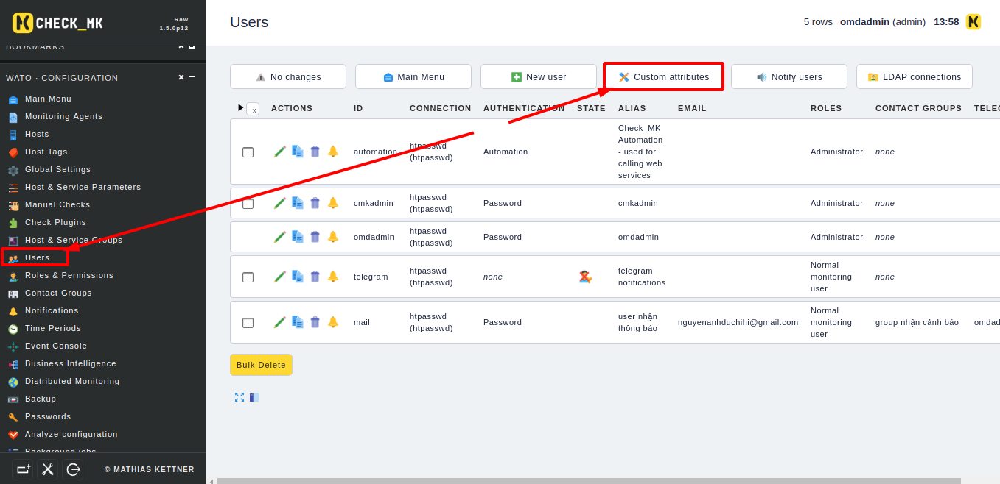

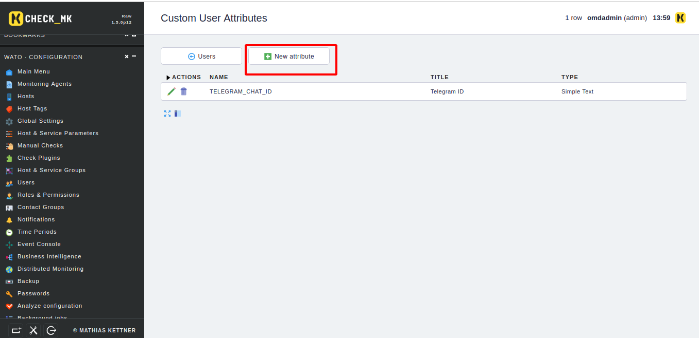

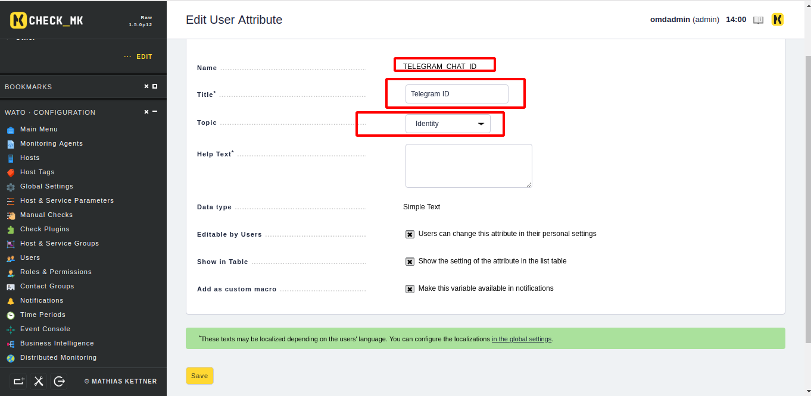

Bước 4: Tạo ra user. Sau đó lưu lại và cập nhật thay đổi 

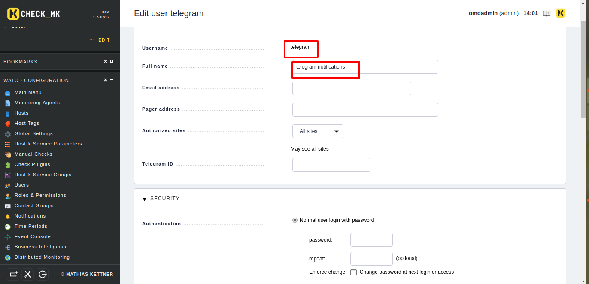

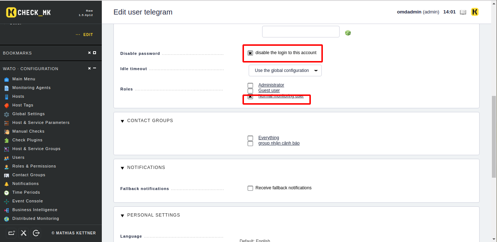

Bước 5: Tạo thêm rule mới ở trong  `notifications`

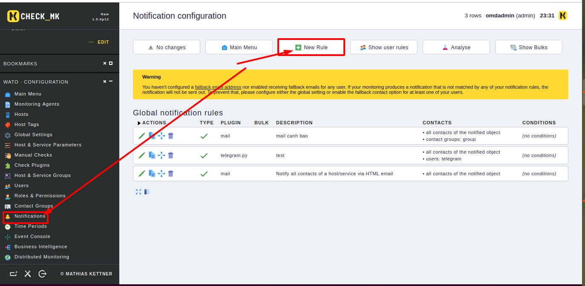

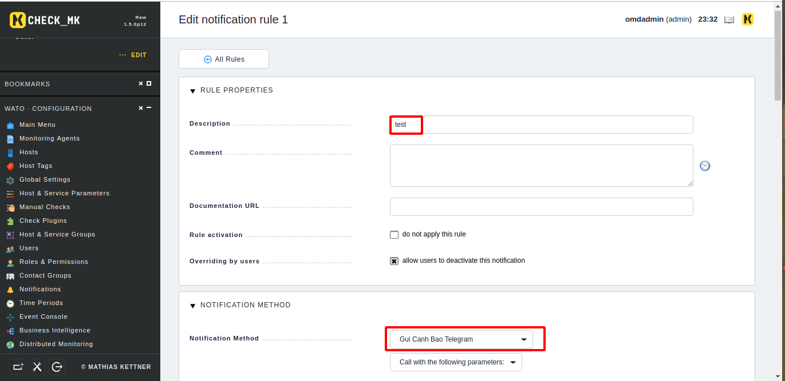

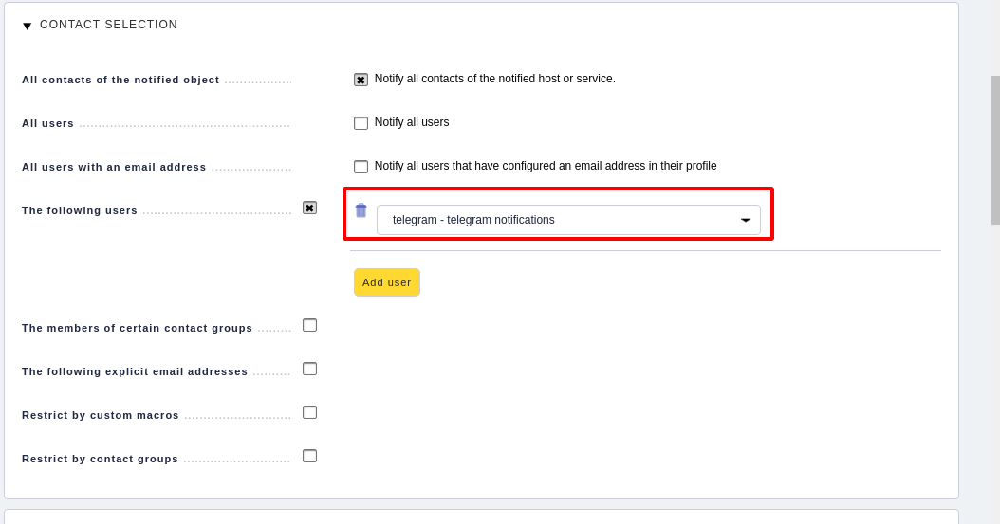

Bước 6: Kiểm tra cảnh báo khi tắt máy 

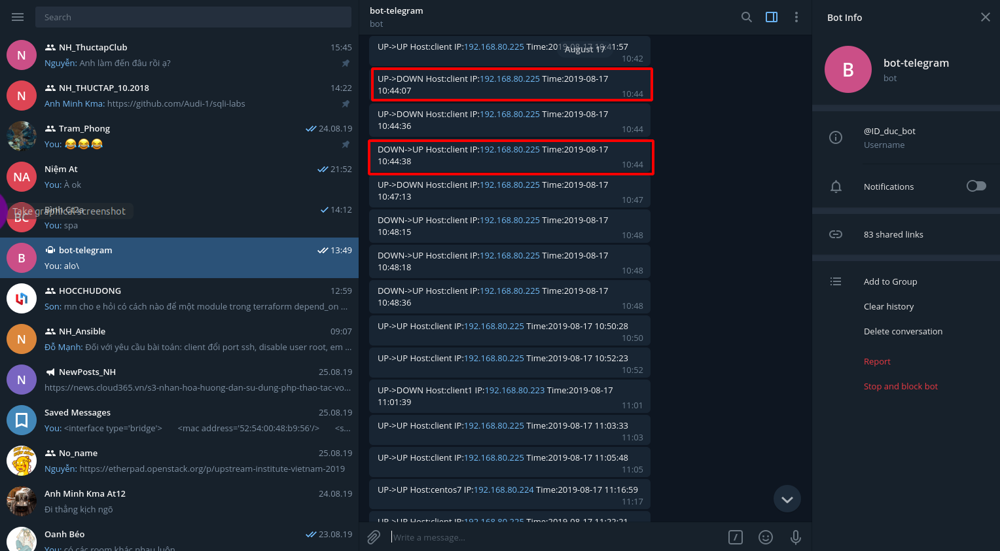

