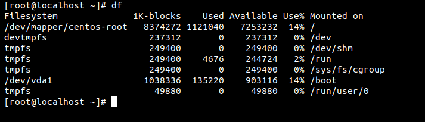
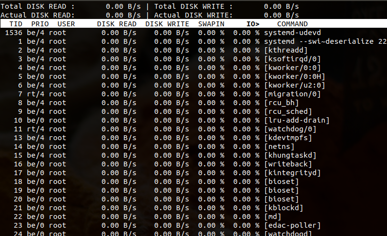

Disk là nơi lưu trữ các thông tin của máy tính. Là nơi lưu trữ kết quả sau quá trình làm việc của người dùng được lưu trữ lại và nó sẽ không bị mất đi khi máy tính tắt. 

# Một số lệnh check disk trong linux 

### Lệnh lsblk 
Đây là lệnh dùng để hiển thị thông tin danh sách các storage  có sẵn ở trong máy hoặc những storage được chỉ định. Lệnh này hiển thị thông tin về các divice, partition và mount point của phân vùng. Nó không hiển thi dung lượng đã được sử dụng và còn trống trên mỗi storage


Các option của lệnh disk 

| Option | DESCRIPTION|
|---|---|
| -a | Hiển thị tất cả |
| -b | Hiển thị theo byte | 
| -d | Chỉ hiển thị thông tin về disk |
| -m | Hiển thị quyền sở hữu, nhóm và mode của các phân vùng và divice|
| -V | Hiển thị phiên bản của lsklk |
| -h | Hiển thị giúp đỡ các option | 

### Command df
Lệnh df hiển thị các thông tin và các không gian sử dụng  của disk.



Các option của lệnh df 

| option | DESCRIPTION |
|----|----|
| -h | Hiển thị ra size của ổ disk | 
| df --block-size |  chọn size hiển thị disk | 
| -T | Hiển thị kiểu của disk | 
| -t | Chọn kiểu disk để hiển thị |
| -v | Hiển thị phiên bản của lệnh | 
| --help | Hiển thị trợ giúp | 
| -x | Hiển thị disk không có kiểu type |

## IOPS
- IOPS (input/output operations per second) hoạt động input output mỗi giây. Là một phương pháp đo tốt input và output cho các storage devices máy tính. 
- Hiệu suất của hệ thống lưu trữ chỉ đo được IOPS khi mà có dữ liệu sử dụng hệ thống lưu trữ. IOPS được đo dưới dạng số nguyên. 
- Nếu chỉ xét theo giá trị IOPS thì không thể đánh giá chính xác được hiệu suất của storage devices. Nó sẽ bị ảnh hưởng bởi kích thước và hiệu suất công việc của nó nhận được 
- Phần dưới là câu lệnh để giám sát giá trị IOPS của disk trong linux(centos7) 

### IOTOP 
IOTOP là một lệnh dùng để đo IOPS của storage. Gói này không có sẵn và phải cài đặt với lệnh sau
```
yum install iotop 
```


Trong đó :

- Total disk read : Tổng lượng đĩa đã đọc
- Total disk write : Tổng lượng đĩa đã viết
- Current Disk read : hiện tại tốc độ đĩa đọc
- Current Disk write : hiện tại tốc độ đĩa viết
- User : tài khoản sử dụng
- Disk read : Tốc độ đĩa đọc
- Disk write : Tốc độ đĩa viết
- Command : Lệnh thực hiện 
- TID : ID tiến trình
- PRIO : Sự ưu tiên 
- IO> : Phần trăm thời gian thread dành cho việc chờ đợi trên I/O
# link tham khảo 
https://searchstorage.techtarget.com/definition/IOPS-input-output-operations-per-second

https://storageswiss.com/2015/02/23/what-are-iops-and-should-you-care/

https://en.wikipedia.org/wiki/IOPS

https://www.znetlive.com/blog/monitor-disk-io-windows-linux/


