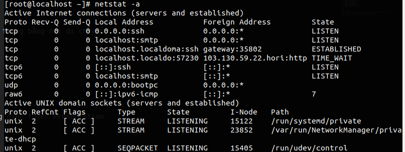
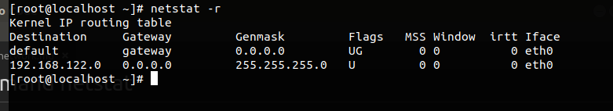
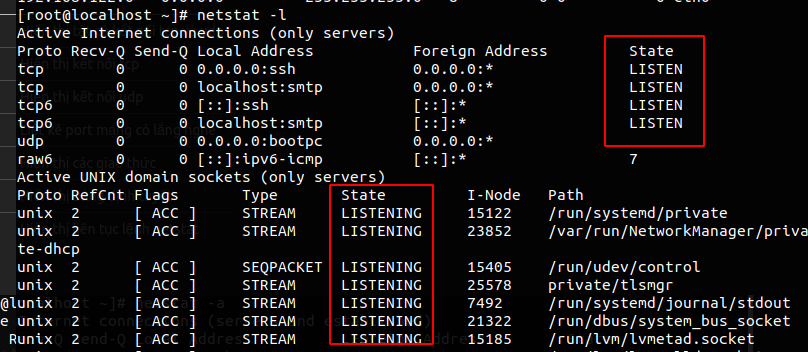
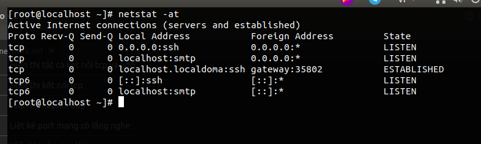
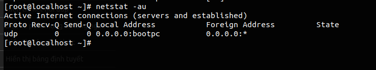

Truy cập mạng với tốc độ ra sao đó là điều cần chú ý đến khi chúng ta dùng mạng. Tốc độ truy cập mạng thường được gọi là băng thông. Mỗi băng thông thì sẽ có 2 đại lượng là IN và OUT. Một số lệnh sẽ sử dụng để check bandwith của port. Có rất nhiều lệnh(netstat, vnstat, nload, iftop,....) nhưng lệnh dưới hiển thị khá là đầy đủ thông tin 

# Lệnh ethtool 
Lệnh ethtool được dùng để check speed tối đa của port mạng 


File cat /sys/class/net/enp0s25/speed cũng lưu tốc độ tối đa của port mạng 
# 1. Command nload 
Lệnh nload là lệnh dùng để hiển thị thông tin tốc độ của port mạng trong thời gian thực 

Cài đặt ethtool 
```
yum install ethtool
```

Ta cần cài đặt lệnh nload vì ban đầu nó sẽ không có sẵn 
```
yum install nload 
```


Trong đó :
- Device : `enp0s25` là tên thiết bị 
- 172.16.2.39 : là địa chỉ IP của port 
- 1/9 : là trang 1 trong 9 trang của 9 port mạng của máy. Chuyển giữa các trang bằng nút di chuyển 
- Incomming : là tốc độ vào của port 
- curr : Tốc độ ở thời điểm hiện tại 
- Avg : Tốc độ trung bình 
- Min : Tốc độ nhỏ nhất đo được
- MAX : Tốc độ lớn nhất đo được 
- Ttl : Tổng dung lượng đã vào và ra 

# Command netstat 
Lệnh netstat dùng để  giám sát các kết nối mạng cả đến và đi cũng như bảng định tuyến Presentation

Cài đặt 
```
yum -y install net-tools
```

| option | DESCRIPTION |
|---|---|
| -a | Hiển thị tất cả kết nối tcp và udp | 
| -at | Hiển thị kết nối tcp | 
| -au | Hiển thị kết nối udp |
| -l | Liệt kê port mạng có lắng nghe | 
| -s | Hiển thị các giao thức  | 
| -r | Hiển thị bảng định tuyết |
| -c | Hiển thị liên tục lệnh netstat | 

Ví dụ 



Xem Bảng định tuyến 



Với option -l chỉ liệt kê các port lắng nghe



Với option -at sử dụng kết nối tcp



Hay với -au sử dụng giao thức udp 



# link tham khảo 

https://www.cyberciti.biz/faq/how-to-test-the-network-speedthroughput-between-two-linux-servers/

https://www.tecmint.com/20-netstat-commands-for-linux-network-management/

