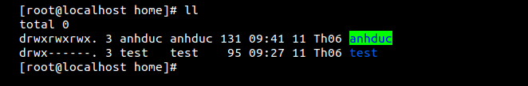
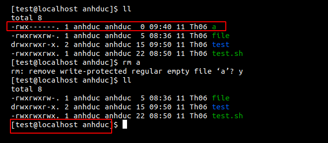
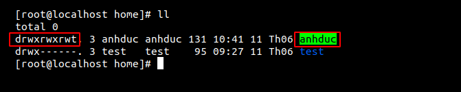
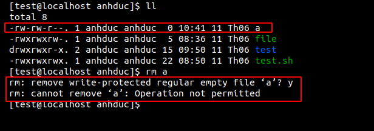

Symbolic Value
Thường thì khi phân quyền chúng ta sẽ sử dụng `chmod` theo cấu trúc 
```
chmod XXX file/folder 
```
Theo mặc địch thì giá trị khi viết 3 số thì nó sẽ thể hiện là 0XXX.  Ví dụ 777 sẽ là 0777

Trong đó XXX là số quyền ta cấp cho thư mục hoặc file nhưng ta còn có thêm một giá trị nữa ở trong linux được gọi là bát phân bổ sung. Bình thường các giá trị (0-7) sẽ thể hiện các quyền đọc viết và thực thi nhưng trong giá trị bát phân bổ sung nó sẽ được thể hiện theo cách khác 

# A Sticky Bit (1)
Gía trị này thể hiện rằng chỉ có chủ sở hữu và root mới có thể có quyền xóa các file và folder nằm trong thư mục này 

For example : Có 2 user. cấp quyền không có bát phân bổ sung. sau rồi cấp quyền có bát phân bổ sung rồi so sánh kết quả. 

Chuẩn bị: OS gồm 2 user `anhduc` và `test` 

Thực hành: 
- Bước 1: sử dụng user root Cấp quyền 777 cho `/home/anhduc` 



- Bước 2: Ta sử dụng user `anhduc` tạo ra một file tên a. Rồi sử dụng user `test` xóa file đó. 



- Bước 3: Ở trên ta thấy kết quả rằng file đã bị xóa. Tiếp theo ta sẽ cấp quyền 1777 cho `/home/anhduc` và làm như 2 bước trên 





- Kết quả: Ta thấy rằng file a đã không bị xóa do user `test` không có quyền xóa. Đó là công dụng của quyền của bát nhị phân bổ sung `A Sticky Bit (1)`

# SUID (SETUID)


# Link tham khảo 

http://www.filepermissions.com/articles/sticky-bit-suid-and-sgid#Overview

http://www.filepermissions.com/file-permission/2775

https://thachpham.com/linux-webserver/phan-quyen-tap-tin-thu-muc-linux.html

