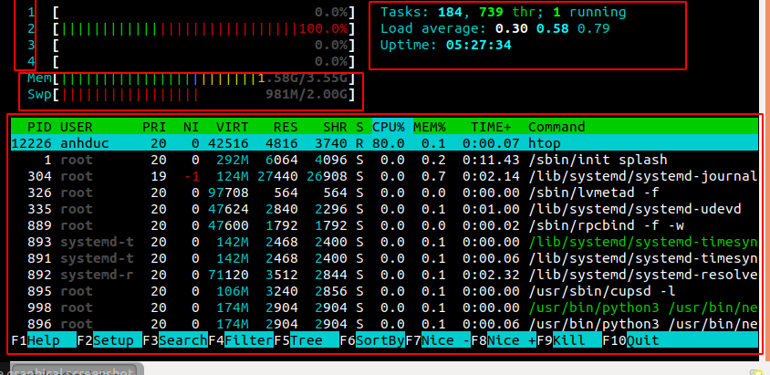
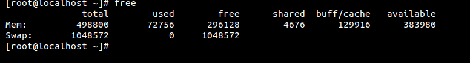

# Tổng quan 
1. Khái niệm

RAM(Random access memory) hay còn được gọi là bộ nhớ tạm thời. Là nơi lưu trữ những thông tin của pc tạm thời và có tốc độ truy xuất cao. 

Một số đặc điểm của RAM : 
- Tốc độ truy xuất cao
- Sẽ bị mất đi khi mất điện 

2. Cách kiểm tra trạng thái của Memorry 
Command `htop` : là một trình xem và quản lý tiến trình của hệ thống. Nó hiển thị một danh sách được cập nhật thường xuyên của các quá trình đang chạy trên máy tính, thường được sắp xếp theo lượng sử dụng CPU

Ô đầu tiên: 
- `1234` : là số core của máy tính và phần trăm hoạt động

Ô thức 2: 
- Tasks        :  Tổng số tiến trình đang chạy       
- thr          :   
- running      : Số user chạy     
- load average : Số CPU load trung bình 
- uptime       : Thời gian máy chạy 

Ô thứ 3 
- Mem :  số lượng RAM chạy trên tổng RAM 
- Swap : lượng swap chạy trên tổng 

Ô thứ 3 giống với command `top`

Command free -m 
Là lệnh dùng để hiển thị dung lượng đã trống và đã sử dụng trong bộ nhớ 

| Option | DESCRIPTION | 
|-------|-----------|
| -b  | Hiển thị kết quả theo byte |
| -k | Hiển thị kết quả theo kilobyte|
| -m | Hiển thị kết quả theo megabyte | 
| -g | Hiển thị kết quả theo gigabyte | 

**File lưu trữ thông tin của ram cat /proc/meminfo**

https://www.tecmint.com/set-linux-process-priority-using-nice-and-renice-commands/

