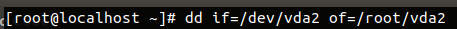
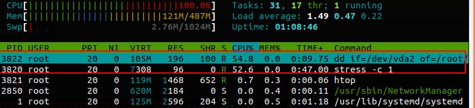
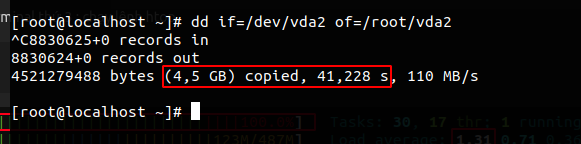
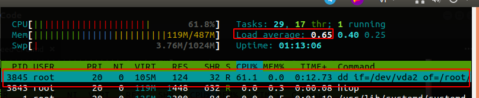
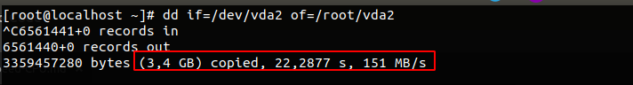

# Kịch bản 
Sử dụng lệnh `stress` để tạo ra tiến trình đẩy cho công xuất cpu lên max. Sau đó ta sẽ sử dụng lệnh `dd` để xem công suất làm việc của CPU sau khi bị đẩy lên max sẽ ra sao.

Chuẩn bị: 
- OS : Centos7
- Máy cài đặt các gói : wget; stress; htop

# Thực hiện
Cài các gói lên OS

Bước 1: Cài wget 
```
yum install wget
```
Bước 2: Cài đặt gói htop
```
wget dl.fedoraproject.org/pub/epel/7/x86_64/Packages/e/epel-release-7-11.noarch.rpm

rpm -ihv epel-release-7-11.noarch.rpm 

yum install htop
```
Bước 3: Cài đặt gói stress
```
yum install http://ftp.tu-chemnitz.de/pub/linux/dag/redhat/el7/en/x86_64/rpmforge/RPMS/stress-1.0.2-1.el7.rf.x86_64.rpm

yum install stress 
```
Chúng ta sẽ chạy đồng thời 3 terminal 
- Terminal 1 : Chạy lệnh stress
```
stress -c 1 
```


- Terminal 2 : Chạy lệnh dd 
```
dd if=/dev/vda2 of=/root/vda2
``` 



- Terminal thứ 3 : chạy lệnh htop 
```
htop
```


Như ta đã thấy thì CPU đã thực hiện hết công xuất là 100% khi thực hiện đồng thời 3 tiến trình thì CPU được chia làm 2 phần lớn. 1 là dùng cho tiến trình stress 2 là cho lệnh dd. Khi phải thực thi 2 tiến trình nafy cùng 1 lúc sẽ làm cho các tiến chậm hơn vì lý do CPU phải làm nhiều việc 1 lúc ta nhìn vào kết quả của lệnh dd



Bây giờ chúng ta sẽ chạy lệnh dd khi không tạo ra tiến trình từ lệnh stress





Như chúng ta thấy kết quả nó dành hầu hết lượng CPU cho lệnh dd khi đó chỉ mất 22s đã hoàn thành xong 3,4G còn ở trên khi phải chạy 2 tiến trình thì trong vòng 41s mới chạy xong 4,5G. 

**Lưu ý chỉ số của load average với OS được cài đặt với 1 core thì chỉ số này khi dưới 1 nghĩ là hệ thống đang chạy bình thường còn khi số này lớn hơn 1 nghĩa là hệ thống này đang quá tải và các tiến trình sẽ bị chạy chậm do số lượng công việc của CPU bị quá tải**