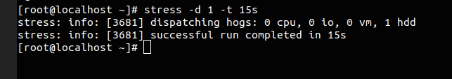
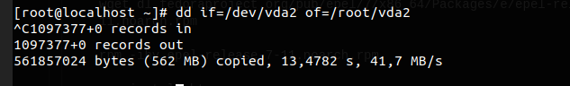
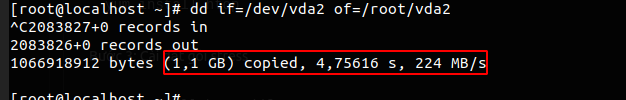

# kịch bản 
Sẽ dùng lệnh stress để tạo ra tiến trình công việc cho disk làm việc. Sau đó sử dụng lệnh dd để kiểm tra xem khi có nhiều công việc thì hiệu xuất của disk có bị giảm hay là không 

Chuẩn bị 
- OS : Centos 7
- Máy cài đặt các gói : wget; stress; htop

# Thực hiện 
Cài các gói lên OS

Bước 1: Cài wget 
```
yum install wget
```
Bước 2: Cài đặt gói htop
```
wget dl.fedoraproject.org/pub/epel/7/x86_64/Packages/e/epel-release-7-11.noarch.rpm

rpm -ihv epel-release-7-11.noarch.rpm 

yum install htop
```
Bước 3: Cài đặt gói stress
```
yum install http://ftp.tu-chemnitz.de/pub/linux/dag/redhat/el7/en/x86_64/rpmforge/RPMS/stress-1.0.2-1.el7.rf.x86_64.rpm

yum install stress 
```
Chúng ta sẽ chạy đồng thời 2 terminal 

- Terminal 1 : Chạy lệnh stress
```
stress -d 1 -t 15s 
```
- Terminal : chạy lệnh dd
```
dd if=/dev/vda2 of=/root/vda2
```

Sau khi chạy xong 2 câu lệnh trong vòng 15s ta kiểm tra 2 terminal 



Đây là lệnh stress. Nó tạo ra một công việc cho disk trong vòng 15s 



Ta thấy rằng trong vòng 13s mà ổ đĩa mới copy được 562MB. Bây giờ chúng ta sẽ thực hiện copy ổ đĩa khi không tạo ra công việc cho disk bằng lệnh stress 



Tốc độ write của disk được tính ra ở dưới. Tính bằng dung lượng ghi được trên giây

**Kết quả là chưa tới 5s thì đã copy được 1,1GB. Ta thấy rằng khi phải chạy nhiều việc và truy xuất nhiều thì disk sẽ bị ảnh hưởng và sẽ bị chạy chậm đi**

Kiểm tra tốc độ đọc 
```
[root@localhost ~]# hdparm -t /dev/vda 

/dev/vda:
 Timing buffered disk reads: 588 MB in  3.00 seconds = 195.96 MB/sec
```

https://www.shellhacks.com/disk-speed-test-read-write-hdd-ssd-perfomance-linux/

