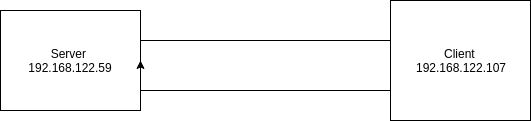
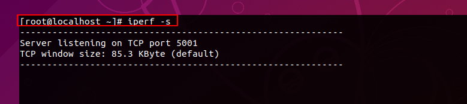
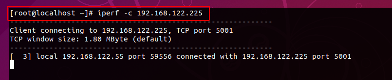
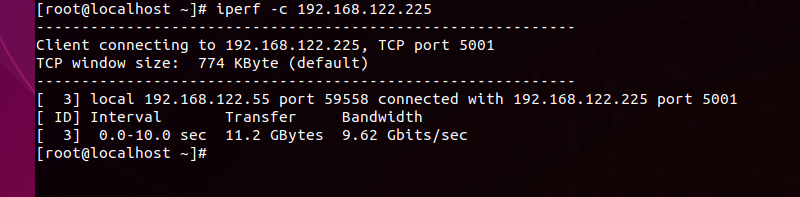
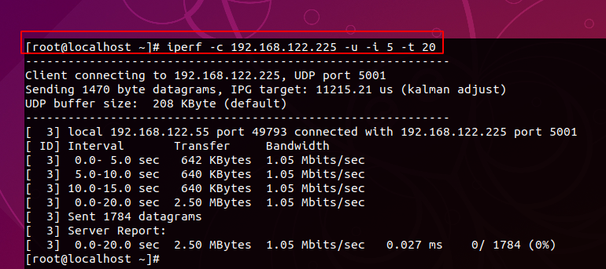

Để kiểm tra tốc độ băng thông network ta sử dụng lệnh `iperf` để. `Iperf` có thể kiểm tra thông lượng của kết nối TCP và UDP 

# Kịch Bản 
Mô hình gồm 2 máy OS một máy đóng vai trò client và một máy đóng vai trò server. Trong mô hình này thì máy client sẽ liên tục gửi gói tin đến server để test băng thông của nó. Gói tin là UDP hay là TCP thì đó là do ta cài đặt. Theo mặc định thì gói tin chuyển đi sẽ là TCP 

Theo mặc định thì `iperf` sẽ mặc địch sử dụng port 5001. Tao có thể thay đổi port bằng option -p  nhưng cả client và server phải chỉ cùng một port



Chuẩn bị :
- Server : OS centos7; gói iperf 
- Client : OS centos7; gói iperf 

# Thực hiện 

Cài đặt gói `iperf` lên 2 VM 
```
rpm -ivh http://dl.fedoraproject.org/pub/epel/6/x86_64/epel-release-6-8.noarch.rpm

yum -y install iperf
```
Tắt firewall
```
systemctl disable firewalld
systemctl stop firewalld
```
disable selinux ở trong file `/etc/selinux/config`

**Trên Server**

Sử dụng lệnh 
```
iperf -s 
```




**Trên Client**

Sử dụng lệnh 
```
iperf -c 192.168.122.225
```



*Sau khi thực hiện 2 lệnh này xong thì gói tin sẽ liên tục gửi gói tin từ client đên server. Khi không sử dụng option -t thì mặc định của nó là đo băng thông trong vòng 10s*



- Kết quả ta thấy rằng Tốc độ bandwidth là 9.62 Gbits/sec

Ta Có thể sử dụng bắt gói tin bằng kết nối UDP bằng option -u. Client và server sẽ phải cùng sử dụng một kết nối 
```
iperf -c 192.168.122.225 -u option-thêm 
```


Nhưng kết quả ta thấy Bandwidth = 1.05Mb Đó là vì iperf giới hạn băng thông của kết nối udp. Ta Có thể tăng băng thôn của nó với option -b 


Bandwidth đã được đẩy lên là 1G sau khi ta sử dụng option -b 